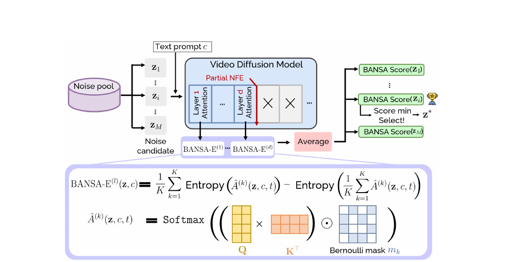

## 1. 한 줄 정리

- Text-to-Video diffusion 모델이 여러 초기 Gaussian noise seed 중 **stochastic perturbation에도 attention이 가장 일관적인 seed**를 BANSA로 고르게 하여, 재학습이나 전체 후보 생성 없이 영상 품질·시간적 일관성·prompt alignment를 개선하는 inference-time noise selection 방법이다.

## 2. Motivation

- 큰 도메인
	- Video diffusion의 inference-time scaling 및 초기 noise seed 선택 문제를 다룬다.
- 기존 문제
	- 같은 prompt와 모델을 사용해도 초기 noise seed에 따라 영상 품질이 크게 달라지며, 기존 FreeInit·FreqPrior 계열은 사람이 설계한 frequency prior와 반복적인 diffusion sampling에 의존해 계산량이 크고 모델 내부의 선호 신호를 사용하지 못한다.
- 해결 방식
	- **Bayesian uncertainty estimation**: 후보 seed별 attention의 epistemic uncertainty를 측정하여 가장 안정적인 seed를 선택한다.

## 3. Main Method

### 3.1 문제 설정

- 입력
	- Text prompt $c$와 $M$개의 초기 noise 후보 $\mathcal{Z}=\{z_1,\ldots,z_M\}$를 받으며, 각 $z_i\sim\mathcal{N}(0,I)$는 video diffusion 모델의 초기 latent $z_T$와 같은 shape이다.
- 출력
	- 후보 중 BANSA score가 가장 낮은 $z^*$를 선택하고, 이 seed로 기존 sampling pipeline을 끝까지 실행해 video $\hat v$를 생성한다.
- 핵심 관점
	- 좋은 seed는 prompt와 무관하게 항상 좋은 “golden seed”가 아니라, 주어진 prompt에서 모델이 안정적으로 해석할 수 있는 **prompt-dependent seed**이다.

> Figure 3의 내부 BANSA 수식은 두 entropy 항의 순서가 본문 Eq. (4), Eq. (6), Appendix B와 반대로 그려져 있다. 논문의 비음수 정의와 실제 선택에는 아래의 $H(\text{mean})-\text{mean}(H)$를 사용한다.

### 3.2 Background: BALD

- BALD는 여러 stochastic model sample이 서로 얼마나 다른 예측을 내는지를 나타내는 epistemic uncertainty이다.

$$
\operatorname{BALD}(x)
=H\left[\frac{1}{K}\sum_{k=1}^{K}p^{(k)}(y\mid x)\right]
-\frac{1}{K}\sum_{k=1}^{K}H\left[p^{(k)}(y\mid x)\right]
$$

- 첫 항은 모든 예측을 평균낸 분포의 entropy이고, 둘째 항은 각 stochastic pass가 가진 entropy의 평균이다.
	- 각 pass가 같은 예측을 하면 두 항이 같아져 score가 낮다.
	- 각 pass는 자신 있게 예측하지만 서로 다른 답을 내면 평균 분포만 퍼지므로 score가 높다.
	- 따라서 단순 predictive entropy에 포함되는 data ambiguity보다, 모델 파라미터에 대한 불확실성과 disagreement를 분리해 측정한다.
- 일반 active learning은 label을 얻을 가치가 큰 **high-BALD sample**을 고르지만, 이 논문은 안정적인 생성을 위해 **low-BALD noise seed**를 고르는 방향으로 재해석한다.

### 3.3 BANSA: BALD를 attention 공간으로 이전

- Diffusion 모델에는 classifier의 class probability에 해당하는 명시적 predictive distribution이 없으므로, text·visual token의 상호작용을 나타내는 attention map을 stochastic prediction으로 취급한다.
- Denoising network의 한 attention layer에서 query와 key는 $Q(z,c,t),K(z,c,t)\in\mathbb{R}^{N\times d}$이고, attention map은 다음과 같다.

$$
A(z,c,t)=\operatorname{Softmax}\left(Q(z,c,t)K(z,c,t)^\top\right)\in\mathbb{R}^{N\times N}
$$

	- $N$: attention token 수
	- $d$: query/key feature dimension
	- 각 row는 한 query token이 $N$개 key token에 할당한 확률분포이다.
- 동일한 $(z,c,t)$에 stochastic perturbation을 달리 적용해 $K$개의 attention map $\{A^{(1)},\ldots,A^{(K)}\}$을 얻고, row별 entropy를 평균한 $H(A)$를 사용한다.

$$
H(A)=\frac{1}{N}\sum_{i=1}^{N}\sum_{j=1}^{N}-A_{ij}\log A_{ij}
$$

$$
\operatorname{BANSA}(z,c,t)
=H\left(\frac{1}{K}\sum_{k=1}^{K}A^{(k)}\right)
-\frac{1}{K}\sum_{k=1}^{K}H\left(A^{(k)}\right)
$$

- Entropy의 concavity로 $\operatorname{BANSA}\ge 0$이며, 모든 stochastic attention map이 같을 때만 score가 0이 된다.
- 해석
	- 낮은 score: perturbation이 달라져도 attention 구조가 비슷함 → 모델의 seed 해석이 안정적임.
	- 높은 score: perturbation에 따라 attention이 크게 바뀜 → seed에 대한 epistemic uncertainty가 큼.
	- 엄밀히는 score 0이 attention 간 **agreement**를 보장하지만 attention 자체가 sharp하다는 것까지 보장하지는 않으므로, BANSA의 직접적인 핵심 신호는 stochastic disagreement이다.
- 최종 seed는 다음처럼 고른다.

$$
z^*=\arg\min_{z\in\mathcal{Z}}\operatorname{BANSA}(z,c,t)
$$

### 3.4 Bernoulli-masked attention을 이용한 효율적 근사

- Seed마다 독립적인 forward pass를 $K$번 수행하면 비싸므로, 한 번 계산한 attention에 $K$개의 Bernoulli mask를 적용해 stochastic attention sample을 만든다.
- 각 $k$에 대해 $m_k\in\{0,1\}^{N\times N}$, $m_{k,ij}\sim\operatorname{Bernoulli}(p)$를 샘플링하고 다음 map을 계산한 뒤 각 row를 다시 normalize한다.

$$
\hat A^{(k)}(z,c,t)=\operatorname{RowNorm}\left(A(z,c,t)\odot m_k\right)
$$

- $\{\hat A^{(k)}\}_{k=1}^{K}$를 BANSA 식에 넣은 근사 score를 **BANSA-E**라고 하며, 기본 설정은 $K=10$, $p=0.2$이다.
- $QK^\top$ 계산을 공유하면서 mask만 여러 개 적용하므로, $K$번의 전체 denoising pass보다 훨씬 저렴하게 attention-level uncertainty를 근사한다.

### 3.5 Early timestep 및 informative layer 선택

- Timestep
	- 후보 seed 평가는 첫 denoising step에서만 수행하며, 25·50 step 평균은 품질을 미세하게 높일 뿐 비용이 각각 약 $25\times$, $50\times$로 증가한다.
- Layer
	- Layer $l$의 BANSA-E를 $\operatorname{BANSA\text{-}E}^{(l)}$라 할 때, 첫 $d$개 layer의 누적 평균을 다음처럼 정의한다.

$$
\widehat{\operatorname{BANSA\text{-}E}}^{\le d}
=\frac{1}{d}\sum_{l=1}^{d}\operatorname{BANSA\text{-}E}^{(l)}
$$

	- 전체 layer score와의 Pearson correlation이 threshold $\tau=0.7$ 이상이 되는 가장 작은 depth $d^*$를 모델별로 미리 선택한다.
	- 사용한 $d^*$는 AnimateDiff 10, CogVideoX-2B 14, CogVideoX-5B 19, HunyuanVideo와 Wan2.1은 약 20이다.
	- 이후 inference에서는 $d^*$까지만 partial network evaluation을 수행하므로 full-layer 평가와 거의 같은 ranking을 더 낮은 비용으로 얻는다.

### 3.6 전체 inference pipeline

1. Prompt $c$에 대해 $M$개의 Gaussian noise 후보 $z_1,\ldots,z_M$을 샘플링한다.
2. 각 $z_i$를 첫 denoising timestep에서 layer $d^*$까지만 통과시켜 base attention을 계산한다.
3. Attention마다 $K$개의 Bernoulli mask를 적용하고 layer별 BANSA-E를 계산한다.
4. $d^*$개 layer score를 평균하여 후보별 최종 uncertainty score를 얻는다.
5. $z^*=\arg\min_{z_i}\widehat{\operatorname{BANSA\text{-}E}}^{\le d^*}(z_i,c,t)$를 선택한다.
6. 선택된 $z^*$ 하나만 기존 video diffusion sampler로 끝까지 denoise하고 decode한다.

- 모델 weight, sampler, noise distribution은 변경하지 않으며 별도 학습도 필요 없다.
- 계산량은 후보 모두를 영상으로 완성하는 best-of-$M$이 아니라, 후보별 **초기 partial evaluation + 선택된 하나의 full generation**이다.

## 4. 실험

### 4.1 실험 설정

- Backbone
	- U-Net 계열 AnimateDiff와 MMDiT 계열 CogVideoX-2B/5B, HunyuanVideo, Wan2.1에서 평가하여 architecture와 model scale에 대한 범용성을 확인한다.
	- 기본값은 noise pool $M=10$, stochastic sample $K=10$, Bernoulli probability $p=0.2$이며, 각 모델의 공식 50-step sampling 설정을 유지한다.
- VBench-long
	- 4초 이상 영상 평가를 위해 GPT-4o로 확장한 prompt를 모델에 입력하고 생성 영상의 시각적 품질과 prompt 일치도를 측정한다.
	- Quality Score는 subject/background consistency, temporal flickering, motion smoothness, aesthetic/imaging quality, dynamic degree의 가중 평균이고, Semantic Score는 object, action, color, spatial relation, scene, style 등 9개 의미 차원의 가중 평균이다.
	- Total Score는 $0.8\times\text{Quality}+0.2\times\text{Semantic}$이며 높을수록 좋다.
- MSR-VTT + FVMD
	- MSR-VTT test split의 prompt 200개로 영상을 생성하고 실제 영상 분포와 생성 영상의 motion feature 분포 사이 Fréchet distance를 측정한다.
	- FVMD는 낮을수록 실제 영상과 가까운 motion fidelity를 뜻한다.
- Human study
	- 4개 backbone에서 VBench prompt 30개의 baseline/ANSE 영상 쌍을 만들고, blind evaluator 12명이 overall quality와 text-video alignment를 비교했다.

### 4.2 핵심 결과

- AnimateDiff의 VBench Total Score는 $77.98\rightarrow79.33$, Semantic Score는 $69.03\rightarrow71.09$로 상승했으며, FreqPrior와 결합하면 Total Score가 $80.43$까지 향상되어 기존 noise prior와도 직교적으로 결합된다.
- CogVideoX-2B/5B의 Total Score도 각각 $81.03\rightarrow81.66$, $81.52\rightarrow81.71$로 상승하여 MMDiT와 큰 모델에서도 적용 가능했다.
- HunyuanVideo와 Wan2.1에서도 subject consistency, motion smoothness, temporal flickering 등 대부분의 quality dimension이 개선되었다.
- FVMD는 HunyuanVideo에서 $17641.19\rightarrow16491.68$, Wan2.1-1.3B에서 $16495.59\rightarrow14306.19$로 감소하여 motion fidelity 향상을 확인했다.
- 추론 시간 증가는 backbone에 따라 약 $8\%$-$15\%$였으며, AnimateDiff에서 FreqPrior의 약 $105\%$ 증가보다 훨씬 작았다.
- Human study에서도 ANSE 영상이 overall quality와 prompt alignment 양쪽에서 일관되게 선호되었다.

## 5. Ablation 또는 Analysis

### 5.1 Analysis: BANSA가 선택한 seed의 성질

- Cross-prompt behavior
	- 한 prompt에서 나쁜 high-BANSA seed를 다른 prompt에 적용했을 때 성능이 좋아지기도, 나빠지기도 하여 seed 품질이 절대적 속성이 아니라 prompt-dependent임을 확인했다.
- Intra-prompt attention consistency
	- 100개 prompt에서 low-BANSA group의 attention pairwise distance가 high-BANSA group보다 작아($1.567<1.635$), 낮은 score가 더 안정적인 attention pattern과 연결되었다.
- Latent trajectory
	- Low-BANSA seed는 high-BANSA seed보다 low-frequency latent trajectory variation이 낮고($51.07<52.34$), intra-frame variance는 높아($0.053>0.041$) 시간적으로 안정적이면서도 표현력 있는 dynamics를 보였다.
- 실제 품질과의 correlation
	- BANSA score와 Subject Consistency, Background Consistency, Motion Smoothness의 Pearson correlation은 각각 $-0.6672$, $-0.7492$, $-0.6769$로, score가 낮을수록 영상 품질이 높은 경향이 강했다.

### 5.2 Ablation

- Acquisition function
	- Random, 단순 entropy, dropout 기반 BANSA보다 Bernoulli-masked BANSA가 CogVideoX-2B에서 가장 높은 Total Score $81.66$을 기록하여 disagreement와 구조화된 attention perturbation이 모두 중요했다.
- Ensemble size $K$
	- $K=1$에서 10까지 늘릴수록 subject/background consistency가 향상되었고 $K=10$ 부근에서 포화되어 이를 기본값으로 사용했다.
- Noise pool size $M$
	- 후보 수가 늘수록 좋은 seed를 찾을 확률은 높아지지만 CogVideoX-2B/5B 모두 $M=10$ 부근에서 성능이 포화되어 비용 대비 기본값으로 선택했다.
- Reversed criterion
	- 가장 높은 BANSA seed를 선택하면 Quality Score가 baseline $82.08$보다 낮은 $81.93$으로 하락한 반면, 최저 score 선택은 $82.56$을 기록해 selection direction의 타당성을 확인했다.
- Bernoulli probability $p$
	- $p\in[0.2,0.7]$에서는 비교적 안정적이지만 $p=0.2$가 가장 좋았고, masking을 사실상 끄거나 극단적으로 적용한 양 끝 설정은 성능이 하락했다.
- Truncated layer
	- CogVideoX-2B에서 full-layer와 truncated score의 Quality Score가 $82.58$과 $82.56$으로 거의 같았지만 시간은 $303.7\text{s}\rightarrow269.3\text{s}$로 줄어 relative ranking만으로 충분함을 보였다.
- Temporal scope
	- 첫 1 step 대신 25·50 step의 BANSA를 평균해도 품질 증가는 미미하지만 비용은 각각 $25\times$, $50\times$가 되어 1-step 평가가 가장 실용적이었다.
- Attention type
	- AnimateDiff에서 self-attention BANSA는 주로 perceptual quality를, cross-attention BANSA는 semantic alignment를 더 개선하여 attention 공간에 따라 포착되는 uncertainty가 다름을 확인했다.
- CFG scale
	- CFG scale 5.0과 7.5 모두에서 ANSE가 vanilla보다 높아, 초기 seed 선택과 후단 guidance strength 조절이 대체로 독립적으로 작동했다.
- Equivalent compute
	- Wan2.1 baseline의 sampling step을 50에서 60으로 늘려도 개선되지 않았지만 ANSE는 60 step보다 적은 유효 계산량으로 더 높은 성능을 보여, gain이 단순 추가 compute가 아닌 seed 선택에서 왔음을 확인했다.
- Strong/post-RL backbone
	- Wan2.1-14B와 preference-aligned IPOC-2B에서도 대부분의 VBench dimension이 개선되어 scale과 post-training 이후에도 적용 가능했다.

### 5.3 Limitations

- ANSE는 초기 seed만 선택하고 이후 denoising trajectory를 수정하지 않으므로, low-BANSA seed라도 부자연스러운 영상이 생성될 수 있다.
- Attention uncertainty는 semantic·aesthetic quality 전체를 직접 평가하는 metric이 아니므로 score와 perceptual quality가 항상 일치하지 않는다.
- 여러 후보의 완성 영상을 강한 reward/quality model로 평가하면 정확도를 높일 수 있지만 계산량이 커지며, 향후 Self-Forcing 같은 post-training refinement와 결합하는 방향을 제안한다.
