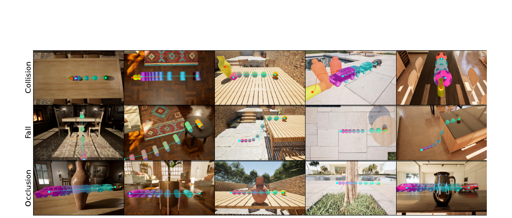

# 한 줄 정리

- 동일한 물리 사건에서 **장면·시점·물체 종류·외관만 체계적으로 바꾼 counterfactual 영상**을 생성하고, 영상 모델의 물리적 정확도와 조건 변화에 대한 일관성을 함께 측정하는 photorealistic benchmark.

# Motivation

- 큰 도메인: video generation model이 시각적 상관관계를 넘어 안정적인 인과·물리 구조를 학습했는지 평가하는 world model benchmark.
- 기존 문제: 기존 물리 벤치마크는 주로 고정된 한 관측에서 생성 결과의 plausibility만 평가하므로, 같은 물리 사건이 시점·외관·환경 변화에도 일관되게 예측되는지는 알기 어려움.
- 해결 방식: Unreal Engine 기반 controlled intervention + reference/object-centric evaluation + intervention sensitivity.

# Main Method

## 1. Counterfactual physical consistency

- **평가 단위는 physical event**: 초기 상태, impulse, 물리 simulator parameter로 정해지는 하나의 3D dynamics를 기준으로 삼음.
- 이 사건에서 한 intervention 축만 바꾸고 나머지를 고정한 counterfactual observation들을 생성함.
	- **Nuisance intervention**: camera viewpoint·object appearance는 물리 parameter를 바꾸지 않으므로, 예측 품질과 dynamics가 안정적으로 유지되어야 함.
	- **Structured intervention**: scene은 layout을, object category는 shape·material·mass·friction 등을 바꿀 수 있으므로, 모델은 달라진 조건에 맞게 rollout을 일관성 있게 수정해야 함.
- 따라서 CRONOS는 개별 영상의 물리적 품질뿐 아니라, 동일 사건의 조건 변화에 따라 그 품질이 얼마나 흔들리는지를 함께 평가함.

## 2. 데이터 생성

- Unreal Engine에서 모든 영상을 $1920 \times 1080$, 30 FPS로 렌더링하고, RGB와 object별 segmentation mask를 함께 저장함.
- 세 가지 event는 모두 초기 impulse로 motion을 시작함.
	- **Fall (roll-to-drop)**: 물체가 표면 위를 구르다가 가장자리에서 떨어짐. contact condition 변화와 free-fall을 평가.
	- **Collision**: 움직이는 물체가 다른 물체와 충돌함. 상호작용 dynamics, 시공간적 일관성, object permanence를 평가.
	- **Occlusion**: 움직이는 물체가 가림막 뒤에서 완전히 사라졌다가 반대편에 재등장함. hidden motion과 장기 temporal coherence를 평가.
- 각 event에서 다음 네 축을 full-factorial로 조합함.
	- scene 5종: 배경과 layout을 변경하며, fall의 낙하 높이처럼 실제 rollout에 영향을 줄 수도 있음.
	- object category 5종: 외형뿐 아니라 mass·friction·material 같은 물리 property도 달라짐.
	- appearance 3종: 색 등 시각 속성만 바꾸고 물리 property는 유지함.
	- viewpoint 4종: 3D dynamics는 유지한 채 camera만 변경함. 단, occlusion은 가림 구조를 보존하기 위해 한 시점만 사용.
- 데이터 규모는 fall 300개, collision 300개, occlusion 75개로 총 675개 reference video임.
	- Fall/Collision: $5_{\text{scene}} \times 5_{\text{object}} \times 3_{\text{appearance}} \times 4_{\text{view}} = 300$.
	- Occlusion: $5 \times 5 \times 3 \times 1 = 75$.

## 3. Video model 평가 절차

- 입력은 event별 text prompt와 visual condition임.
	- **I2V**: reference의 첫 frame 한 장을 조건으로 future video를 생성.
	- **V2V**: 방향과 초기 속도를 보여주는 첫 5 frames를 조건으로 이후를 생성.
- Prompt는 scene·view·object·appearance와 의도한 사건을 대략 설명하고, camera/background 고정 및 물체의 비변형·비소멸 조건을 공통으로 명시함.
- I2V처럼 입력만으로 future가 완전히 결정되지 않는 경우를 고려해 조건당 seed 3개를 생성하고, reference와 motion similarity가 가장 높은 결과를 사용함.
	- Intervention sensitivity를 계산할 때는 variant마다 seed를 따로 고르지 않고, 해당 intervention group 전체의 평균 motion score가 가장 높은 seed 하나를 선택해 비교의 일관성을 유지함.

## 4. Per-video evaluation metrics

- Frame/object 단위 score는 평균 대신 전체 frame의 약 5%에 해당하는 **최악의 $k$개 score 평균**인 robust minimum/maximum으로 집계함. 짧은 morphing이나 한 물체의 심각한 오류가 전체 평균에 묻히지 않게 하기 위함.
- **Appearance stability**
	- SAM3 mask로 object 배경을 제거하고, frame 0과 이후 frame의 DINOv2 CLS embedding cosine similarity를 비교함.
	- 잠깐이라도 물체의 색·정체성이 변하거나 다른 물체로 morphing되는지를 검출하며 높을수록 좋음.
- **Background stability**
	- 각 frame과 frame 0에서 공통으로 background인 pixel만 골라 MSE를 계산하고 robust maximum을 취함.
	- background morphing, 조명 변화, camera motion, 새 물체 출현을 검출하며, 최종 score는 $\exp(-50S)$로 변환해 높을수록 좋게 만듦.
- **3D-shape stability**
	- SAM3 mask를 SAM3D에 입력해 frame별 object mesh를 복원하고, scale·rotation 정렬 후 frame 0 mesh와 Chamfer distance를 계산함.
	- 일시적인 물체 변형을 검출하며 exponential scaling 후 높을수록 좋음.
- **Motion similarity**
	- Appearance/object identity에 덜 의존하는 DisMo motion encoder로 generated/reference frame을 embedding하고 cosine similarity를 계산함.
	- 단순 centroid 비교보다 복잡한 motion pattern의 일치도를 보며 높을수록 좋음.
- **Physical plausibility**
	- Qwen3-VL-32B가 event-specific 5문항과 공통 5문항에 True/False로 답함.
	- 예를 들어 fall의 낙하·가속, collision 접촉과 반응, occlusion 뒤 재등장, 공통적인 비변형·background 고정·smooth motion을 확인함.
	- Ideal answer와 다른 응답 수를 $N_{\text{wrong}}$이라 할 때 score는 $(1+N_{\text{wrong}})^{-1}$로, 위반 몇 개만 있어도 빠르게 감점됨.
- **Object disappearance 보정**
	- 물체가 image boundary로 나간 것이 아닌데 이후 frame에서 계속 사라지면 disappearance로 판정하고 appearance·shape·motion score를 최저값으로 둠.
	- 심한 occlusion에서 mask 기반 metric이 불안정해지는 것을 막기 위해, object mask가 초기 크기의 25%보다 큰 frame에서만 appearance·shape를 계산함.

## 5. Success rate와 intervention sensitivity

- **Success rate**: 다섯 metric이 모두 사람 평가로 보정한 threshold를 넘고 object disappearance도 없어야 해당 영상을 성공으로 판정함.
	- Threshold: appearance 0.48, background 0.30, motion 0.57, shape 0.60, physical plausibility 0.48.
	- 한 metric의 치명적인 실패가 다른 metric 평균에 가려지지 않는 strict all-pass 기준임.
- **Intervention sensitivity**: 다른 조건을 고정하고 한 축만 바꾼 group에서 metric별 최고·최저 score 차이를 구한 뒤 group과 metric에 걸쳐 평균함.
	- 낮을수록 조건 변화에도 생성 품질이 안정적이어서 counterfactual consistency가 높음.
	- 단, 모든 variant의 절대 품질이 똑같이 낮아도 sensitivity는 작을 수 있으므로 success rate 및 per-video metric과 함께 해석해야 함.

# 실험

- **Benchmark task**
	- 입력: 첫 frame 또는 첫 5 frames + 사건과 조건을 설명하는 text prompt.
	- 출력: fall·collision·occlusion의 future video.
	- 생성 영상이 reference의 motion을 따르면서 물체 외관·3D shape·background·물리 사건을 안정적으로 유지하는지, 그리고 intervention에 따라 품질이 얼마나 변하는지를 평가함.
- **평가 모델**
	- Cosmos2.5-2B/14B, MAGI-1-4.5B는 I2V와 V2V로, CogVideoX1.5-5B와 Wan2.2-14B는 I2V로 평가함.
	- Reference 675개마다 seed 3개를 생성하므로 model configuration당 2,025개 영상을 생성함.
- **Metric 검증**
	- 540개 영상을 대상으로 8명의 qualification 통과 annotator 중 영상당 3명이 appearance·shape·background·motion·event quality를 1--5점으로 평가함.
	- 자동 metric과 사람 점수는 모두 양의 Pearson correlation을 보였고, background 1.00, shape 0.92, physical plausibility 0.86, appearance 0.82였음. Motion은 0.68로 가장 낮고 $p=0.07$이어서 다른 metric보다 검증 근거가 약함.
- **주요 결과**
	- 최고 success rate도 Cosmos2.5-2B V2V의 0.22이며, Wan2.2 I2V가 0.20, 나머지는 0.01--0.14에 그침. 짧은 기본 rigid-body 사건에서도 모든 품질 기준을 동시에 만족하기 어려움.
	- Appearance intervention이 가장 덜 해롭지만 강한 모델도 약 20%의 품질 변화를 보임. Viewpoint와 object-category 변화에서 sensitivity가 특히 커, 모델이 동일한 3D dynamics를 view-independent하게 표현하지 못함을 시사함.
	- Cosmos와 MAGI-1은 V2V가 I2V보다 motion뿐 아니라 background와 object stability에서도 대체로 우수함. 초기 5 frames가 dynamics와 camera/object identity를 더 강하게 고정하는 것으로 해석됨.
	- 같은 Cosmos2.5 계열에서는 14B가 2B보다 I2V·V2V의 거의 모든 metric과 success rate에서 낮았음. 모델 크기 증가만으로 counterfactual physical consistency가 개선되지는 않음.

# Ablation 또는 Analysis

- **Intervention analysis**: appearance보다 viewpoint·object-category에서 품질 편차가 더 큼. 특히 물리 상태가 같은 viewpoint 변경에도 민감해 예측이 3D dynamics보다 관측 시점의 visual statistics에 강하게 묶여 있음을 보여줌.
- **Conditioning analysis**: 첫 frame만 주는 I2V보다 5 frames를 주는 V2V가 motion, background, object stability를 전반적으로 개선함.
- **Scale analysis**: Cosmos2.5-2B가 14B보다 일관되게 우수해, 단일 model family·scale step이라는 제한은 있지만 단순 scaling이 물리 일반화를 보장하지 않음을 보임.
- **Metric-human alignment**: 제안 metric은 사람 평가와 전반적으로 양의 상관을 보였지만, motion similarity는 통계적 유의성이 가장 약해 추가 검증 여지가 있음.
- **Failure mode**: trajectory drift, 잘못된 충돌 반응, object identity/shape distortion, disappearance, background·camera drift가 반복적으로 관찰됨.
- **한계**: Unreal Engine의 synthetic-to-real gap, 하나의 reference rollout과 비교하는 평가, 세 rigid-body event에 한정된 범위, closed commercial model을 제외한 open model 중심 평가가 있음.
