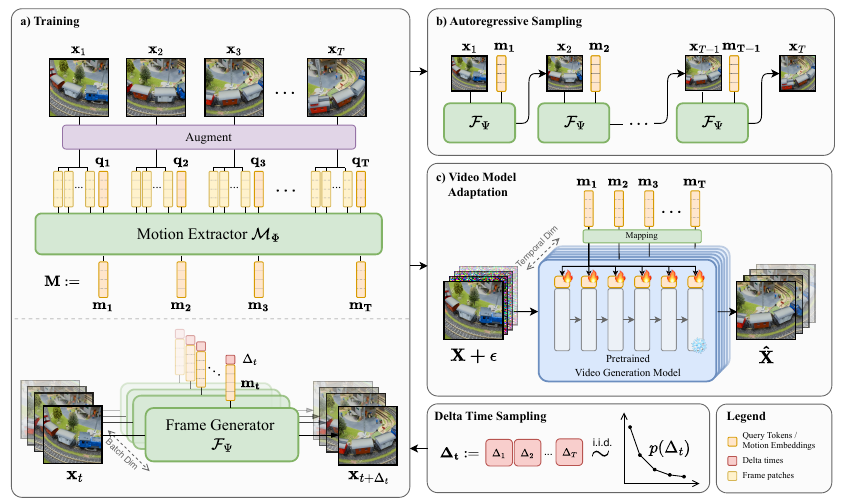

- 한 줄 정리
	- 비디오에서 appearance와 분리된 motion embedding을 학습하고, 이를 pretrained video generation model에 주입해 open-world motion transfer를 수행하는 방법

- motivation
	- 도메인: text/image-conditioned video generation에서 motion을 명시적으로 제어하는 문제
	- 기존 문제: optical flow/keypoint/trajectory 기반 제어는 source video의 구조, 위치, viewpoint에 강하게 묶임
	- 해결 방향: reconstruction-based motion representation learning + frozen VDM adapter

- Main Method
	- 핵심 Figure
		- 

	- 1. Motion representation pretraining
		- 입력: 짧은 비디오 클립 $X=\{x_t\}_{t=1}^T$
		- motion extractor $M_\theta$는 timestep별 motion embedding $M=\{m_t\}_{t=1}^T$를 출력
		- 구현은 DINOv2-B frame embedder + 3D ViT-B/16 sequence encoder
		- optical flow처럼 직접 motion을 계산하는 것이 아니라, 미래 프레임 재구성 과제를 통해 학습됨

	- 2. Frame generator
		- 입력: 현재 프레임 $x_t$, motion embedding $m_t$, 시간 간격 $\Delta t$
		- 목표: 미래 프레임 $x_{t+\Delta t}$ 재구성
		- 개념식: $F_\psi: x_{t+\Delta t}\sim p(x_{t+\Delta t}\mid x_t,m_t,\Delta t)$
		- 실제 네트워크 출력은 완성 프레임이 아니라 flow matching용 velocity field
		- 역할: $m_t$가 미래 변화를 설명하는 정보를 담도록 motion extractor를 압박하는 학습 장치

	- 3. 왜 motion이 분리되도록 유도되는가
		- $x_t$가 appearance/content를 이미 제공하므로 $m_t$는 미래 변화를 설명하는 residual information을 담는 것이 효율적
		- embedding bottleneck과 강한 photometric/geometric augmentation으로 appearance leakage를 줄임
		- 단, motion-only 분리가 수학적으로 보장되는 것은 아니며 실험적으로 검증하는 주장에 가까움

	- 4. $\Delta t$
		- constant $\Delta t$: 항상 일정 프레임 뒤를 예측하는 hyperparameter 성격
		- sampled $\Delta t$: 각 prediction마다 frame offset을 랜덤 샘플링
		- $\Delta t$를 condition으로 주기 때문에 같은 motion이라도 짧은 변화와 긴 변화를 모두 학습 가능

	- 5. VDM adaptation
		- 고품질 생성에서는 frame generator 결과가 VDM에 들어가는 것이 아님
		- driving video $\rightarrow$ motion extractor $\rightarrow \{m_t\}$ 추출
		- motion sequence를 mapping network로 변환 후 frozen VDM의 conditional LoRA에 주입
		- VDM 입력: noise/video latent, diffusion timestep, prompt, optional start frame, DisMo motion embedding
		- 각 spatiotemporal token은 시간적으로 대응되는 motion embedding만 condition으로 받도록 설계

- 실험
	- Open-world motion transfer
		- task: driving video의 motion을 target image 또는 text prompt의 content로 옮겨 새 비디오 생성
		- metric: tracking 기반 motion fidelity, CLIP 기반 prompt adherence, consecutive frame CLIP 기반 temporal consistency, source video와의 CLIP similarity로 leakage 평가
		- 결과: DisMo가 motion fidelity와 prompt adherence의 trade-off를 기존 방법보다 잘 줄임

	- Appearance/structure disentanglement
		- task: motion embedding으로 actor identity가 복원되는지, action은 잘 구분되는지 평가
		- metric: IARD에서 kNN identity/action classification
		- 결과: identity accuracy는 random에 가깝고 action accuracy는 높아 appearance보다 motion/action 정보를 더 잘 담음

	- Zero-shot action classification
		- task: frozen DisMo embedding으로 ARID, Jester, SSv2, IARD action label 예측
		- metric: mean-pooled feature에 kNN classifier 적용
		- 결과: V-JEPA, VideoMAE 계열보다 motion 중심 benchmark에서 강함

- Ablation 또는 Analysis
	- Previous frame conditioning
		- $x_t$를 같이 주면 appearance 정보가 frame stream으로 빠져 motion embedding leakage가 줄어듦
	- Augmentation
		- photometric/geometric augmentation을 넣으면 driving video의 색/구조 변화에도 생성 결과가 더 안정적
	- Video backbone 교체
		- LTX, SparseCtrl, CogVideoX에 적용 가능하며 더 강한 generator를 쓰면 생성 품질과 motion fidelity가 개선됨
	- Latent space analysis
		- DisMo embedding은 identity보다 action 기준으로 더 잘 clustering되고, irreversible motion의 forward/backward 차이도 더 잘 구분함
