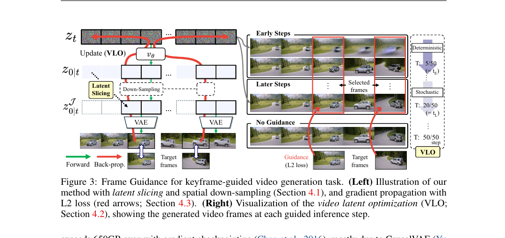

## 한 줄 정리

- Pretrained video diffusion model을 바꾸지 않고, 선택한 frame의 loss gradient로 sampling latent를 직접 보정하여 keyframe, style, depth, sketch 등을 제어한다.

## Motivation

- 도메인: 사용자가 주는 frame-level reference로 video diffusion generation을 제어하는 문제.
- 기존 문제: frame interpolation이나 ControlNet류 방법은 task별 학습이 필요하고, 대형 VDM에 training-free gradient guidance를 적용하면 VAE 역전파 memory가 너무 크다.
- 해결 방식: training-free latent optimization.

## Main Method

### Input / Output

- Base VDM 입력: text prompt와 I2V의 initial image 등 기존 모델이 원래 받는 condition.
- 추가 제어 입력 $c_{\text{frames}}$: keyframe, style image, depth, sketch 등. 이는 VDM 입력에 직접 넣지 않고 guidance loss의 target으로만 사용한다.
- Latent: 현재 noisy video latent는 $z_t \in \mathbb{R}^{C \times F \times H \times W}$이고, $F$는 temporal latent length이다. 실제 차원은 backbone VDM/VAE에 따라 달라진다.
- 출력: 모든 frame이 자연스럽게 연결되면서, 선택 frame $I$가 target condition을 따르는 video.

### 전체 흐름

1. $z_t$와 timestep $t$를 denoising network $v_\theta$에 넣어 predicted clean latent $z_{0|t}$를 얻는다.
2. Guidance를 줄 video frame index $I$를 대응 latent index $J$로 변환하고, $z_{0|t}$에서 $J$ 주변의 작은 temporal window만 자른다.
3. Sliced latent를 VAE decoder $D$로 decode해 predicted frame $x^I_{0|t}$를 얻는다.
4. $x^I_{0|t}$와 target $c_{\text{frames}}$로 loss $\mathcal{L}_e$를 계산하고, $g_t = \nabla_{z_t}\mathcal{L}_e(x^I_{0|t}, c_{\text{frames}})$를 구한다.
5. Gradient로 $z_t$를 보정한 뒤, 일반 denoising step을 진행한다. 이 과정을 guidance 구간에서 반복한다.

여기서 $i$는 video frame index, $t$는 noise에서 clean으로 진행하는 denoising timestep이다. Loss는 $I$에 속한 frame에서만 계산하지만, gradient가 $v_\theta$를 통과하므로 전체 video latent와 주변 frame에도 영향을 준다.

### 1. Latent Slicing

- 문제: CausalVAE는 frame 하나만 decode해도 temporal latent 전체를 처리하는 구조라, full-sequence guidance의 peak memory가 매우 크다.
- 관찰: 한 video frame의 변화는 실제로 temporal latent 전체가 아니라 인접한 몇 개 latent에만 영향을 준다. 이를 temporal locality라 부른다.
- 방법: target frame 하나를 복원할 때 대응 latent와 그 주변 3개 latent만 decode하고, 필요하면 latent를 spatially downsample한다.
- 효과: Wan-14B에서 full decode $606\,\text{GB}$, slicing $41\,\text{GB}$, slicing + $2\times$ downsampling $10\,\text{GB}$로 줄어든다. 이 memory는 guidance gradient 계산 시의 peak memory다.

### 2. Video Latent Optimization (VLO)

- Denoising 초반은 전체 layout과 motion 방향이 정해지고, 한 frame의 guidance가 다른 frame에 가장 넓게 퍼지는 시기다. 따라서 deterministic update를 사용한다: $z_t \leftarrow z_t - \eta g_t$.
- 후반은 deterministic update만 반복하면 artifact, oversaturation, temporal disconnection이 누적될 수 있다. 따라서 time-travel처럼 noise를 다시 섞는 stochastic update를 사용한다.
- $t > t_E$는 초반 deterministic guidance, $t_E \geq t > t_L$는 후반 stochastic guidance, $t \leq t_L$는 guidance 없이 base sampler만 수행하는 구간이다.

### 3. Gradient가 전체 video에 퍼지는 이유

- Shortcut처럼 $v_\theta$를 건너뛰고 sliced latent만 직접 업데이트하면, gradient가 guided frame 근처에만 남아 video가 끊겨 보인다.
- $z_t \rightarrow v_\theta \rightarrow z_{0|t} \rightarrow D \rightarrow \mathcal{L}_e$ 전체 chain으로 역전파하면 denoising network에 담긴 temporal prior가 gradient를 다른 frame으로 전달해 coherence를 유지한다.

### 4. Task별 Loss

- Keyframe: user reference frame $x_i^*$와 generated frame $x^i_{0|t}$의 L2 loss. Keyframe은 latent target이 아니라 decoded frame이 맞춰야 하는 reference이다.
- Style: differentiable style encoder $\Psi$의 feature cosine similarity. $\Psi$가 differentiable해야 loss gradient가 generated frame을 거쳐 $z_t$까지 흐른다.
- Loop: 첫 frame과 마지막 frame의 L2 loss로 seamless loop를 유도한다.
- Depth / Sketch: differentiable depth estimator 또는 edge predictor의 feature space에서 target과 generated frame을 맞춘다.
- 여러 condition은 각 loss를 더해 함께 적용할 수 있다.

## 실험

- Keyframe-guided generation: DAVIS의 81 frame 이상 clip 40개와 더 dynamic한 Pexels video 30개에서, initial frame과 middle/final keyframe을 주고 자연스러운 긴 video를 생성하는 task를 평가했다.
- Metric: FID는 생성 frame image distribution의 visual quality, FVD는 video feature distribution의 visual quality와 temporal dynamics를 평가한다. Human evaluation은 video quality와 keyframe similarity를 직접 비교한다.
- 결과: training-free I2V baseline에 guidance를 적용하면 다른 training-free 방법보다 좋았고, CogX-Interp에 적용한 결과는 training이 필요한 interpolation baseline도 넘어섰다. Wan-14B 기반 결과는 human evaluation에서 가장 높은 video quality를 보였다.
- Style generation: style reference 6개와 content prompt 9개 조합에서 text/style alignment와 motion을 평가했다. CLIP/ViCLIP 기반 text-style similarity 및 human evaluation에서 대체로 가장 좋은 결과를 보였다.
- Loop, color block, masked region, depth/sketch, style transfer, multi-condition에도 같은 framework와 loss 조합을 적용할 수 있음을 보였다.

## Ablation / Analysis

- VLO: time-travel만 사용하면 초반 layout 형성이 약해 FVD가 $778.4$였고, deterministic update만 사용하면 artifact가 누적됐다. 둘을 결합한 VLO는 FVD $577.1$로 가장 좋았다.
- Gradient path: denoising network 역전파를 생략한 shortcut은 temporal disconnect를 만들었다. 전체 gradient path가 video coherence에 필수다.
- $t_E$: low-frequency layout이 안정화되는 시점을 기준으로 정하며, DAVIS ablation에서는 $t_E = 6$이 가장 좋았고 인근 값에도 비교적 robust했다.
- GPU memory: guided frame 수가 늘면 VAE decode memory가 거의 선형으로 증가한다. RGB/depth 등 loss type이 추가하는 overhead는 VAE와 score network보다 작다.
- 한계: guidance는 base inference보다 약 2-4배 느리고, backbone이 학습하지 못한 highly dynamic scene, OOD style, fine-grained edge control에는 약하다.
