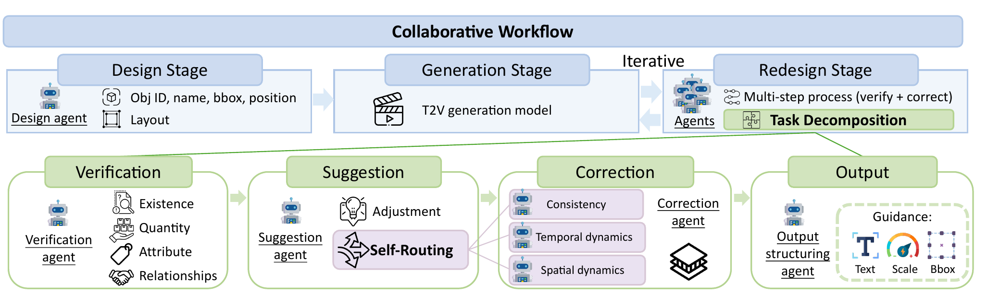

- 한 줄 정리
	- 복잡한 조합형 텍스트 조건을 프레임별 객체 배치로 먼저 설계하고, 생성 결과를 역할이 분리된 여러 MLLM agent가 검증·수정해 prompt, bounding box, guidance scale을 반복 갱신하는 별도 학습 없는 text-to-video 생성 framework.

- 핵심 아이디어 먼저
	- 한 MLLM에게 영상을 이해하고, 오류를 찾고, 수정안까지 한 번에 만들게 하면 영상의 시공간적 복잡성 때문에 hallucination과 불안정한 판단이 생긴다.
	- 먼저 DESIGN agent가 prompt를 프레임별 객체 bounding box로 바꾸고, 기존 video diffusion model이 이 layout을 따라 영상을 생성한다.
	- 생성 영상이 prompt와 어긋나면 REDESIGN 단계의 네 agent가 `검증 → 수정 방향 제안 및 전문가 선택 → 실제 설계 수정 → JSON 구조화`를 순서대로 맡는다.
	- 예를 들어 “꽃 한 송이가 왼쪽에서 오른쪽으로 흐른다”는 prompt에서 꽃이 두 송이 나오거나 정지해 있으면, spatial-dynamics agent를 선택해 꽃의 box 이동 폭을 키우고 해당 객체의 guidance를 강화한 뒤 다시 생성한다.

- motivation
	- 큰 도메인: 여러 객체의 속성·수량·공간 관계·시간 변화·상호작용을 동시에 만족해야 하는 compositional text-to-video generation.
	- 기존 문제: single-pass layout control은 처음 생성에서 놓친 조건을 복구하지 못하고, 하나의 MLLM이 영상 이해부터 수정 계획까지 전부 맡는 self-correction은 복잡한 시공간 reasoning에서 hallucination이 잦다.
	- 해결 방식: inference-time iterative refinement + sequential task decomposition + role-specialized agent self-routing.

- Main Method
	- 핵심 Figure
		- 
		- 위쪽은 `DESIGN → GENERATION ↔ REDESIGN` 전체 흐름이고, 아래쪽은 REDESIGN을 네 역할로 나눈 내부 흐름이다.

	- 0. 전체 입출력과 실행 조건
		- 입력: 여러 객체와 속성, 수량, 위치, 움직임 또는 상호작용을 서술한 text prompt $P$.
		- 핵심 중간 표현: 각 frame과 object에 대한 `{id, name, box=[x,y,w,h]}` layout, background keyword, 수정된 prompt, 강조할 object와 bounding-box guidance scale.
		- 출력: 원 prompt의 조합 조건을 만족하도록 반복 보정된 video; 실험 설정에서는 VideoCrafter2가 $512\times512$ frame 65개를 생성한다.
		- 학습 여부: 새로운 video model이나 agent를 fine-tuning하지 않는다. GPT-4o와 pretrained VideoCrafter2를 inference 시 연결하고, 매 반복마다 MLLM 호출과 video denoising을 다시 수행한다.

	- 1. DESIGN - text를 움직이는 scene layout으로 변환
		- 입력: 원 text prompt $P$.
		- 처리: design agent가 등장 객체와 배경을 분리하고, object ID·이름·box 크기·위치를 frame별로 계획한다. 같은 ID의 box가 시간에 따라 이동하거나 크기가 변하면서 motion과 spatial relation을 표현한다.
		- 출력: frame별 object list, background keyword, 초기 text prompt와 layout; 예를 들어 오른쪽에서 왼쪽으로 가는 자동차는 $x$ 좌표가 frame마다 감소하는 box sequence로 표현된다.
		- 필요한 이유: text만으로는 diffusion model이 “어떤 객체가 어느 위치에서 어느 방향으로 움직여야 하는지”를 놓치기 쉬우므로, 시공간 구성을 명시적인 좌표 계획으로 바꾼다.

	- 2. GENERATION - cross-attention을 box 안으로 유도
		- 입력: text prompt, frame별 layout, bounding-box guidance scale $\beta$, diffusion latent.
		- 처리: off-the-shelf T2V diffusion model의 cross-attention에서 object token이 지정 box 내부를 강하게 보고 외부는 약하게 보도록 LVD 방식의 energy guidance를 적용한다.
		- object token $o$의 energy는 $L_o=-\beta\operatorname{TopK}(A_t^o\odot M_t^o)+\operatorname{TopK}(A_t^o\odot(1-M_t^o))$이고, 전체 energy는 $L=\sum_{o\in O}L_o$이다.
			- $A_t^o$: denoising timestep $t$에서 latent가 object token $o$를 보는 cross-attention map.
			- $M_t^o$: 같은 공간 크기의 binary box mask로, box 내부는 1이고 외부는 0이다.
			- energy를 최소화하면 box 내부의 높은 attention은 보상하고 외부의 높은 attention은 벌점으로 주므로 object가 계획한 위치에 나타나도록 유도한다.
		- 일부 초기 denoising timestep에서 latent를 $z'_t\leftarrow z_t-\alpha_t\nabla_{z_t}L$로 갱신한다. $\alpha_t$는 step size이며 video generator의 parameter를 업데이트하는 학습식이 아니라 한 번의 sampling 안에서 latent를 보정하는 식이다.
		- 초기 $\beta$는 1.0이고, REDESIGN에서 필요할 때 0.05 단위로 높인다. 큰 $\beta$는 해당 object box를 더 강하게 따르도록 한다.
		- 출력: 현재 layout과 prompt로 생성한 video $V_i$.

	- 3. REDESIGN - 한 번에 풀기 어려운 수정을 네 agent로 분해
		- 3-1. Verification agent
			- 입력: 원 prompt $P$와 현재 생성 video $V_i$.
			- 처리: object existence, quantity, attribute binding, relationship/interaction의 네 관점에서 text-video alignment를 확인한다.
			- 출력: “꽃이 한 송이여야 하는데 두 송이가 있음”, “자동차 방향이 반대임”처럼 다음 반복에서 고쳐야 할 mismatch 목록.
			- 필요한 이유: 수정 계획과 분리해, 먼저 관찰 가능한 오류만 좁게 판정하게 한다.
		- 3-2. Suggestion agent
			- 입력: 현재 video와 verification 결과.
			- 처리: object 추가·삭제, box 이동/크기 변경, object 강조처럼 필요한 조치를 자연어로 제안하고, 문제 유형에 맞는 correction expert를 선택한다.
			- 출력: correction suggestion과 self-routing 결과.
			- 필요한 이유: “무엇이 틀렸는가”를 “어떤 설계 변수를 어떻게 고칠 것인가”로 번역한다.
		- 3-3. Correction agent
			- 입력: 현재 video, suggestion, 이전 반복의 structured design $\epsilon^s_{i-1}$.
			- 처리: 선택된 전문 역할에 따라 frame별 box와 guidance scale을 수정하고, generator가 더 강하게 반영해야 할 object를 구체화한다.
			- 출력: 사람이 읽을 수 있는 corrected design reasoning.
			- 필요한 이유: 이전 설계와 새 제안을 비교해 이미 맞는 부분은 보존하고 unresolved issue만 수정한다.
		- 3-4. Output structuring agent
			- 입력: 현재 video와 correction 결과.
			- 처리: 자유 형식 reasoning을 generator가 다시 사용할 수 있는 JSON-like schema로 정규화하고, 필요하면 text prompt도 더 명시적으로 다시 쓴다.
			- 출력: frame별 `{id, name, box}`, background keyword, revised prompt, 강조할 object와 guidance scale.
			- 필요한 이유: MLLM의 자연어 수정안을 다음 GENERATION 단계의 결정론적인 interface로 바꾼다.

	- 4. Adaptive self-routing - 오류 성격에 맞는 correction expert 선택
		- Consistency expert: 객체의 속성이나 위치 관계가 frame 사이에서 불필요하게 바뀌는 문제를 고친다.
		- Temporal-dynamics expert: 잎이 초록색에서 갈색으로 변하는 것처럼 시간에 따라 상태·속성·행동이 변해야 하는데 변화가 약한 문제를 고친다.
		- Spatial-dynamics expert: 객체의 좌우·상하 이동, 이동 방향, 시간에 따른 상대 위치가 틀린 문제를 고친다.
		- suggestion agent가 verification 결과와 현재 video를 보고 세 expert 중 하나를 매 반복마다 선택한다. 즉, 모든 오류를 하나의 범용 correction prompt로 처리하지 않는다.

	- 5. GENERATION-REDESIGN 반복
		- 순서: $V_i$ 생성 → verification → suggestion 및 routing → correction → structured design $\epsilon_i^s$ → 수정된 조건으로 $V_{i+1}$ 재생성.
		- 세 agent의 자연어 reasoning은 순차적으로 누적되고, output structuring agent가 다음 반복에서 사용할 execution state만 정형화한다.
		- rabbit police officer 예시에서는 첫 영상에 “교통정리” 동작이 없자 rabbit guidance를 강화하고, 다음 반복에서도 상황이 약하자 toy car box와 “on the street” 표현을 추가해 장면 자체를 더 명시적으로 만든다.
		- 반복이 중요한 이유: 한 번에 모든 오류를 바꾸기보다 현재 영상에서 실제로 드러난 실패를 보고 조건을 조금씩 강화할 수 있다.
		- 논문은 실험에서 최대 9 iteration까지 cumulative corrected ratio를 분석하지만, 정확한 자동 종료 판정이나 최대 반복 횟수를 algorithm으로 명시하지는 않는다.

- 실험
	- 실험 설정
		- generator는 VideoCrafter2, 모든 LLM/MLLM agent는 GPT-4o를 사용하며 각 결과는 65-frame, $512\times512$ video이다.
		- 15개 open-source model과 Pika·Gen-3 두 commercial model, 그리고 VideoTetris·Vico·LVD 같은 compositional generation 방법을 포함해 총 17개 baseline과 비교한다.

	- Benchmark: T2V-CompBench
		- task: 조합 조건이 담긴 text prompt를 입력하면 그 조건을 시공간적으로 지키는 video를 생성해야 한다.
		- consistent attribute binding: 서로 다른 객체의 속성이 영상 전체에서 올바른 객체에 계속 붙어 있어야 한다.
		- dynamic attribute binding: 객체의 초기 속성이 시간에 따라 지정된 최종 속성으로 변해야 한다.
		- spatial relationship / motion binding: 객체 사이의 좌우·상하 관계와 각 객체의 이동 방향이 prompt와 맞아야 한다.
		- action binding / interaction: 여러 객체가 각자 지정된 action을 수행하고, 요청된 물리적·사회적 상호작용을 보여야 한다.
		- generative numeracy: 각 종류의 객체를 prompt가 지정한 개수만큼 생성해야 한다.

	- Metric
		- Grid-LLaVA: 영상에서 균일하게 뽑은 6개 frame을 한 image grid로 만들고 LLaVA가 prompt를 분해해 평가한다. consistent attribute, action-object binding, interaction이 영상 전체에서 맞는지를 0~1 score로 측정한다.
		- D-LLaVA: prompt에서 초기 상태와 최종 상태를 분리한 뒤 각 frame을 LLaVA로 채점한다. 첫 frame은 초기 상태, 마지막 frame은 최종 상태, 중간 frame은 두 상태의 전이를 보여줄수록 높은 dynamic-attribute score를 준다.
		- G-DINO: GroundingDINO로 frame별 object box를 검출하고 중복 box를 제거한 뒤, 중심 좌표 관계와 검출 개수를 rule로 계산해 spatial relationship과 numeracy를 평가한다.
		- DOT: object를 segmentation한 뒤 dense optical tracking으로 전경의 이동 궤적과 방향을 구하고, prompt가 지정한 motion direction과 일치하는지 평가한다.
		- 위 지표는 일반적인 화질보다 “어떤 객체가 어떤 속성·행동·위치·움직임을 가져야 하는가”를 category별로 직접 재는 지표다. 세부 정의는 [T2V-CompBench](https://arxiv.org/abs/2407.14505)를 따른다.

	- 핵심 결과
		- 표의 0~1 score를 백분율로 바꾸면 GenMAC은 consistent attribute 78.75%, dynamic attribute 24.98%, spatial 74.61%, motion 36.23%, action 72.73%, interaction 82.50%, numeracy 51.66%로 일곱 category 모두 최고다.
		- 가장 큰 차이는 numeracy로, 이전 최고 29.28% → 51.66%여서 22.38%p, 상대 76.43% 향상이다. 명시적 box로 객체 수를 계획하고 실패한 객체를 반복 강조하는 설계가 특히 수량 제어에 효과적임을 뜻한다.
		- spatial은 56.71% → 74.61%로 17.90%p, motion은 31.11% → 36.23%로 5.12%p 올라 layout 기반 수정이 위치와 이동 방향에도 강함을 보인다.
		- 반면 dynamic attribute는 최고이지만 24.98%에 그쳐, 시간에 따른 상태 변화는 반복 refinement로도 여전히 가장 어려운 조건이다.

- Ablation 또는 Analysis
	- Stage와 iterative refinement
		- generation-only → full GenMAC에서 consistent attribute는 66.63% → 78.75%, spatial은 51.06% → 74.61%, numeracy는 28.69% → 51.66%로 상승한다.
		- DESIGN의 초기 layout과 REDESIGN의 사후 수정이 서로 대체 관계가 아니라, 좋은 초안을 만든 뒤 실제 실패를 고치는 상보적 역할임을 보여준다.

	- Role specialization
		- iterative single-agent는 consistent attribute 71.50%인 반면, verification·suggestion·correction·output structuring을 모두 둔 4-agent 구성은 78.75%다.
		- 같은 지표에서 2-agent 71.13% → 3-agent 75.88% → 4-agent 78.75%로 올라, suggestion과 output structuring을 별도 역할로 떼는 것이 단순 agent 수 증가 이상의 안정화 효과를 낸다.

	- Self-routing
		- 하나의 범용 correction agent를 반복 사용한 구성 → full self-routing에서 consistent attribute는 73.25% → 78.75%, numeracy는 46.47% → 51.66%로 상승한다.
		- consistency, temporal dynamics, spatial dynamics를 같은 prompt로 처리하지 않고 오류 유형에 맞춰 전문화하는 것이 실제 이득을 준다.

	- Iteration별 corrected ratio
		- iteration 1 → 9에서 numeracy는 40%p, spatial relationship과 motion binding은 각각 31%p 더 많은 prompt가 refinement를 완료한다.
		- dynamic attribute는 모든 iteration에서 가장 낮은 corrected ratio를 보여, box와 prompt 수정만으로 연속적인 상태 변환을 강제하는 데 한계가 있음을 보여준다.

	- Guidance 종류별 기여
		- DESIGN과 REDESIGN을 함께 쓸 때 성능 기여는 structured layout 80.4%, revised prompt 12.6%, guidance scale 7.0%로 분석되어 초기 geometry 계획이 가장 큰 역할을 한다.
		- REDESIGN만 보면 revised prompt 42.5%, structured layout 33.9%, guidance scale 23.5%로 더 균형적이어서, 실패를 고칠 때는 세 조절 수단이 모두 필요하다.

	- 한계
		- GPT-4o가 영상을 잘못 이해하거나 base generator가 특정 객체·action 자체를 만들지 못하면, agent가 올바른 설계를 내도 결과를 복구하지 못한다.
		- parameter fine-tuning은 없지만 iteration마다 여러 GPT-4o 호출과 video generation을 반복하므로 계산량·시간·API 비용이 커질 수 있으며, 논문은 runtime과 비용을 정량 보고하지 않는다.
		- 명시된 종료 rule이 없고 automatic metric도 LLaVA, GroundingDINO, tracker의 오류를 물려받으므로, 실사용에서는 최대 반복 수와 human/VLM verification 기준을 별도로 정해야 한다.

- 용어 메모
	- compositional prompt: 여러 객체의 속성·수량·관계·행동·시간 변화를 한 문장 안에서 동시에 요구하는 prompt.
	- attribute binding: `빨간 자동차와 파란 자전거`에서 색이 서로 바뀌지 않고 올바른 객체에 연결되는 성질.
	- structured layout: 객체마다 ID와 frame별 bounding box를 부여한 시공간 장면 설계도.
	- guidance scale $\beta$: object token의 attention을 지정 box 안으로 얼마나 강하게 밀어 넣을지 정하는 계수.
	- self-routing: 현재 오류 종류를 보고 범용 agent가 아니라 적합한 correction expert를 선택하는 과정.
	- training-free: 새 parameter를 학습하지 않는다는 뜻이며, inference 계산이 적다는 뜻은 아니다.
