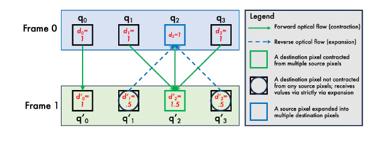

## 한 줄 정리

- optical flow를 따라 noise를 프레임 간 warping해서, video diffusion의 초기 noise 자체에 motion control 정보를 심는 방법

## motivation

- 도메인
	- text/image 조건으로 비디오를 생성할 때 원하는 motion을 제어하는 motion-controllable video generation

- 기존 문제
	- 기존 motion control 방법은 local object motion, camera motion, motion transfer가 따로 다뤄지고, 모델 구조 변경이나 별도 control module이 필요한 경우가 많음

- 해결 방식
	- optical flow 기반 noise warping + 기존 video diffusion model fine-tuning

## Main Method

- 태스크 구조
	- content 조건
		- text prompt 또는 첫 프레임 image
	- motion 조건
		- 최종적으로 optical flow 형태의 dense motion field
	- output
		- content 조건을 유지하면서 motion flow를 따르는 generated video

- Motion flow를 얻는 방법
	- reference video 사용
		- 원하는 움직임이 담긴 영상에서 optical flow를 추출
		- motion transfer나 camera movement control에 사용
	- user-defined flow 사용
		- 첫 프레임 image 위에서 움직일 영역을 mask/polygon으로 선택
		- polygon을 이동, 회전, 확대, 축소하면 프로그램이 dense optical flow로 변환
		- 사용자가 optical flow를 픽셀별로 직접 그리는 것은 아님

- 핵심 개념
	- optical flow는 noise가 아니라 각 위치의 이동량을 담은 motion map
		- 형태는 대략 $H \times W \times 2$
		- 각 위치마다 $dx, dy$가 있음
	- video diffusion의 noise는 프레임별 latent random tensor
		- 형태는 대략 $F \times C \times H \times W$
	- warping은 noise 값에 flow 값을 더하는 것이 아니라, noise의 좌표를 flow가 가리키는 위치로 옮기는 것

- 이해 보조 figure
	- 아래 그림에서 초록색 forward flow는 이전 프레임 noise가 다음 프레임 위치로 이동하는 contraction 경로이고, 파란색 reverse flow는 비어 있는 위치를 채우는 expansion 경로임

- Noise warping pipeline
	- 첫 프레임 noise는 random Gaussian noise로 샘플링
	- 다음 프레임 noise는 이전 프레임 noise를 optical flow 방향으로 이동시켜 생성
	- 이 과정을 반복해 전체 비디오 길이의 warped noise sequence를 만듦
	- 일반 random noise와 달리 warped noise는 시간적으로 motion 방향을 따르는 패턴을 가짐

- 왜 expansion/contraction 처리가 필요한가
	- optical flow는 항상 1:1 대응이 아니기 때문에 단순 이동만 하면 문제가 생김
		- 어떤 위치에는 여러 noise가 동시에 몰림
		- 어떤 위치는 아무 noise도 받지 못해 비게 됨
		- 단순 복사/합산을 하면 i.i.d. Gaussian noise 성질이 깨짐

- Contraction
	- 여러 source noise가 하나의 target 위치로 모이는 경우
	- 예: 물체가 멀어지거나 작아지는 motion
	- 여러 noise를 weighted sum으로 합친 뒤 variance가 유지되도록 normalize
	- 목적은 motion continuity를 유지하면서 Gaussian 분포를 깨지 않게 하는 것

- Expansion
	- 하나의 source noise가 여러 target 위치로 퍼져야 하는 경우
	- 예: 물체가 가까워지거나 커지는 motion
	- forward flow로 채워지지 않은 위치를 backward flow로 이전 프레임에서 당겨와 채움
	- 단순 복제로 같은 noise가 반복되면 correlation이 생기므로 density/weight로 보정
	- 목적은 빈칸을 채우면서 i.i.d. Gaussian 성질을 유지하는 것

- Density의 역할
	- noise가 특정 영역에 얼마나 압축되었는지 또는 퍼졌는지 추적하는 값
	- contraction에서는 여러 source가 모일 때 weight를 조절
	- expansion에서는 source가 퍼질 때 강한 복제 correlation이 생기지 않도록 보정
	- 결과적으로 다음 프레임 noise도 Gaussian noise처럼 유지되게 함

- Fine-tuning
	- 기존 video diffusion model 구조와 denoising objective는 그대로 사용
	- 차이는 clean video latent에 섞는 noise를 random noise가 아니라 warped noise로 바꾸는 것
	- 모델은 warped noise를 denoise하면서 noise의 시간적 패턴과 실제 video motion의 관계를 학습
	- 논문에서는 CogVideoX T2V/I2V variant를 black-box처럼 fine-tuning

- Inference
	- 원하는 motion flow를 준비
	- 해당 flow로 warped noise를 생성
	- warped noise를 diffusion sampling의 초기 noise로 사용
	- 학습된 모델은 이 noise의 시간적 구조를 따라 motion이 반영된 비디오를 생성

- Motion strength 조절
	- clean warped noise $Q$에 random Gaussian noise $\zeta$를 섞어 degradation level $\gamma$로 제어
	- 수식은 $Q_{\gamma} = \frac{(1-\gamma)Q + \gamma\zeta}{\sqrt{(1-\gamma)^2+\gamma^2}}$
	- $\gamma \to 0$이면 clean warped noise에 가까워 motion control이 강함
	- $\gamma \to 1$이면 uncorrelated Gaussian noise에 가까워 motion control이 약해짐

## 실험

- Gaussianity / efficiency 평가
	- 벤치마크
		- input은 optical flow와 이전 프레임 noise이고, output은 다음 프레임 warped noise
		- 목표는 noise가 flow를 따라 시간적으로 이어지면서도 각 프레임에서는 i.i.d. Gaussian처럼 유지되는지 확인하는 것
	- metric
		- Moran's I는 noise map 안의 공간적 autocorrelation을 측정하며, 0에 가까울수록 픽셀 간 상관이 적어 Gaussian white noise에 가까움
		- K-S test는 warped noise의 값 분포가 standard normal distribution과 얼마나 비슷한지 평가함
		- wall-time은 $1024 \times 1024$ 해상도 noise를 생성하는 데 걸리는 시간을 측정함
	- 결과
		- 제안한 warping은 Gaussianity를 유지하면서도 HIWYN보다 훨씬 빠른 real-time 수준의 속도를 보임

- Training-free image diffusion video editing
	- 벤치마크
		- input video에서 RAFT optical flow를 뽑고, image diffusion model에 frame별 warped noise를 넣음
		- output은 video relighting 또는 super-resolution 결과이며, 각 프레임 품질을 유지하면서 시간적으로 흔들리지 않아야 함
	- metric
		- PSNR/SSIM/LPIPS는 생성 프레임의 image quality 또는 perceptual quality를 평가함
		- warping error는 optical flow로 인접 프레임을 정렬했을 때 차이가 얼마나 작은지 보며 temporal consistency를 평가함
	- 결과
		- non-Gaussian interpolation 방식은 화질이나 일관성이 깨지는 반면, 제안 방법은 frame quality와 temporal consistency를 함께 유지함

- Local object / camera motion control
	- 벤치마크
		- input은 첫 프레임 image, text prompt, 사용자가 지정한 polygon/mask motion 또는 camera motion template
		- output은 object나 camera가 의도한 움직임을 따르면서도 object structure와 3D consistency가 유지된 비디오
	- metric
		- VIPSeg 기반 평가는 object region이 의도한 trajectory를 잘 따르는지 확인하는 데 사용됨
		- user study는 사람이 보기에 motion control, object fidelity, temporal consistency가 어느 방법이 더 좋은지 비교함
	- 결과
		- 기존 방법은 local motion을 global shift로 오해하거나 object distortion이 생기는 경우가 많고, 제안 방법은 object fidelity와 temporal consistency가 더 좋다고 보고함

- Motion transfer / camera movement control
	- 벤치마크
		- input은 source/reference video에서 추출한 optical flow와 target prompt 또는 target image
		- output은 target content를 유지하면서 reference video의 motion만 따라가는 새 비디오
	- metric
		- CoTracker mIoU는 reference와 generated video에서 tracking box가 얼마나 겹치는지 측정해 motion controllability를 평가함
		- optical flow error와 pixel MSE는 generated video가 target/reference motion 또는 frame과 얼마나 가까운지 비교함
		- CLIP similarity는 prompt와 생성 프레임의 semantic alignment를 평가함
		- FID/FVD/VBench는 frame quality, video distribution, temporal smoothness를 평가함
	- 결과
		- 제안 방법은 motion fidelity, text alignment, temporal consistency, subjective preference에서 baseline보다 좋다는 점을 강조함

## Ablation 또는 Analysis

- Noise warping 제거
	- original CogVideoX-5B처럼 warped noise 없이 text/initial frame만 쓰면 미래 motion을 충분히 제어하지 못함
	- warped noise를 넣으면 reconstruction, motion controllability, video quality가 개선됨

- Degradation level $\gamma$
	- $\gamma$는 warped noise와 random noise를 섞는 비율을 조절하는 hyperparameter
	- 낮은 $\gamma$는 motion flow를 더 강하게 따르게 하고, 높은 $\gamma$는 생성 자유도를 늘림

- Dataset size
	- 학습 데이터 일부만 사용한 모델은 full dataset으로 학습한 모델보다 성능이 낮음
	- motion control도 결국 다양한 motion/video 분포를 충분히 보는 것이 중요함

- Base model scale
	- CogVideoX-2B 기반 모델은 CogVideoX-5B 기반 모델보다 약한 성능을 보임
	- 방법 자체는 model-agnostic하지만 base model의 생성 능력에 영향을 받음
