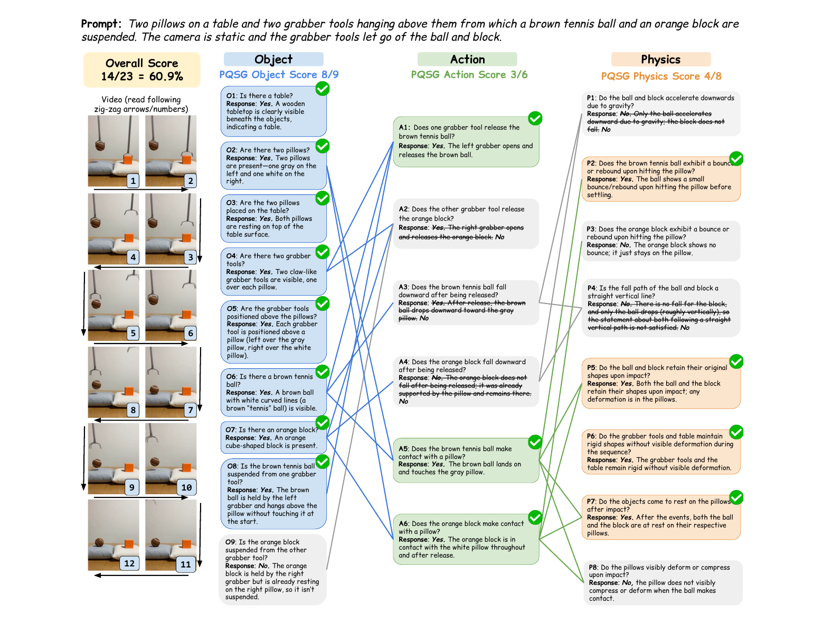

- 원문: [PQSG.pdf](PQSG.pdf)

- 한 줄 정리
	- text prompt를 `객체 → 행동 → 물리 현상`의 의존성을 가진 yes/no 질문 그래프로 분해하고 생성 영상을 순서대로 검증해, 단일 점수뿐 아니라 어느 객체·행동·물리 법칙에서 실패했는지까지 알려 주는 세밀한 T2V 평가 프레임워크

- 핵심 아이디어 먼저
	- “공이 자연스럽게 떨어졌는가?”를 평가하려면 먼저 공이 영상에 있고, 실제로 놓여서 아래로 움직였는지를 확인해야 한다. PQSG는 이 선행조건을 각각 객체 질문과 행동 질문으로 만들고, 마지막에 낙하 가속도·충돌·변형 같은 물리 질문을 연결한다.
	- 질문을 독립적인 체크리스트가 아니라 방향성 비순환 그래프(DAG)로 표현하므로, 부모 질문이 `No`이면 그 조건에 의존하는 자식 질문도 자동으로 `No`가 된다. 따라서 존재하지 않는 공의 낙하를 VLM이 억지로 판정하는 식의 모순과 환각을 줄인다.
	- 각 질문에는 yes/no 판정과 관찰 근거가 함께 남고, 이를 객체·행동·물리별 점수로 모을 수 있다. 즉, “영상이 나쁘다”에서 끝나지 않고 “요청한 낙하 자체가 없었다”와 “낙하는 있었지만 충돌이 비현실적이었다”를 구분한다.
	- 예를 들어 두 grabber가 공과 블록을 놓는 장면에서 블록이 처음부터 베개 위에 있다면, `블록이 매달려 있는가? → 블록을 놓는가? → 블록이 중력으로 낙하하는가?`라는 경로 전체가 실패로 전파된다.

- motivation
	- 도메인: text-to-video 생성 모델의 prompt 충실도와 물리적 사실성을 자동 평가하는 문제
	- 기존 문제: 기존 metric은 영상 전체에 하나의 물리·정합성 점수를 주는 경우가 많아, 객체 누락·행동 누락·비현실적 물리 중 무엇 때문에 실패했는지 구분하지 못하고 선행조건이 성립하지 않는 물리 현상도 직접 판정한다.
	- 해결 방향: VLM 기반 question generation과 video question answering을 결합한 계층적 질문 그래프 평가

- Main Method
	- 핵심 Figure
		- 

	- 문제 설정과 최종 출력
		- 입력: T2V에 사용한 text prompt $p$와 그 prompt로 생성한 video $v$
		- 처리: 먼저 $p$만 보고 평가 질문 그래프를 만든 뒤, $v$를 보면서 그래프의 질문을 조건에 맞게 답한다.
		- 출력: 각 질문의 `Yes/No + 근거`, 객체·행동·물리 category별 점수, 전체 점수
		- 핵심 차이: prompt에 명시된 행동을 했는지와, 그 행동이 암묵적으로 따라야 할 물리 법칙을 지켰는지를 별도 node로 분리한다. 따라서 “공이 떨어지지 않음”은 action 실패, “떨어지지만 가속이나 충돌이 부자연스러움”은 physics 실패로 찾을 수 있다.

	- Stage 1. Question Generation(QG): prompt를 평가용 그래프로 변환
		- 입력: task instruction, 고품질 in-context example 1개, 새 text prompt $p$이다. 생성된 video는 이 단계에 넣지 않는다.
		- VLM이 정답 영상이라면 모두 `Yes`여야 하는 원자적 질문을 만들고, JSON의 `nodes`와 `edges`로 출력한다. 한 질문은 한 사실만 확인하고 다른 질문과 의미가 겹치지 않도록 한다.
		- Object node $O_i$: prompt의 핵심 물체가 존재하고 수량·속성·배치가 맞는지 확인한다. 예: “두 개의 베개가 있는가?”
		- Action node $A_i$: prompt가 직접 요구한 행동이나 물체-행동 결합이 실제로 나타나는지 확인한다. 예: “grabber가 갈색 공을 놓는가?”
		- Physics node $P_i$: prompt에는 직접 쓰이지 않았지만 현실이라면 따라야 하는 중력, 충돌, 변형, 유체 흐름, 반사 등의 결과가 그럴듯한지 확인한다. 예: “공이 베개에 부딪힐 때 베개가 눌리는가?”
		- edge는 부모 조건이 자식 질문을 판단하는 데 반드시 필요할 때만 연결한다. 대표 흐름은 $O\rightarrow A\rightarrow P$이며, 시간적 선후관계가 필요하면 같은 category 안의 $O\rightarrow O$, $A\rightarrow A$, $P\rightarrow P$도 허용한다.
		- 출력은 질문 집합과 의존 edge를 가진 DAG $G=(V,E)$이다. 순환이나 필요하지 않은 연결을 금지해, 각 edge가 실제 논리적 선행조건을 뜻하게 한다.

	- Stage 2. Question Answering(QA): video에서 조건부로 질문 검증
		- 입력: generated video $v$와 현재 node의 질문 하나이다. 질문을 한 번에 몰아서 답하지 않고 node별로 독립 호출한다.
		- 현재 node의 모든 부모가 `Yes`이면 VLM이 먼저 자유형식으로 관찰 근거를 설명하고, 같은 VLM이 그 답을 다시 `Yes/No`로 분류한다. 바로 이진 답만 요구할 때보다 reasoning을 유도하기 위한 2단계 QA이다.
		- 부모 중 하나라도 `No`이면 해당 자식과 그 아래 descendant는 video에 질의하지 않고 자동으로 `No` 처리한다. 예를 들어 공이 없으면 “공이 낙하했는가?”와 “낙하가 중력을 따르는가?”도 실패로 전파한다.
		- 이 전파는 “물리 현상을 관찰할 수 없음”을 좋은 물리 점수로 오해하지 않게 한다. 생성 모델이 물리적으로 어려운 행동 자체를 생략해서 평가를 회피하는 것도 막는다.
		- 출력: node별 이진 판정 $y_i\in\{0,1\}$과 사람이 읽을 수 있는 근거

	- 점수 계산과 해석
		- category $c$의 점수는 그 category에서 `Yes`인 질문의 비율인 $S_c=\frac{\sum_{i\in c}y_i}{|V_c|}$로 계산한다. 자동으로 무효화된 자식도 $y_i=0$으로 분모에 남는다.
		- 전체 점수도 모든 node의 `Yes` 비율 $S=\frac{\sum_i y_i}{|V|}$이며, Figure의 예시는 $14/23=60.9\%$이다.
		- category별 점수는 실패 위치를 알려 주고, 질문·근거·edge는 그 실패가 “객체가 없어서 내려온 결과”인지 “행동은 있었지만 물리가 틀린 결과”인지 추적하게 해 준다.
		- 논문의 주목적은 해석 가능한 세부 진단이지만, 전체 점수는 모델 ranking이나 사람의 overall rating과 비교할 때 사용할 수 있다.

	- Training과 inference 구분
		- 별도의 model training이나 T2V model 수정은 없다. QG와 QA 모두 pretrained VLM을 prompting해 사용하며, Gemini-2.5-Pro와 GPT-5.5 등을 backbone으로 실험한다.
		- inference에서는 prompt마다 QG를 실행하고, 생성 영상마다 그래프를 따라 여러 번 QA를 호출한다. 따라서 model-agnostic이지만 질문 수만큼 VLM 호출이 필요하고, 성능 상한은 QA VLM의 video·물리 이해력에 좌우된다.

- FinePhyEval 구축
	- Prompt와 video
		- Physics-IQ의 65개 prompt를 모두 사용한다. 각 prompt는 여러 물체와 상호작용을 포함하며 solid mechanics, fluid dynamics, optics, thermodynamics, magnetism을 다룬다.
		- 사람 평가의 중심 dataset은 Sora 2, Veo 3, Wan 2.1이 prompt별로 생성한 $65\times3=195$개 video이다. 평균 길이는 4.39초이며 모델별 기본 해상도와 FPS를 유지한다.
		- Cosmos-Predict2.5-14B도 같은 65개 prompt로 추가 생성해 자동 PQSG model 비교에는 포함한다. 따라서 생성물 전체는 260개이지만, Likert annotation과 Table 12가 말하는 FinePhyEval의 주 human-evaluation split은 195개이다.

	- Human annotation
		- QG ground truth: 20개 prompt에 대해 prompt 내용을 빠짐없이 덮고 서로 겹치지 않는 atomic verification question을 사람이 작성한다.
		- QA ground truth: 30개 prompt-video pair에서 생성 질문에 사람이 yes/no를 달아 총 444개 QA pair를 만든다.
		- Video-level score: 195개 video 각각에 객체, 행동, 물리, overall의 네 항목을 1~5 Likert scale로 평가해 총 780개 category score를 수집한다. annotator는 생성 모델의 한계를 봐주지 않고 현실 영상처럼 판단하며, prompt 정합성과 물리성은 분리해 채점한다.
		- 50개 video의 pilot에서 평균 ICC는 0.84로 높았지만, physics의 Krippendorff's $\alpha$는 0.543으로 네 category 중 가장 낮았다. 심하게 무너진 물리를 얼마나 나쁘게 볼지에는 사람 사이에도 상대적으로 큰 차이가 있음을 보여 준다.

- 실험
	- Benchmark와 metric
		- FinePhyEval 전체 video 평가: prompt-video pair를 metric에 넣고 얻은 전체 점수가 사람의 overall Likert score와 얼마나 함께 움직이는지 Pearson's $r$, 순위가 얼마나 일치하는지 Kendall's $\tau$와 Spearman's $\rho$로 측정한다.
		- Category별 평가: PQSG의 object/action/physics 점수를 같은 category의 human Likert score와 Pearson's $r$로 비교해, 세부 점수가 실제로 해당 실패 유형을 반영하는지 확인한다.
		- QG 평가: 사람이 만든 질문의 의미를 생성 질문이 얼마나 빠짐없이 덮는지를 recall, 생성 질문 중 사람이 의도한 내용을 실제로 덮는 비율을 precision으로 수작업 판정한다.
		- QA 평가: 같은 질문에 대한 VLM의 yes/no와 사람의 yes/no가 일치한 비율인 accuracy를 object/action/physics별로 계산한다.
		- VideoPhy-2 generalization: 외부의 100개 prompt-video pair에서 prompt 내용 충실도인 Semantic Adherence(SA)와 현실 물리 상식 준수도인 Physical Commonsense(PC)에 대한 human judgment correlation을 측정한다.

	- 핵심 결과
		- Human overall score와의 상관에서 GPT-5.5 기반 PQSG는 $r=0.478$, $\tau=0.336$, $\rho=0.456$으로 가장 높았다. 기존 최고 baseline인 Direct VQA의 $r=0.382$보다 높아, 세부 질문 분해가 단순 1~5점 직접 질의보다 사람 판단에 잘 맞았다.
		- 사람의 overall score는 object $r=0.44$, action $r=0.66$, physics $r=0.85$ 순으로 강하게 연결되었다. 사람이 영상 전체 품질을 정할 때 물리적 오류를 특히 크게 본다는 뜻이다.
		- GPT-5.5 QA의 category별 human correlation은 object $0.59$, action $0.68$, physics $0.48$이었다. Human QA로 바꾸면 각각 $0.59$, $0.73$, $0.57$이 되어, 남은 병목이 특히 action·physics 질문을 video에서 답하는 능력임을 보여 준다.
		- PQSG의 `object/action/physics/overall` 점수는 Sora 2가 $95\%/75\%/69\%/78\%$, Veo 3가 $98\%/78\%/68\%/80\%$, Wan 2.1이 $86\%/53\%/46\%/59\%$, Cosmos-14B가 $93\%/56\%/46\%/62\%$였다. 모든 모델에서 object보다 action과 physics가 어렵고, 이 평가에서는 두 closed-source model이 두 open-source model보다 높았다.
		- QG는 Gemini-2.5-Pro가 precision/recall $95.2\%/95.2\%$, GPT-5.5가 $92.0\%/99.6\%$로 사람 질문을 잘 재현했다. 반면 QA의 physics accuracy는 Gemini $61.5\%$, GPT-5.5 $64.6\%$에 그쳐 질문 생성보다 질문 답변이 명확한 병목이었다.
		- VideoPhy-2에서는 PQSG를 적용해 SA correlation이 $0.450\rightarrow0.550$, PC correlation이 $0.420\rightarrow0.498$로 올라, 다른 dataset과 open-source VLM 설정에서도 개선이 유지되었다.
		- PQSG의 세부 실패 feedback으로 Wan 2.2 TI2V-5B의 prompt를 GPT-5.5가 반복 수정하게 하자 첫 refinement에서 평균 점수가 약 15% 상승했고, 두 번째 뒤 $81.9\%$에 도달한 후 plateau가 나타났다. 평가 결과를 architecture 수정이나 재학습 없이 생성 개선 신호로도 쓸 수 있음을 보인 실험이다.

- Ablation 또는 Analysis
	- Dependency graph 제거
		- 부모 실패를 자식에 전파하지 않고 모든 질문을 독립적으로 물으면 human correlation이 GPT-5 QA 기준 $0.478\rightarrow0.44$, Human QA 기준 $0.80\rightarrow0.75$로 하락했다. 논리적 선행조건이 hallucinated·무의미한 물리 판정을 줄이는 데 실제로 기여한다.
	- Fine-grained question 제거
		- object/action/physics를 각각 Direct VQA로 한 번씩 채점해 평균하면 correlation이 GPT-5 QA $0.478\rightarrow0.40$, Human QA $0.80\rightarrow0.68$로 가장 크게 떨어졌다. 원자적 질문 분해 자체가 핵심 구성요소이다.
	- Reference video를 QG 입력에 추가
		- 사람이 찍은 정답 video를 질문 생성 때 함께 주면 correlation이 $0.478\rightarrow0.418$로 낮아졌다. VLM이 prompt가 요구한 사실 대신 reference video의 부수적 장면까지 질문하는 문제가 생겼다.
	- Action과 Physics의 정의를 prompt에서 더 강하게 제약
		- action은 명시된 것만, physics는 추론된 것만 만들라는 추가 문구를 넣으면 오히려 질문의 일관성이 깨져 correlation이 $0.478\rightarrow0.407$로 떨어졌다.
	- QA failure mode
		- 빠른 동작과 연기 방향·밀도 같은 복잡한 시공간 현상을 놓치며, 실제로 보이지 않는 현상도 상식상 일어날 법하다는 이유로 `Yes`라고 답하는 yes-bias가 나타났다. 그 결과 물리 질문 accuracy가 약 65%에 머문다.
	- QG failure mode
		- 현재 prompt의 주 객체 외에 이후 상호작용할 수 있는 주변 물체와 미래 상태를 빠뜨리는 경우가 주된 recall 오류였다. 다만 전체 precision과 recall은 90% 이상이었다.
	- 평가 범위의 한계
		- PQSG는 prompt로부터 질문을 만들기 때문에 prompt가 명시하거나 함의한 상호작용만 검사한다. 배경에서 새로 생긴 물체처럼 prompt 밖의 비현실적 현상은 사람이 보더라도 점수에 반영되지 않을 수 있다.
	- 재현성과 비용
		- 주 실험은 closed-source VLM에 의존하고, 그래프 생성 뒤 node별 QA 호출이 필요하다. 코드는 공개하고 open-source VLM generalization도 보였지만, 실제 사용 비용·latency와 QG run 간 질문 변동성을 함께 고려해야 한다.

- 용어 메모
	- Atomic verification question: 한 질문에서 한 가지 사실만 yes/no로 확인하는 최소 단위 질문
	- Dependency graph: 어떤 질문을 판단하기 전에 반드시 참이어야 하는 선행 질문을 edge로 기록한 그래프
	- DAG(Directed Acyclic Graph): edge에 방향은 있지만 순환 경로는 없는 그래프. 부모에서 자식으로 실패를 한 방향으로 전파할 수 있다.
	- QG(Question Generation): text prompt를 객체·행동·물리 질문과 edge로 바꾸는 단계
	- QA(Question Answering): generated video를 보고 그래프의 각 질문에 근거와 yes/no를 답하는 단계
	- Yes-bias: 관찰 증거가 부족하거나 실제 장면이 틀렸는데도 질문 내용이 상식적으로 그럴듯하다는 이유로 `Yes`를 과도하게 선택하는 경향
