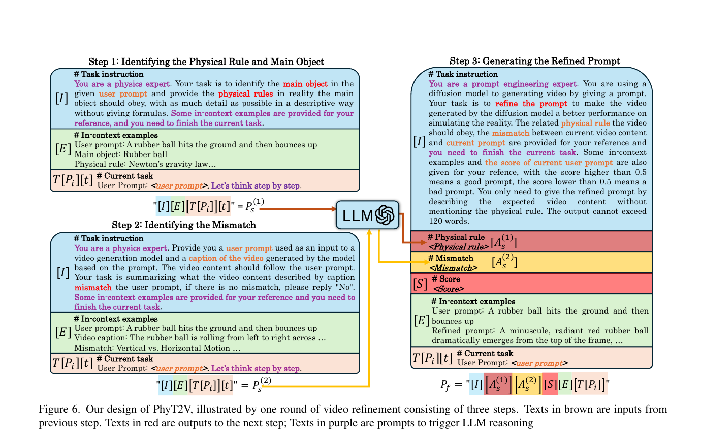

- 원문: [PhyT2V.pdf](PhyT2V.pdf)

- 한 줄 정리
	- 생성된 영상을 caption으로 다시 읽고, LLM이 `물리 규칙`과 `현재 영상의 실패`를 진단해 프롬프트를 반복 수정함으로써, T2V 모델을 재학습하지 않고 물리적 사실성을 높이는 inference-time 프레임워크

- 핵심 아이디어 먼저
	- 기존 prompt enhancer는 처음 받은 문장을 한 번 풍부하게 만들 뿐, 실제로 생성된 영상이 무엇을 틀렸는지는 보지 않는다.
	- PhyT2V는 먼저 영상을 생성한 뒤 captioning model로 그 결과를 텍스트화하고, LLM이 원래 의도와의 mismatch를 찾아낸다. 동시에 원래 prompt에서 물체와 지켜야 할 물리 규칙도 추출한다.
	- 이후 `물리적으로 무엇이 일어나야 하는가`와 `현재 영상은 무엇을 잘못했는가`를 함께 넣어 다음 prompt를 만들고, 영상을 다시 생성한다.
	- 예를 들어 “사과가 단단한 바닥에 떨어진다”에서 여러 사과가 고무공처럼 튀었다면, 다음 prompt는 사과가 하나라는 점과 충돌 시 변형·에너지 손실로 거의 튀지 않아야 한다는 점을 구체적인 장면 묘사로 바꿔 준다.

- motivation
	- 도메인: text-to-video 생성에서 중력, 충돌, 유체, 광학, 열 변화와 같은 현실 물리 규칙을 따르게 하는 문제
	- 기존 문제: 데이터 추가나 depth·edge·3D engine 같은 별도 조건에 의존하는 방법은 학습 분포 밖의 새로운 물체·상호작용에 일반화하기 어렵고, 단발성 prompt enhancement는 실제 생성 실패를 피드백받지 못한다.
	- 해결 방향: video caption feedback + LLM의 local chain-of-thought(CoT) + global step-back reasoning을 이용한 반복적 prompt refinement

- Main Method
	- 핵심 Figure
		- 

	- 전체 구성요소와 데이터 흐름
		- 입력은 사용자의 짧은 prompt $P_i$이고, 현재 T2V model $V$가 video $V(P_i)$를 생성한다.
		- video captioning model $C$가 생성 영상을 caption $C(V(P_i))$으로 바꾼다. 이 덕분에 이후의 물리 추론과 영상-prompt 비교를 모두 text domain에서 수행할 수 있다.
		- LLM은 Step 1과 Step 2의 결과, evaluator score $S_i$, 현재 prompt를 받아 refined prompt $P_{i+1}$을 출력한다.
		- 새 prompt로 다시 영상을 생성하며, 결과가 충분히 좋거나 round 간 향상이 수렴할 때까지 이 과정을 반복한다.
		- 개념적으로는 다음과 같다.
			- $P_{i+1}=f_{\mathrm{enhance}}\!\left(P_i, f_{\mathrm{phy}}(P_i), f_{\mathrm{mismatch}}(C(V(P_i)),P_i), S_i;\theta\right)$
			- 기존 enhancer가 $P_i$만 고치는 것과 달리, 실제 생성 결과에서 얻은 mismatch와 prompt에서 추론한 물리 규칙이 매 round 추가된다는 점이 핵심이다.

	- Step 1. 물리 규칙과 주 객체 식별 - local CoT
		- 입력: 현재 prompt $P_i$
		- 처리: LLM에 physics expert 역할을 부여하고, 주 객체와 그 객체가 현실에서 따라야 할 물리 규칙을 수식 없이 자세히 기술하게 한다.
		- prompt는 task instruction $[I]$, QA 형태의 in-context example $[E]$, 현재 task $[T(P_i)]$, “Let's think step by step” trigger $[t]$로 구성된다.
		- 출력: 주 객체와 물리 규칙을 담은 고수준 설명 $A_s^{(1)}$
		- 필요한 이유: 단순히 prompt를 장황하게 만드는 대신, 운동 방향·상태 변화·변형·에너지 손실처럼 영상에 실제로 나타나야 할 현상을 먼저 고정한다.

	- Step 2. 생성 영상과 prompt의 mismatch 식별 - local CoT
		- 입력: 현재 prompt $P_i$와 captioning model이 만든 현재 영상 caption
		- 처리: LLM이 caption 속 객체·행동·상호작용을 원래 prompt와 단계적으로 대조한다. 차이가 없으면 `No`를 출력하도록 지시한다.
		- Step 1과 독립적이므로 두 단계는 병렬로 수행할 수 있다.
		- 출력: 누락, 잘못된 수량, 잘못된 운동·상태 변화처럼 관찰된 실패를 요약한 $A_s^{(2)}$
		- 필요한 이유: 물리 지식만 일반적으로 덧붙이는 대신, 방금 생성된 영상이 실제로 실패한 부분을 다음 round의 수정 목표로 만든다.

	- Step 3. refined prompt 생성 - global step-back reasoning
		- 입력: $P_i$, Step 1의 물리 규칙 $A_s^{(1)}$, Step 2의 mismatch $A_s^{(2)}$, 현재 영상의 evaluator score $S_i$, in-context examples
		- 처리: 앞선 두 답을 복잡한 문제에서 한 단계 물러나 얻은 고수준 사실로 사용해, 물리 규칙을 만족하고 mismatch를 해소하는 장면을 다시 서술한다.
		- score가 $0.5$보다 낮으면 이전 수정이 좋지 않았다는 신호로 제시해 다른 reasoning path를 택하도록 유도한다. 다만 논문은 전체 loop의 종료에 사용할 고정 score threshold는 명시하지 않는다.
		- 최종 prompt가 물리 법칙 이름이나 불필요한 추론을 그대로 읊지 않고 예상 영상 내용만 묘사하도록 제한하며, T2V 입력 길이에 맞춰 최대 120단어로 자른다.
		- Step 1·2와 달리 “Let's think step by step” trigger는 제거한다. 이미 정보가 긴 Step 3에서 원래 장면과 무관한 설명이 최종 prompt에 섞이는 것을 막기 위해서다.
		- 출력: 다음 round의 T2V 입력이 되는 $P_{i+1}$

	- 반복 및 종료
		- $P_{i+1}\rightarrow V(P_{i+1})\rightarrow C(V(P_{i+1}))$로 새 round를 시작하고 동일한 세 단계를 반복한다.
		- evaluator가 만족스러운 품질을 판단하거나, base T2V model의 한계 때문에 여러 round 동안 개선 폭이 거의 없어지면 종료한다.
		- 실험에서는 대부분의 향상이 처음 두 번의 refinement에서 발생해 총 3~4 round면 충분했다.

	- 학습과 inference 구분
		- 별도의 training은 없다. T2V model, video captioning model, LLM, evaluator를 모두 pretrained 상태로 사용하며 parameter update를 하지 않는다.
		- 필요한 것은 inference 시 round마다 `video 생성 → caption → 두 LLM 진단 → prompt 재작성 → 평가`를 수행하는 것이다. 따라서 data-independent이지만, 여러 번의 video generation과 LLM 호출 비용은 발생한다.

- 실험
	- 설정
		- reasoning LLM은 ChatGPT-4 o1-preview, video captioner는 Tarsier를 사용하고, T2V backbone은 CogVideoX-5B/2B, OpenSora 1.2, VideoCrafter를 평가한다.
		- 생성 영상은 6초, $720\times480$으로 통일했다. FPS는 본문에 10 FPS, Appendix A에 8 FPS로 서로 다르게 적혀 있다.

	- Benchmark와 metric
		- VideoPhy: solid-solid, solid-fluid, fluid-fluid 등 현실 물체 상호작용을 서술한 688개의 human-verified caption을 prompt로 주고, 생성 영상이 해당 상호작용을 물리적으로 올바르게 보여 주는지 평가한다.
		- PhyGenBench: mechanics, optics, thermal, material의 네 물리 영역을 다루는 160개 prompt benchmark이다. 이 논문은 material을 제외하고 mechanics·optics·thermal 세 영역을 사용한다.
		- Physical Commonsense (PC): VideoCon-Physics evaluator가 행동과 물체 상태가 현실 물리 법칙을 따르는지 prompt별로 0/1 판정한 뒤 평균한다. 예를 들어 물에 넣은 돌이 떠 있거나 사과가 고무공처럼 튀면 낮아진다.
		- Semantic Adherence (SA): 요청한 객체, 행동, 사건과 상호작용이 영상에 실제로 등장하는지 prompt별로 0/1 판정한 뒤 평균한다. 물리적으로 그럴듯해도 핵심 객체나 행동이 빠지면 낮아진다.
		- VBench: 화질뿐 아니라 video-condition consistency, subject/background consistency, motion smoothness, human preference 등 여러 생성 품질 축을 함께 평가한다.

	- 핵심 결과
		- CogVideoX-2B에서 최대 향상이 나타났다. VideoPhy PC는 $13\%\rightarrow29\%$로 약 $2.2\times$, PhyGenBench SA는 $15\%\rightarrow35\%$로 약 $2.3\times$가 되었다.
		- CogVideoX-5B의 VideoPhy 결과도 PC $26\%\rightarrow42\%$, SA $48\%\rightarrow59\%$로 상승했다. 즉, 단순한 prompt 충실도뿐 아니라 실제 물리 준수율도 함께 좋아졌다.
		- 논문은 일반 prompt enhancer보다 최소 35% 우수하다고 요약한다. 대표적으로 VideoPhy에서 CogVideoX-5B의 SA는 ChatGPT-4 enhancer $41\%\rightarrow$ PhyT2V $59\%$, OpenSora의 PC는 $21\%\rightarrow31\%$였다.
		- 대부분의 지표는 Round 1에서 Round 3 사이에 크게 오르고 Round 4에서는 개선이 작거나 일부 하락했다. 무한 반복보다 3~4 round에서 멈추는 편이 합리적이다.
		- 영역별로는 미세한 물체 상호작용이 필요한 fluid 및 thermal 장면에서 특히 큰 이득을 보였고, VBench에서도 주로 prompt와 영상의 조건 일치도를 나타내는 축이 개선되었다.

- Ablation 또는 Analysis
	- Step 1 - physical rule reasoning 제거
		- 물체의 운동·상태·변형을 물리 법칙에 연결하지 못해 refined prompt에 막연하거나 불필요한 설명이 늘고 PC가 낮아졌다. 즉, 물리 지식 추출은 “무엇이 보여야 하는가”를 구체화한다.
	- Step 2 - mismatch reasoning 제거
		- 이전 영상에서 빠뜨린 핵심 객체·행동을 표적 수정하지 못해 SA가 낮아졌다. 즉, caption feedback은 “현재 무엇이 틀렸는가”를 구체화한다.
	- LLM role indicator 제거
		- `physics expert` 같은 역할 문장을 없애면 출력의 물리 정보가 덜 정밀해졌다.
	- In-context example 제거
		- LLM이 요구한 형식대로 답하지 못하는 경우가 늘어, 예시가 내용뿐 아니라 출력 형식도 고정하는 역할을 했다.
	- T2V model 크기
		- CogVideoX-5B가 2B보다 refined prompt의 물리 정보를 더 잘 영상화했다. PhyT2V는 base model에 없는 생성 능력을 새로 학습시키기보다, 이미 잠재된 능력을 prompt로 꺼내는 방법이므로 backbone capacity의 영향을 받는다.
	- Failure mode
		- 긴 시간의 flickering과 불연속 trajectory처럼 base model 구조 자체의 temporal coherence 문제는 prompt만으로 고치기 어렵다.
		- 학습 데이터에 드문 복잡한 물리 현상과 손가락 같은 어려운 인체 구조도 여러 round 뒤까지 실패했다.
	- 구조적 한계
		- LLM은 영상을 직접 보지 않고 caption만 보므로, captioner가 놓치거나 잘못 기술한 현상은 mismatch feedback에서도 사라질 수 있다. 이 caption bottleneck은 논문에서 정량 ablation하지 않았다.
		- 재학습이 없다는 장점과 별개로, 각 round에 T2V 생성·captioning·평가와 여러 LLM 호출이 필요하다. 논문은 품질 향상은 보고하지만 latency와 inference cost는 비교하지 않는다.

- 용어 메모
	- Local CoT reasoning: Step 1과 Step 2 각각에서 한 가지 하위 문제만 단계적으로 풀어, 물리 규칙과 mismatch를 따로 얻는 과정
	- Global step-back reasoning: 두 하위 문제의 답을 고수준 단서로 먼저 확보한 뒤, 그 단서에서 출발해 전체 prompt를 다시 쓰는 과정
	- Semantic mismatch: 원래 prompt가 요구한 객체·행동·상태와 생성 영상 caption 사이의 차이
	- Data-independent: 새 학습 데이터나 fine-tuning이 필요 없다는 뜻이며, 외부 pretrained LLM·captioner·evaluator가 필요 없다는 뜻은 아니다.
