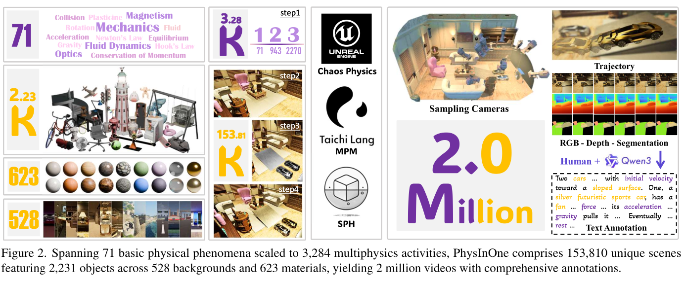

- 한 줄 정리
	- 71개 일상 물리 현상을 조합한 153,810개 동적 3D scene을 여러 simulator로 생성하고, 13개 camera view와 geometry·semantics·motion·물성·text annotation을 제공하는 200만 video 규모의 visual physics 학습 suite

- motivation
	- 도메인: video generation, future prediction, inverse physics 등 시각 관측으로 실제 세계의 물리 dynamics를 학습·추론하는 visual physics
	- 기존 문제: 기존 dataset은 수십~수천 scene, 단순 물체·배경, 좁은 현상에 치우쳐 복잡한 multiobject·multiphysics dynamics를 foundation model에 학습시키기 어려움
	- 해결 방향: 대규모 synthetic 3D simulation dataset + dense ground-truth annotation + application benchmark

- Main Method
	- 핵심 Figure
		- 

	- 1. 물리 현상과 activity 정의
		- 일상에서 시각적으로 관찰 가능한 mechanics, optics, fluid dynamics, magnetism의 네 영역을 대상으로 71개 basic physical phenomenon을 선정한다. 온도·소리처럼 추가 sensor가 필요한 thermodynamics와 acoustics는 제외한다.
		- 각 현상을 Newton's laws, momentum conservation, Hooke's law, Bernoulli principle 등의 지배 법칙과 연결한다.
		- 실제 장면은 여러 현상이 동시에 또는 순차적으로 나타나므로, 71개 single-physics activity에 물리적으로 의미 있는 943개 double-physics와 2,270개 triple-physics 조합을 더해 총 3,284개 conceptual activity를 만든다.

	- 2. 3D asset pool 구축
		- Object: 약 163 category의 일상 물체 2,231개를 수집한다. 물체는 solid, movable part가 있는 interactable, 파괴 가능한 destructible, deformable, granular, liquid 유형을 포함한다.
		- Material: plastic, metal, wood, stone, fabric 계열의 623개 material을 수집한다. density, friction, restitution 등 물성을 바꿔 동일 형상의 동작 변형을 만든다.
		- Background: living room, factory, swimming pool 등 실내외 환경과 scale이 다양한 528개 복잡한 3D background를 사용한다.

	- 3. Multiobject·multiphysics scene 생성
		- 각 activity에 물리적으로 가능한 background를 배정하고, 상호작용할 여러 object를 배치한 뒤 material과 물성값을 변화시킨다.
		- 이 과정을 activity당 평균 46.84개 변형으로 확장해 153,810개 고유 scene을 만든다. scene당 평균 object 수는 single/double/triple-physics에서 각각 3.9/6.3/7.8개로, 결합 현상이 늘수록 장면 복잡도도 증가한다.

	- 4. 물리 simulation
		- UE5의 Chaos Physics가 rigid-body interaction을 포함한 대부분의 일상 물리 현상을 처리한다.
		- 형태가 변하는 elastic·plastic object와 모래 같은 granular material은 Taichi 기반 Material Point Method(MPM)로 simulation한다.
		- 물·우유·크림 등의 liquid는 Doriflow의 Smoothed Particle Hydrodynamics(SPH)로 simulation한다.
		- 즉 하나의 scene 안에서도 object type에 맞는 simulator를 결합해 복잡한 물리 activity 전체를 생성한다.

	- 5. Camera sampling과 video rendering
		- 각 scene의 위쪽 반구에 elevation $30^\circ\!\sim\!60^\circ$인 12개 static camera를 배치하고, activity 주변을 도는 1개 moving monocular camera를 추가한다.
		- 총 13개 view에서 전체 activity를 $1120\times1120$, 30 FPS로 rendering한다. laser scene 8,780개는 60 FPS이며, video 평균 길이는 약 5.2초이다.
		- 결과적으로 153,810개 scene에서 약 200만 video를 얻는다.

	- 6. Annotation과 split
		- Geometry: metric depth map, object mesh, camera pose를 제공한다.
		- Semantics: frame별 object mask와 object 정보를 제공한다.
		- Motion·properties: dynamic object의 3D trajectory와 material/physical parameter ground truth를 제공한다.
		- Text: annotator가 최소 세 camera view로 scene을 세 번 이상 관찰해 초기 상태, object별 동작·상호작용, 지배 물리 법칙을 평균 64단어의 paragraph로 기술하고, Qwen3-VL-235B-A22B-Thinking으로 문법·명료성·완전성을 교정한다.
		- Train/validation/test를 8:1:1로 분할하되 71개 현상의 비율을 유지하고, 동일 3D asset이 서로 다른 split에 나타나지 않게 해 leakage를 막는다.

	- 7. Physical Motion Fidelity(PMF)
		- 생성 video $V_{\mathrm{gen}}$와 동일 초기 조건의 reference $V_{\mathrm{ref}}$에 RGB·공간·시간축 3D DFT를 적용하고, 각 frequency의 정규화 energy distribution을 구한다.
		- 정규화 energy는
		$$
		E_{u,v,s}=
		\frac{\sum_c|\tilde V(c;u,v,s)|^2}
		{\sum_{u',v',s'}\sum_c|\tilde V(c;u',v',s')|^2}
		$$
		이며 두 distribution의 total variation distance로
		$$
		\mathrm{PMF}(V_{\mathrm{gen}},V_{\mathrm{ref}})
		=-\ln\left(\frac{1}{2}\sum_{u,v,s}
		|E^{\mathrm{gen}}_{u,v,s}-E^{\mathrm{ref}}_{u,v,s}|\right)
		$$
		를 계산한다. 점수가 높을수록 reference와 motion dynamics가 비슷하다.
		- Pixel 위치나 밝기의 절대 일치보다 motion pattern을 보려는 metric으로, 정규화 spectral energy는 전역 시공간 shift와 brightness scaling에 불변이다.

- 실험
	- Benchmark와 metric
		- Physics-aware video generation: 첫 frame과 text를 입력해 이후 video를 생성한다. 83,650개 text-video pair로 SVD-XT, CogVideoX-1.5-5B, Wan2.2-5B를 LoRA/SFT/final-layer tuning하고, test-small 772 pair에서 motion의 PMF, feature distribution 기반 영상 품질인 FVD, reference를 본 34명의 평가자가 trajectory·smoothness·shape/semantic consistency 등을 순위화한 human rating을 측정한다.
		- Long-term future prediction: test-mini 103 scene의 앞 절반 video를 입력해 약 2.6초 뒤의 나머지 약 78 frame을 예측한다. TiNeuVox·DefGS·FreeGave·TRACE는 multiview로 학습한 4D representation에서 seen/novel view를 예측하고, ExtDM·MAGI-1은 monocular video continuation을 수행한다.
		- Continuous short-term future prediction: validation 103 scene에서 관측 frame이 순차적으로 들어올 때마다 다음 10 frame을 반복 예측한다. Long-/short-term 모두 PMF와 함께 pixel fidelity인 PSNR/SSIM, perceptual distance인 LPIPS를 사용한다.
		- Physical property estimation: 5개 material 유형에서 4개씩 뽑은 test-tiny 20 scene의 multiview video로 PAC-NeRF와 GIC가 dynamic 3D representation을 복원한 뒤 Young's modulus $E$, Poisson ratio $\nu$, yield stress $\tau_Y$, viscosity $\mu$, bulk modulus $\kappa$, friction angle $\theta_{\mathrm{fric}}$, 초기 속도 등을 회귀한다. Parameter ground truth와의 오차를 측정하고, 추정값으로 초기 조건을 바꿔 resimulation한 video를 PMF/PSNR/SSIM/LPIPS로 reference와 비교한다.
		- Motion transfer: source video의 motion을 다른 object가 있는 target 첫 frame에 옮겨 target 외관을 유지한 video를 생성한다. Validation에서 physics activity는 같고 주 object의 shape/material만 다른 273 pair를 구성해 GoWithTheFlow와 MotionPro를 PMF/PSNR/SSIM/LPIPS로 평가한다.

	- 결과
		- Video generation에서는 SFT가 가장 안정적이었다. SVD의 PMF는 $2.753\rightarrow3.147$, Wan2.2-5B는 $2.041\rightarrow2.978$로 향상되어 PhysInOne fine-tuning이 motion plausibility를 실제로 높일 수 있음을 보였다.
		- Long-term prediction의 seen view에서는 MAGI-1이 PMF 4.086으로 가장 높았지만, 4D 방법은 novel view에서 PMF와 모든 영상 지표가 크게 하락했다. 복잡한 dynamics를 3D로 extrapolation하는 능력이 아직 부족하다.
		- Physical property estimation에서는 GIC가 PAC-NeRF보다 대체로 나은 reconstruction/resimulation 결과를 냈지만, 두 방법 모두 복잡한 object·boundary·background에서 ground-truth 물성을 정확히 찾지 못했다.
		- Motion transfer의 PMF는 GoWithTheFlow 3.309, MotionPro 3.484에 머물렀다. 두 방법은 외관은 비교적 유지하지만 moving car·falling ball이 얽힌 복합 motion은 제대로 전달하지 못했다.

- Ablation 또는 Analysis
	- Fine-tuning strategy: SFT는 SVD와 Wan2.2에서 PMF를 가장 크게 높인 반면 LoRA와 final-layer tuning의 효과는 일관되지 않았다. PhysInOne의 물리 정보를 흡수하려면 제한된 adapter보다 충분한 model capacity를 갱신하는 편이 유리함을 시사한다.
	- Physics domain: 대체로 magnetism과 fluid dynamics의 PMF가 높고 mechanics와 optics가 낮았다. 충돌·회전처럼 여러 힘이 결합되거나 빛의 진행이 상호작용하는 현상이 더 어렵다.
	- PMF sensitivity: 초기 위치만 다른 동일 낙하는 최고 점수를 유지하고, 속도를 절반으로 바꾸거나 낙하 방향을 반대로 만들면 점수가 크게 낮아진다. 반면 object 외형이 달라도 motion이 같으면 비교적 높은 점수를 유지해 appearance보다 dynamics에 집중함을 보인다.
	- Viewpoint generalization: long-/short-term prediction 모두 seen view보다 novel view 성능이 크게 낮다. 현재 4D representation이 관측 camera의 appearance는 맞춰도 물리 운동장을 viewpoint에 독립적으로 복원하지 못함을 드러낸다.
	- Inverse physics failure: PAC-NeRF와 GIC는 단순 scene보다 복잡한 geometry·background와 deformable/fluid/granular dynamics에서 parameter error가 커지고, 추정 물성으로 재실행한 결과도 비현실적으로 변한다.
	- Motion representation limitation: optical-flow 기반 MotionPro와 GoWithTheFlow는 단순 pixel displacement는 옮길 수 있지만, multiobject contact와 여러 물리 법칙이 결합된 causal interaction은 전달하지 못한다.
	- Dataset limitation: simulator가 완전한 현실 물리를 보장하지 않으므로 PhysInOne은 real-world ground truth 그 자체가 아니라, 알려지고 통제된 simulation error를 가진 대규모 synthetic training/test bed로 보는 것이 적절하다.
