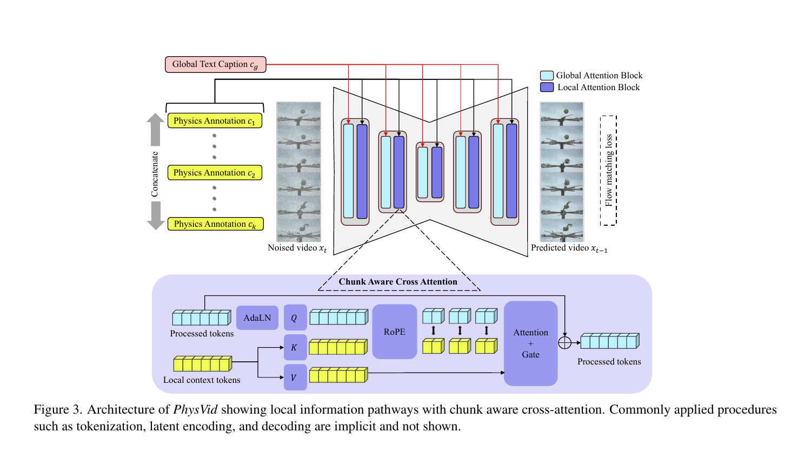

- 한 줄 정리
	- 전체 비디오에 하나의 text condition을 주는 대신, 약 0.7초짜리 시간 chunk별 물리 설명을 별도 cross-attention으로 주입하고, 물리 법칙 위반 설명을 음성 guidance로 사용해 물리적으로 그럴듯한 T2V를 만드는 방법

- motivation
	- 도메인: text-to-video (T2V) 모델에서 충돌, 유체, 조명처럼 시간에 따라 바뀌는 물리 현상의 사실성을 높이는 문제
	- 기존 문제: 전역 prompt는 모든 프레임에 동일하게 적용되어 순간적인 운동ㆍ변형ㆍ광학 현상과 시간적으로 맞물리지 않고, frame-level control은 너무 짧은 범위와 특정 도메인에 묶임
	- 해결 방향: VLM 기반 local physics prompting + chunk-aware cross-attention + counterfactual guidance

- Main Method
	- 핵심 Figure
		- 

	- 1. 학습 데이터의 local physics annotation 생성
		- 입력 video-caption pair를 연속된 $k$개 chunk로 자른 뒤, 각 chunk와 전체 caption을 VLM에 입력한다. 실험에서는 5초, 81-frame clip을 약 0.7초의 7개 chunk로 나눔.
		- VLM(VideoLLaMA3-7B)은 해당 구간에서 실제로 보이는 물리 현상만 dynamics(운동ㆍ힘), shape(변형ㆍ탄성), optics(조명ㆍ그림자ㆍ반사ㆍ굴절)로 구조화해 짧은 local prompt $c_i$를 만든다.
		- 전체 caption $c_g$도 VLM에 함께 주므로, local prompt가 장면의 전역 의미와 모순되지 않게 한다. 학습 조건은 $c_g$와 $C=\{c_1,\ldots,c_k\}$의 조합.

	- 2. Chunk-aware local cross-attention
		- pretrained Wan2.1-1.3B의 각 transformer block에 global attention과 병렬인 local cross-attention block을 추가해, noised video latent의 token이 local prompt token을 읽게 한다.
		- video query에는 $(frame,height,width)$ 3D RoPE를, local text key에는 $(chunk\ index,\ token\ index)$ grid RoPE를 적용한다. 따라서 모든 chunk의 text를 볼 수 있지만, 시간적으로 대응되는 $c_i$에 더 위치 정렬된 attention을 줄 수 있다.
		- local pathway는 짧은 물리 변화에 집중하고, 기존 global text pathway는 장면 전체의 장거리 의미를 유지한다. 전체 모델은 flow-matching loss로 학습됨.

	- 3. 학습 방식
		- WISA-80k에서 5초보다 긴 video를 832$\times$480, 16 fps clip으로 잘라 약 53k sample을 만든다. 원래 WISA의 전역 physics label은 clip과 시간적으로 어긋날 수 있어 쓰지 않고, 위 VLM annotation을 새로 생성한다.
		- 새 local block만 1,000 step 학습해 안정화한 뒤, base를 unfreeze해 2,000 step 전체 fine-tuning한다. 추가 module을 포함한 PhysVid는 1.7B parameter.

	- 4. 추론: positive/negative local guidance
		- 생성할 video는 없으므로, global caption만 보고 LLM이 시간적으로 이어지는 $k$개의 positive local prompt를 상상해 생성한다.
		- 각 positive prompt에서 바퀴 회전-이동 불일치, 비정상 변형, 틀린 그림자처럼 해당 물리 법칙을 의도적으로 깨는 counterfactual prompt $C'$도 생성한다.
		- classifier-free guidance를 $\hat{x}_{t-1}=(1+w)G(x_t,c_g,C,t)-wG(x_t,c_n,C',t)$로 계산한다. 즉, 정상 local physics 쪽으로 끌고 counterfactual local physics 쪽에서는 멀어지게 denoising한다.

- 실험
	- Benchmark와 metric
		- VideoPhy: solid-solid, solid-fluid, fluid-fluid 상호작용을 포함한 수작업 caption 344개에서 video를 생성하는 benchmark. prompt 의미와 생성 결과의 일치도인 Semantic Alignment (SA), 사람 판단을 모사하도록 학습된 평가 모델의 물리 상식 점수인 Physical Commonsense (PC)를 사용하며 둘 다 높을수록 좋다.
		- VideoPhy2: object interaction, sports/physical activity 등 더 다양한 현실 물리 현상을 담은 caption 590개와 특히 어려운 subset을 평가한다. VideoPhy와 동일하게 SA와 PC를 보되, PC는 범주형 rating 기반이라 VideoPhy의 연속 점수 기반 평가와 절대값을 직접 비교하면 안 된다.
	- 결과
		- VideoPhy에서 1.7B PhysVid의 PC는 $0.317$로 Wan2.1-1.3B의 $0.240$보다 약 33% 높고, 14B Wan baseline의 $0.240$도 넘는다. VideoPhy2에서도 $0.641$로 1.3B baseline $0.614$, 14B baseline $0.590$보다 높다.
		- 다만 SA는 VideoPhy에서 $0.457\rightarrow0.430$으로 조금 낮아져, 물리적 사실성을 얻는 대신 caption의 일반적 의미 충실도에는 작은 trade-off가 있다.

- Ablation 또는 Analysis
	- Local conditioning vs. 단순 fine-tuning
		- VideoPhy PC가 base $0.2401$, 동일 데이터만으로 fine-tuning $0.2866$, local conditioning은 counterfactual 없이 $0.2924$로 상승한다. 데이터 재학습 자체의 효과를 넘어 시간 정렬된 물리 prompt가 추가 이득을 준다.
	- Counterfactual guidance
		- local negative prompt를 더하면 VideoPhy PC가 $0.2924\rightarrow0.3169$, VideoPhy2 PC가 $0.6334\rightarrow0.6411$로 추가 향상한다. 법칙 위반 예시를 명시적으로 배제하는 guidance가 유효함을 보인다.
	- Content similarity와 한계
		- fine-tuned Wan보다 FVD가 약간 악화되어, 물리 PC 향상이 모든 시각적 similarity 지표의 향상을 뜻하지는 않는다. VLM annotation의 hallucination, 학습 시 video를 보고 만든 prompt와 추론 시 caption만 보고 만든 prompt의 distribution mismatch, 모든 block에 local path를 넣는 계산 비용이 한계다.
