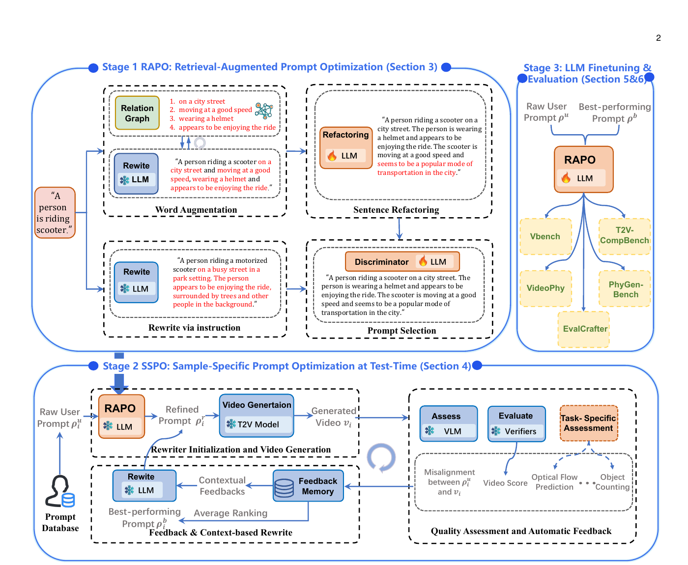

## 한 줄 정리

- 짧은 사용자 프롬프트를 **학습 데이터 분포에 맞게 보정하는 RAPO**, 생성된 비디오의 실패를 보며 프롬프트를 반복 수정하는 **SSPO**, 이 반복 최적화 결과를 다시 **LLM에 학습시키는 단계**를 연결하여, T2V backbone을 바꾸지 않고 조합성·시간 일관성·물리적 타당성을 높인다.

## 핵심 아이디어 먼저

- T2V 모델을 다시 학습하는 대신, 모델이 더 잘 이해하는 언어로 요청을 번역하고 결과를 보며 그 번역을 고친다.
	- 예를 들어 `A person is riding scooter.`가 들어오면, RAPO는 학습 caption에서 자주 함께 등장한 `도심 거리`, `헬멧`, `적당한 속도` 같은 설명을 가져와 자연스러운 문장으로 재구성한다.
	- SSPO는 이 프롬프트로 비디오를 만든 뒤, VLM과 여러 평가기가 원문 의미 누락·깜빡임·공간 관계·물리적으로 이상한 움직임 등을 찾아낸다. LLM은 현재 결과뿐 아니라 이전 반복의 실패와 성공도 보고 다음 프롬프트를 쓴다.
	- 여러 반복에서 한 metric만 가장 높은 결과가 아니라 여러 평가 차원의 평균 순위가 가장 좋은 프롬프트를 고른다.
	- 마지막으로 `원래 프롬프트 → SSPO가 찾은 최적 프롬프트` 쌍을 LLM에 학습시켜, 다음에는 좋은 초기 프롬프트를 더 빨리 만들게 한다.
- **RAPO와 RAPO++의 차이**: RAPO는 생성 전에 한 번 수행하는 학습-data-aligned rewrite이고, RAPO++는 여기에 생성 결과를 이용하는 test-time 반복 최적화와 그 경험을 흡수하는 LLM fine-tuning을 추가한다.

## Motivation

- **큰 도메인**: diffusion/DiT 기반 Text-to-Video(T2V) 모델의 prompt optimization.
- **기존 문제**: 사용자의 짧고 비정형적인 프롬프트는 T2V 학습 caption의 길이·어휘·구조와 다르며, 단순 LLM 확장은 불필요하거나 잘못된 세부사항을 넣고 비디오의 시간적 실패까지 교정하지 못한다.
- **해결 방식**: training-data retrieval 기반 rewrite + verifier feedback을 이용한 test-time scaling + optimized prompt pair를 이용한 LLM fine-tuning.

## Main Method

### 전체 입출력과 단계 구분

- **최종 입력**: 사용자가 쓴 짧은 프롬프트 $\rho_i^u$.
- **최종 출력**: 여러 품질 축에서 가장 좋은 최적 프롬프트 $\rho_i^b$와, 이를 조건으로 T2V 모델이 생성한 비디오.
- **Backbone 처리**: T2V 모델의 weight나 내부 구조는 수정하지 않는다. 프롬프트를 만드는 외부 모듈만 학습·실행한다.
- **Offline 준비/학습 시 필요**
	- T2V 학습 caption으로 relation graph를 구축한다.
	- RAPO의 refactoring LLM $L_r$와 discriminator LLM $L_d$를 instruction tuning한다.
	- SSPO를 실행해 $(\rho_i^u, \rho_i^b)$ 쌍을 수집하고 rewriter LLM을 추가 fine-tuning한다.
- **Inference 시 필요**
	- RAPO 또는 fine-tuned rewriter로 초기 프롬프트를 만든다.
	- T2V 생성 → VLM/verifier 평가 → feedback-memory 기반 rewrite를 정해진 횟수만큼 반복한다.
	- 후보들의 metric별 평균 순위로 최종 프롬프트를 고른다.

### Stage 1. RAPO: 학습 caption 분포에 맞춘 초기 프롬프트

- **1) Relation graph 구축 - offline**
	- **입력**: T2V 모델의 학습 caption corpus.
	- LLM이 각 caption에서 장면(scene)과 그 장면에 연결된 주체·행동·분위기 modifier를 추출한다.
	- 장면을 중심 node로, modifier를 하위 node로 연결해 relation graph $G$를 만든다. 같은 장면이 이미 있으면 modifier만 추가한다.
	- **출력/이유**: 모델의 실제 학습 문장에서 관찰된 장면-설명 관계. 일반 LLM이 임의의 세부사항을 만들어내는 대신 학습 분포에 근거해 확장하기 위한 지식원이다.
- **2) Word augmentation - inference**
	- **입력**: 사용자 프롬프트 $x_i$.
	- sentence transformer로 $x_i$와 graph의 장면 node를 embedding하고 cosine similarity로 top-$k$ 장면을 찾은 뒤, 연결된 modifier 중 다시 top-$k$를 검색한다.
	- Frozen LLM $L$이 modifier $p_i^m$을 하나씩 현재 문장 $x_i^m$에 병합한다.
	- 핵심 연산은 $x_i^{m+1}=f(x_i^m,p_i^m)$이다. $f$는 원래 의미를 보존하면서 modifier를 자연스럽게 붙이는 LLM merge를 뜻한다.
	- **출력/이유**: 관련 세부정보가 늘어난 문장 $w_i$. modifier를 순차적으로 합쳐 원문 정보가 한꺼번에 덮이는 것을 줄인다.
- **3) Sentence refactoring - offline 학습 후 inference 사용**
	- **학습 데이터**: 실제 T2V 학습 caption $c_i$를 LLM으로 일부러 길이·형식을 흐트러뜨린 $w_i$와 짝지어 $(w_i,c_i)$를 만든다. 둘의 의미는 비슷하지만 문장 구조는 다르다.
	- **처리**: $L_r$를 instruction tuning하여 augmented prompt의 주체·행동·장면 의미를 보존하면서 길이와 형식을 학습 caption처럼 바꾸게 한다. 필요하면 단순한 동작 설명도 보강한다.
	- **출력/이유**: training-style 후보 $x_r$. 내용 추가뿐 아니라 모델이 학습 때 보던 문장 구조에 맞춘다.
- **4) Parallel naive rewrite와 prompt selection**
	- Frozen LLM이 사용자 프롬프트를 지시문만으로 확장한 별도 후보 $x_n$을 만든다.
	- $L_d$는 $(x_i,x_r,x_n)$을 보고 원문 의미를 지키면서 관련 있고 명확한 modifier를 담은 후보를 선택한다.
	- $L_d$의 label은 두 후보로 생성한 비디오를 프롬프트 내용에 알맞은 평가 차원으로 비교해 만든다.
	- **출력/이유**: retrieval 기반 후보가 항상 최선이라고 고정하지 않고, 직접 rewrite가 더 나은 경우까지 흡수한 RAPO refined prompt $\rho_i^r$.

### Stage 2. SSPO: 생성 결과를 보고 하는 sample-specific test-time optimization

- **1) Rewriter initialization and video generation**
	- **입력**: raw prompt $\rho_i^u$.
	- RAPO가 초기 refined prompt $\rho_i^r$를 만들고, frozen T2V backbone이 비디오 $v_i$를 생성한다.
	- RAPO rewriter와 T2V 모델은 교체 가능한 모듈이라 UNet 기반 LaVie뿐 아니라 DiT 기반 Latte, HunyuanVideo, CogVideoX, Wan2.1에도 적용할 수 있다.
- **2) Quality assessment and automatic feedback**
	- VLM은 raw prompt와 생성 비디오의 의미 불일치 $M(\rho_i^u,v_i)$를 텍스트 feedback으로 찾는다.
	- $K$개의 verifier가 공간 충실도, 시간 일관성, 의미 정렬 등 각 품질 점수 $s_k$를 계산하고, 전체 점수는 $S(v_i)=\frac{1}{K}\sum_{k=1}^{K}s_k$로 집계한다.
	- 필요하면 task-specific assessor를 추가한다. 물리 비디오 실험에서는 optical flow 기반 $O(v_i)$로 motion field, 물체 궤적, 비현실적인 운동을 점검하며 object counting 같은 모듈도 연결할 수 있다.
	- **출력/이유**: 단순한 좋음/나쁨 점수가 아니라 `원문에서 무엇이 빠졌는가`, `어느 품질 축이 약한가`, `task 고유 실패가 무엇인가`를 함께 제공한다.
- **3) Feedback memory와 context-based rewrite**
	- Feedback memory는 매 반복의 raw prompt, 이전 optimized prompt, 비디오, 의미 불일치, 전체 점수, task-specific feedback을 누적한다.
	- LLM은 현재 feedback만 보지 않고 이전 실패·성공·점수 추세를 함께 읽어 $\rho_i^r \rightarrow \rho_i^{r+1}$로 rewrite한다.
	- 새 프롬프트로 다시 비디오를 만들고 평가하는 폐루프를 반복한다. 논문의 물리 실험은 초기 생성인 round 0부터 네 번 수정한 round 4까지 비교한다.
	- **이유**: 매번 독립적으로 다시 쓰면 같은 오류를 반복하거나 한 품질을 고치다 다른 품질을 망칠 수 있으므로, history를 최적화 context로 사용한다.
- **4) Average ranking으로 최종 후보 선택**
	- 각 반복 후보를 semantic alignment, spatial fidelity, temporal consistency, physical plausibility 등 metric별로 순위화한다.
	- 후보마다 순위의 평균을 구하고 가장 낮은 평균 순위의 프롬프트를 $\rho_i^b$로 선택한다.
	- **이유**: 단위와 scale이 다른 점수를 직접 평균내지 않으며, 특정 metric 하나가 최종 선택을 지배하는 것을 줄인다.

### Stage 3. SSPO의 탐색 결과를 LLM에 흡수

- **입력**: prompt database의 raw-best pair $\{(\rho_i^u,\rho_i^b)\}_{i=0}^{n-1}$.
- LLM을 instruction tuning하여 raw prompt로부터 장면·행동·카메라·조명·분위기를 포함한 best-performing prompt를 직접 예측하게 한다.
- **출력/이유**: 다음 inference에서 더 좋은 초기점으로 시작하므로 SSPO가 local optimum에 빠질 가능성과 필요한 반복 수를 줄이고, 다른 T2V 모델·task로 최적화 규칙을 이전하기 쉬워진다.
- 따라서 Stage 2는 **추론 때 계산을 써서 prompt를 탐색**하고, Stage 3는 그 탐색 결과를 **offline에서 rewriter의 parameter에 압축**한다.

### 구체적인 학습·구현 설정

- RAPO relation graph는 Vimeo25M의 2,500만 text-video pair 중 약 210만 개의 유효 문장을 사용한다.
	- Mistral이 scene/subject/action/atmosphere를 추출하고, `all-MiniLM-L6-v2`가 retrieval embedding을 만든다.
	- Refactoring model에는 약 8.6만 prompt pair, discriminator 준비에는 VBench 전 차원을 포괄하는 약 7천 caption을 사용한다.
	- LLaMA 3.1에 LoRA(rank 64, batch 32)를 적용하고 single A100에서 refactorer 8 epoch, discriminator 3 epoch를 학습한다.
- SSPO 분석은 GPT-4로 만든 약 1.2만 개의 다양한 raw prompt, LaVie/Latte, LLaVA-OneVision 의미 불일치 평가, Qwen2.5-7B-Instruct rewrite를 사용한다.
- 물리-aware 설정은 HunyuanVideo, CogVideoX-5B, Wan2.1에 optical-flow feedback을 추가한다.

## 실험

### 벤치마크와 metric

- **VBench**
	- T2V 모델에 차원별 prompt를 주고, 생성 비디오의 subject/background 일관성, motion smoothness, flicker, 객체·행동·공간 관계 등 16개 품질 차원을 자동 평가한다.
	- 각 차원과 종합 점수가 높을수록 좋다. 이 논문은 특히 temporal flickering, imaging quality, human action, object class, multiple objects, spatial relationship을 보고한다.
- **T2V-CompBench**
	- 여러 객체와 속성·행동·공간 관계·상호작용·수량을 한 비디오에 정확히 결합해야 하는 compositional generation benchmark이다.
	- MLLM 및 detection/tracking 기반으로 consistent/dynamic attribute binding, action binding, object interaction 등을 0~1 점수로 평가하며 높을수록 prompt의 여러 조건을 올바르게 함께 구현한 것이다.
- **EvalCrafter**
	- 700개 prompt로 생성한 비디오를 17개 metric으로 검사하는 종합 평가 파이프라인이다.
	- 본문 표의 motion quality, text-video alignment, visual quality, temporal consistency는 각각 움직임의 자연스러움, 문장 내용 충족, 프레임 외관 품질, 시간축 안정성을 재며 높을수록 좋다.
- **VideoPhy**
	- solid-solid, solid-fluid, fluid-fluid 상호작용 prompt에서 충돌, 운동량, 궤적 등 물리 상식에 맞는 비디오를 생성하는지 본다.
	- Physical Consistency(PC)는 물리적으로 타당한지, Semantic Alignment(SA)는 원래 prompt의 사건을 충족하는지를 0~1로 평가한다.
- **PhyGenBench**
	- 27개 물리 법칙을 포괄하는 160개 prompt에 대해 single frame부터 전체 비디오까지 계층적으로 물리 법칙 준수를 평가한다.
	- 역시 PC와 SA를 사용하므로, SSPO가 물리성을 높이면서 원문 의미를 희생하는지 함께 확인할 수 있다.
- **VideoScore 분석**
	- 별도 2.2천 prompt에서 temporal consistency, visual quality, T2V alignment, factual consistency의 반복별 변화를 측정하여 test-time scaling 효과를 확인한다.

### 핵심 결과

- **VBench / LaVie**: 종합 점수는 원문 80.89% → RAPO 82.38% → RAPO++ 82.65%였고, multiple objects는 37.71% → 64.86% → 71.89%, spatial relationship은 37.27% → 59.15% → 64.76%로 크게 상승했다.
- **VBench / Latte**: 종합 점수는 77.03% → 79.97% → 80.75%, multiple objects는 29.55% → 52.78% → 55.38%였다. 서로 다른 UNet/DiT backbone에서 같은 경향이 나타난다.
- **EvalCrafter / LaVie**: text-video alignment는 69.60% → 74.38% → 75.62%, temporal consistency는 60.87% → 61.29% → 66.80%였다. RAPO++의 추가 단계는 특히 시간축 안정성에 기여한다.
- **T2V-CompBench / LaVie**: consistent attribute binding은 62.0% → 69.2% → 74.2%, object interaction은 76.0% → 83.9% → 84.9%였다. 다만 action binding은 RAPO 63.5%에서 RAPO++ 63.2%로 아주 조금 낮아져 모든 세부 metric이 항상 오르는 것은 아니다.
- **PhyGenBench, round 0 → 4**
	- HunyuanVideo의 PC는 38% → 57%, SA는 24% → 42%였다.
	- CogVideoX-5B의 PC는 34% → 53%, Wan2.1의 PC는 40% → 50%로, task-specific feedback의 반복이 세 backbone 모두에서 물리성을 높였다.
- **VideoPhy, HunyuanVideo solid-solid, round 0 → 4**: PC 28% → 40%, SA 41% → 65%였으며 solid-fluid와 fluid-fluid에서도 PC/SA가 반복마다 대체로 단조 증가했다.
- **비용**: 여러 SSPO 반복은 single-pass 대비 inference 시간이 약 3배이고 LLaVA-OneVision에 약 2GB의 추가 memory가 든다. 대신 LaVie/Latte 평균으로 VBench 3.5%, T2V-CompBench 18.1%의 향상을 보고한다.

## Ablation 또는 Analysis

### Ablation

- **RAPO 세 모듈**: word augmentation만 80.37%, sentence refactoring만 79.75%였지만 둘을 합치면 81.58%, prompt selection까지 모두 쓰면 VBench 82.38%로 가장 높아 세 기능이 상보적이다.
- **Rewrite LLM 종류**: GPT-4 82.38%, Mistral 82.25%, LLaMA 3.1 82.10%로 차이가 작아 특정 LLM에 크게 종속되지 않았다.
- **SSPO와 Stage 3 fine-tuning**: 둘 다 없을 때 T2V-CompBench의 `consistent attribute / dynamic attribute / action / interaction`은 62.0% / 23.2% / 48.3% / 76.0%였다.
	- SSPO만 사용하면 62.9% / 23.6% / 54.2% / 77.8%, fine-tuning만 사용하면 65.9% / 25.3% / 55.2% / 83.5%로 각각 개선된다.
	- 둘을 함께 쓰면 74.2% / 29.4% / 63.2% / 84.9%로 가장 높아, per-sample 탐색과 탐색 경험의 parameter화가 상보적이다.

### Analysis

- **Multiple objects**: irrelevant action/atmosphere를 빼고 객체 사이의 상대적 공간 설명을 추가하자 attention binding과 다중 객체 생성이 개선됐다.
- **Prompt 길이 분포**: RAPO prompt의 길이 분포가 실제 training caption에 가장 가까웠다. 짧은 사용자 prompt뿐 아니라 과도하게 길고 복잡한 일반 LLM rewrite도 성능을 해칠 수 있다는 해석이다.
- **Fine-tuned LLM의 unusual concept 처리**: `춘절 분위기의 마트에서 빨간 앞치마와 명찰을 단 판다가 계산원으로 일한다`처럼 비전형적인 역할을 명시적으로 구조화해, 사람 계산원으로 바뀌는 오류를 줄였다.
- **Inference-time scaling**: 반복 횟수가 늘수록 VideoScore의 시간 일관성, 시각 품질, text-video 정렬, 사실 일관성이 모두 상승했다.
- **한계 - 정확한 수량**: `앵무새 다섯 마리`, `기린 세 마리` 같은 prompt는 여전히 개수를 맞추지 못했다. T2V 모델 자체가 숫자 정보를 다른 의미와 섞어 표현하고, 현재 SSPO feedback에 정밀한 count-aware verifier가 없기 때문이다.
- **적용 범위 해석**: backbone weight와 구조에는 독립적이지만 Stage 1은 해당 모델의 training-caption 분포 또는 그 대용 corpus가 필요하므로, 완전히 data-agnostic한 방식이라기보다 **architecture-agnostic, training-data-aware**한 방식으로 보는 편이 정확하다.

## 용어 메모

- **Modifier**: 원문에 붙이는 주체의 외형, 행동, 배경, 분위기 등의 짧은 설명.
- **Relation graph**: 학습 caption에서 관찰한 `장면 ↔ 관련 modifier` 관계를 저장한 검색용 graph.
- **Verifier**: 생성 비디오를 특정 품질 축으로 자동 채점하는 평가 모델 또는 metric.
- **Feedback memory**: SSPO 반복 동안 이전 prompt, 평가, 실패 원인을 누적해 다음 rewrite의 context로 주는 저장소.
- **Test-time scaling**: 모델을 더 학습시키는 대신 inference 때 후보 생성·평가·수정에 추가 계산을 써서 한 sample의 품질을 높이는 방식.
- **Average ranking**: 후보마다 metric별 순위를 낸 뒤 평균 순위가 가장 낮은 후보를 선택하는 multi-objective selection.
