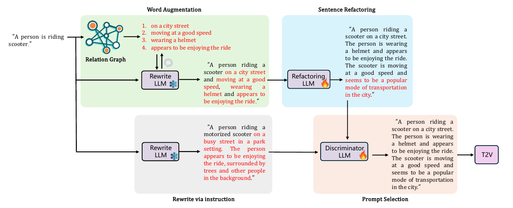
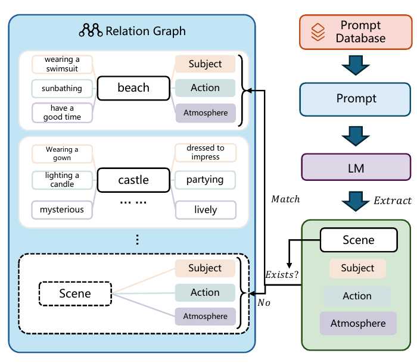

- 한 줄 정리
	- T2V 학습 caption에서 검색한 표현으로 prompt를 보강하고 문장 형식을 맞춘 뒤, LLM이 직접 다시 쓴 후보와 비교·선택해 영상 품질과 텍스트 충실도를 높이는 prompt optimization 방법.

- 핵심 아이디어 먼저
	- 영상 모델이 학습할 때 읽은 caption과 사용자가 입력하는 짧은 prompt는 어휘·길이·문장 구조가 달라, 같은 의도를 전달해도 생성 성능이 떨어질 수 있다.
	- RAPO는 학습 caption을 “장면별로 어떤 주체·행동·분위기 표현이 함께 등장했는지” 찾을 수 있는 사전처럼 만들고, 사용자 prompt에 어울리는 표현을 가져와 추가한다.
	- 이어서 문장 정리 모델이 보강된 prompt를 학습 caption의 형식으로 다듬고, 선택 모델이 이 결과와 범용 LLM의 직접 재작성 결과 중 더 나은 후보를 고른다.
	- 예를 들어 “사람이 스쿠터를 탄다”에 “도시 거리에서”, “헬멧을 쓰고”, “빠르게 이동하는”을 하나씩 붙인 뒤 읽기 좋은 문장으로 정리한다(Figure 2).
	- 영상 생성 모델은 그대로 사용하며, 문장 정리 모델과 선택 모델을 별도로 학습한다. 실제 사용 시에는 영상 생성 전에 텍스트 후보를 선택한다.

- motivation
	- 큰 도메인: 자연어 설명을 조건으로 영상을 만드는 text-to-video generation의 입력 prompt 최적화.
	- 기존 문제: 단순 LLM 재작성은 표현을 길고 풍부하게 만들 수 있지만, T2V 모델이 익숙한 어휘·문장 형식과 어긋나거나 원래 의도에 없던 세부 내용을 추가해 오히려 생성을 방해한다.
	- 해결 방식: retrieval-augmented prompt enrichment + caption-style refactoring + learned prompt selection.

- Main Method
	- 전체 구조와 입출력
		- 
		- Figure 2, PDF p.4. 위쪽은 `표현 검색·추가 → 문장 정리`, 아래쪽은 `LLM 직접 재작성`이며, 두 결과 중 하나를 선택해 T2V 모델에 넣는다. 눈송이는 고정된 LLM, 불꽃은 별도로 fine-tuning한 LLM을 뜻한다.
		- 입력은 사용자 text prompt $x_i$, RAPO의 출력은 최적화한 text prompt 하나이며, 기존 T2V 모델이 이를 받아 최종 video를 생성한다.
		- 중간 결과도 검색된 표현 목록과 가변 길이 문자열이다. RAPO는 별도의 video latent, frame별 layout, diffusion architecture를 제안하지 않는다.
		- 아래에서는 먼저 필요한 자원을 만드는 **사전 준비·학습**을 설명하고, 이후 **inference**의 실제 처리 순서를 설명한다.

	- A. 사전 준비·학습
		- A-1. 학습 caption으로 검색용 관계 그래프 만들기 (§3.1)
			- 입력: T2V 모델이 학습에 사용한 caption 모음. 실험에서는 LaVie와 Latte가 공통으로 학습한 Vimeo25M의 약 2,500만 text-video pair 중 약 210만 개의 유효 문장을 골라 사용한다.
			- 처리: 고정된 LLM이 각 caption에서 장면(scene)과 그에 연결된 주체·행동·분위기 설명(modifier)을 추출한다. 이미 등록된 장면이면 표현을 추가하고, 새로운 장면이면 중심 노드를 만든다.
			- 출력: 장면을 중심 노드로, 관련 표현을 하위 노드로 연결한 관계 그래프(relation graph) $G$. 그래프 구축의 추출 LLM으로 Mistral을 사용한다.
			- 필요한 이유: 범용 LLM이 임의로 만든 표현 대신, 실제 학습 데이터에 등장한 장면 관련 표현을 검색할 수 있게 한다. 별도의 GNN을 학습하는 구조는 아니다.
			- 
			- Figure 3, PDF p.4. `beach`에는 “수영복을 입고”, “일광욕하며”, “즐거운 시간을 보내는” 등의 표현이 연결된다. 한 영상의 객체 배치를 표현하는 scene graph가 아니라, 여러 caption에서 모은 표현의 검색용 그래프다.

		- A-2. 문장 형식을 학습 caption에 맞추는 모델 학습 (§3.2)
			- 역할: 문장 정리 모델(Refactoring LLM, $L_r$)은 내용이 보강된 문장을 받아, 원래 T2V 학습 caption에 가까운 길이와 문체로 정리한다.
			- 학습 pair 만들기: 원래 학습 caption $c_i$를 고정된 LLM으로 다시 써서, 의미는 비슷하지만 형식·길이는 다른 문장 $w_i$를 만든다. 즉, 정답 caption을 먼저 확보한 뒤 문장 형식을 흐트러뜨린 입력을 합성한다.
			- 학습 방향: $w_i \rightarrow c_i$. 실제 검색·보강 결과를 전부 수집하는 대신, 그와 비슷한 입력을 합성해 caption 형식을 복원하도록 학습한다.
			- 지시문은 주체·행동·장면을 유지하면서 길이와 형식을 다듬도록 하며, 필요하면 명확한 동작 표현도 추가하도록 한다. 따라서 단순 문법 교정만 하는 모델은 아니다.
			- 약 8.6만 prompt pair로 LLaMA 3.1을 LoRA fine-tuning한다. 학습은 8 epoch이며, 출력 모델은 이후 inference에서 고정해 사용한다.

		- A-3. 더 좋은 영상으로 이어질 prompt를 선택하는 모델 학습 (§3.3)
			- 역할: 후보 선택 모델(Prompt Discriminator, $L_d$)은 원 prompt $x_i$와 두 후보 $x_r, x_n$을 읽고 어느 후보를 사용할지 나타내는 label을 출력한다.
			- 입력 데이터: 여러 T2V benchmark에서 모은 prompt와 LLM으로 추가 생성한 prompt를 사용한다. 구현에서는 VBench의 평가 차원을 포괄하는 caption 7천 개를 Mistral로 생성했다고 설명한다.
			- 정답 만들기: 각 입력에 대해 `검색·보강·문장 정리` 후보 $x_r$와 `직접 재작성` 후보 $x_n$을 만들고, **두 후보로 실제 영상을 생성해 평가한 결과**로 더 나은 후보의 label $y_d$를 정한다.
			- prompt 내용에 따라 LLM이 평가할 차원을 정하고 해당 metric으로 영상을 비교한다. 예를 들어 여러 객체가 요구되면 그 조건을 반영하는 평가가 필요하다.
			- 학습 데이터는 $(x_i, x_r, x_n, y_d)$이며, LLaMA 3.1을 3 epoch LoRA fine-tuning해 텍스트만으로 선택 결과를 예측하도록 만든다.
			- 필요한 이유: 검색으로 보강한 후보에도 부정확하거나 모호한 내용이 생길 수 있으므로, 직접 재작성한 대안까지 비교한다. **영상 평가는 선택 모델의 학습 label 생성에 필요하고, inference 입력은 텍스트 세 개다.**
			- 두 학습 모델은 batch size 32, LoRA rank 64, 단일 A100 설정을 사용한다. 본문에는 label 생성 시 여러 metric의 점수를 결합하거나 동점을 처리하는 세부 규칙은 명시되어 있지 않다.

	- B. Inference: 사용자 prompt에서 최종 video까지
		- B-1. 원 prompt에 관련된 장면과 표현 검색
			- 입력: 원 prompt $x_i$와 사전 구축한 그래프 $G$.
			- 처리: sentence embedding 모델 `all-MiniLM-L6-v2`로 문장을 벡터화하고 cosine similarity로 가장 관련된 장면 top-$k$를 찾는다. 그 장면들에 연결된 표현을 모은 뒤, 원 prompt와 관련된 표현 top-$k$를 다시 고른다.
			- 출력: 주체·행동·분위기를 구체화할 표현 $k$개. 장면으로 먼저 검색 범위를 좁힌 뒤 표현을 고르므로, 문맥에 맞는 학습 어휘를 가져올 수 있다.
			- 논문 본문은 검색 개수를 $k$로 표기하지만 고정된 수치는 제시하지 않는다.

		- B-2. 검색된 표현을 하나씩 추가: Word Augmentation
			- 입력: 현재 prompt와 검색된 표현 하나.
			- 처리: 고정된 재작성 LLM $L$에 예시와 함께 “기존 내용을 유지하며 해당 표현을 자연스럽게 합쳐라”라고 지시하고, 이 과정을 검색된 표현마다 순서대로 반복한다.
			- $x_i^{m+1}=f_L(x_i^m,p_m),\quad x_i^0=x_i,\quad m=0,\ldots,k-1$.
			- $x_i^m$은 표현 $m$개를 반영한 현재 문장, $p_m$은 다음에 추가할 표현, $f_L$은 LLM의 문장 병합이다. 한 번에 표현을 나열하는 대신, 앞서 만든 문장에 다음 표현을 이어 붙이면서 관련성과 문장 흐름을 유지한다.
			- 출력: 검색한 세부 표현을 포함하는 보강 prompt $x_i^k$. 이 반복은 텍스트를 합치는 과정이며, 매번 영상을 생성하는 반복은 아니다.

		- B-3. 보강한 문장을 학습 caption 형식으로 정리: Sentence Refactoring
			- 입력: 표현을 여러 번 합쳐 길이나 문체가 흐트러질 수 있는 보강 prompt $x_i^k$.
			- 처리: 학습한 $L_r$가 주체·행동·장면을 유지하면서 문장 구조와 길이를 다듬는다.
			- 출력: 첫 번째 후보 $x_r$. 어휘를 학습 데이터에서 가져오는 것에 더해, 전체 문장도 T2V 모델이 익숙한 형식에 맞춘다.

		- B-4. 원 prompt를 직접 다시 써서 대안 만들기: Rewrite via Instruction
			- 입력: 보강 전의 원 prompt $x_i$.
			- 처리: 고정된 LLM이 정해진 지시문에 따라 직접 상세한 prompt로 다시 쓴다. 이 경로는 그래프 검색과 $L_r$를 거치지 않는다.
			- 출력: 두 번째 후보 $x_n$. 검색 경로의 결과가 항상 낫다고 가정하지 않고 비교할 대안을 확보한다.

		- B-5. 후보 선택 후 영상 생성: Prompt Selection
			- 입력: 원 prompt $x_i$와 두 후보 $x_r, x_n$.
			- 처리: 학습한 $L_d$가 의미 보존과 관련 표현의 명확성 등을 고려해 후보 하나를 선택하고, 선택된 문자열을 기존 T2V 모델에 전달한다.
			- 출력: 선택 prompt에 조건화된 video. inference에서는 후보별 영상을 먼저 만들고 점수를 비교하는 과정이 없다.
			- 실행에 필요한 것은 그래프·검색 encoder·고정 LLM·학습된 $L_r$와 $L_d$·T2V 모델이다. 학습 pair, 선택 label을 만드는 평가 metric, 후보 비교용 영상 생성은 사전 준비에만 필요하다.
			- 기존 LLM prompt 확장과의 핵심 차이는 **학습 caption의 어휘를 검색하고, 문장 형식을 복원하며, 실제 생성 결과로 학습한 선택기를 사용한다**는 점이다.

- 실험
	- 설정
		- T2V 모델은 LaVie와 Latte이며, 원래의 짧은 prompt·GPT-4 재작성·Open-sora prompt refiner와 비교한다. 두 모델 모두 Vimeo25M을 학습에 사용했으므로 해당 데이터에서 만든 표현과 문장 형식이 맞는지 검증할 수 있다.
		- 아래 백분율은 각 benchmark의 점수 표현이며, 모두 “완전히 성공한 영상의 비율”을 뜻하지는 않는다.

	- Benchmark와 metric
		- **VBench**: 객체·행동·공간 관계 등 평가 차원에 맞춘 text prompt를 입력해 영상을 생성하고, 의미 충실도와 시각·시간 품질을 16개 차원에서 평가한다. 객체·행동의 존재 여부, 프레임 사이의 일관성과 깜빡임, 화질 등을 자동 평가해 차원별 점수와 종합 점수를 산출한다.
		- 특히 `multiple objects`는 prompt에 적힌 여러 종류의 객체가 함께 나타나는지를 평가한다. 단일 객체가 잘 보이는 것과 여러 객체를 빠뜨리지 않고 생성하는 능력을 구분하는 지표다.
		- **EvalCrafter**: 다양한 text prompt에 대응하는 영상을 생성하고 약 17개 자동 metric으로 평가한다. RAPO는 움직임 품질, 텍스트와 영상의 의미 일치, 시각 품질, 시간적 일관성으로 묶은 점수와 그 합계를 보고한다.
		- **T2V-CompBench**: 여러 객체에 서로 다른 속성·행동을 지정하거나 시간에 따른 속성 변화·객체 간 상호작용을 요구하는 prompt를 입력하고, 그 조합 조건을 지키는 영상을 생성해야 한다. RAPO는 네 차원을 골라 속성 유지, 속성 변화, 행동의 올바른 객체 연결, 객체 간 상호작용이 맞는지를 0~1 점수로 평가한다.

	- 핵심 결과 (Tables 4-6)
		- 가장 큰 개선은 VBench의 다중 객체 생성으로, LaVie **37.71% → 64.86%**, Latte **29.55% → 52.78%**다. prompt를 바꾸는 것만으로 여러 객체를 함께 표현하는 능력이 크게 개선되었고, VBench 종합 점수도 각각 80.89% → 82.38%, 77.03% → 79.97%로 높아졌다.
		- T2V-CompBench에서도 LaVie의 action binding이 **48.3% → 63.5%**로 올라 “어떤 객체가 어떤 행동을 해야 하는지”를 더 잘 반영하며, EvalCrafter 합계도 LaVie 248 → 256, Latte 217 → 227로 개선된다. 다만 LaVie의 움직임 품질이나 두 모델의 시간적 일관성 등 모든 세부 metric에서 항상 최고인 것은 아니다.

- Ablation 또는 Analysis
	- Word Augmentation (§4.5, Table 7)
		- 검색 기반 모듈을 제거한 대조군에서는 GPT-4가 관련 표현을 직접 만들어 한 번에 합치게 하며, 문장 정리·선택을 유지한 이 설정의 VBench 점수는 81.75%다.
		- 전체 RAPO는 82.38%로 높아져, **그래프 검색과 순차 병합을 묶은 설계**의 이득을 보인다. 두 요소 중 어느 쪽의 기여인지를 이 비교만으로 분리할 수는 없다.
	- Sentence Refactoring (Table 7)
		- 단어 보강·후보 선택을 유지하고 문장 정리를 제외한 경우와 전체 구성을 비교한다.
		- **80.60% → 82.38%**로 높아져, 표현을 추가하는 것에 더해 학습 caption의 문장 형식을 맞추는 단계가 필요함을 보인다.
	- Prompt Selection (Table 7)
		- 후보를 무작위로 선택하는 대조군과 학습한 판별기로 선택하는 구성을 비교한다.
		- 단어 보강·문장 정리가 있는 설정에서 **81.58% → 82.38%**로 높아져, 두 후보를 만들어 두는 것뿐 아니라 어느 후보를 쓸지 학습하는 것이 효과적이다.
	- 재작성 LLM 종류 (Table 8)
		- 고정 LLM $L$을 GPT-4, Mistral, LLaMA 3.1로 바꿔 비교한다.
		- VBench 종합 점수가 각각 82.38%, 82.25%, 82.10%로 비슷해, 해당 실험에서는 특정 고성능 LLM 하나에만 효과가 의존하지 않는다.
	- 다중 객체의 attention 분석 (§4.4, Figure 5)
		- LaVie와 같은 text encoder를 쓰는 SD 1.4에 방법을 적용하고, 동작·분위기 표현을 제외해 객체 간 상대 위치 설명의 영향을 시각화한다.
		- 관련 공간 설명을 추가했을 때 객체별 attention과 생성 결과가 개선된다. 이는 위치를 명시하는 표현이 객체를 구분하는 데 도움이 된다는 정성적 근거이며, video attention을 직접 분석한 결과는 아니다.
	- Prompt 길이 분포 (§4.4, Figure 6)
		- 학습 caption·사용자 prompt·여러 재작성 방법의 단어 수 분포를 비교한다.
		- RAPO가 학습 caption의 길이 분포에 가장 가깝고, 사용자 prompt는 너무 짧으며 다른 재작성 방법은 더 긴 경향을 보인다. 길이의 정렬을 보여주는 결과이며, 이것만으로 의미·문체 분포 전체의 일치를 증명하지는 않는다.
	- 적용 범위와 PPVDM 관점에서의 해석
		- 본문 실험의 중심은 다중 객체·의미 충실도·영상 품질이며, 물리 법칙 위반을 직접 진단하거나 별도의 물리 평가 점수로 최적화하는 구조는 제시하지 않는다.
		- PPVDM에 참고할 부분은 “생성 결과를 사전에 평가해 얻은 선호를 텍스트 선택기에 학습시킨다”는 구조다. 이를 물리 타당성에 적용하려면 그 기준으로 학습 label을 만드는 설계가 추가로 필요하다는 것은 이 정리의 해석이다.
		- 학습 caption에 접근해 그래프와 문장 정리 데이터를 만들고 후보별 영상을 생성해 선택 label을 준비해야 한다. 따라서 video generator의 추가 학습은 없지만, 방법 전체가 training-free인 것은 아니다.

- 용어 메모
	- modifier: “헬멧을 쓰고”, “도시 거리에서”처럼 기존 장면을 구체화하는 짧은 설명이며, 문법적 수식어뿐 아니라 행동·상황을 담은 구절도 포함한다.
	- refactoring: 의미의 중심을 유지하면서 문장 길이·구조·문체를 학습 caption 형식에 맞추는 작업.
	- discriminator: 여기서는 GAN의 진짜/가짜 판별기가 아니라, 두 text prompt 중 어느 것을 사용할지 고르는 LLM.
	- attribute/action binding: “빨간 자동차와 파란 자전거”에서 색이 올바른 객체에 붙고, 각 객체가 자신에게 지정된 행동을 수행하는 성질.

- 참고
	- 정리 기준: [로컬 PDF](RAPO.pdf), [arXiv:2504.11739v2](https://arxiv.org/abs/2504.11739v2), 2025-05-06 버전. RAPO++가 아닌 원래 RAPO의 본문을 기준으로 작성했다.
	- Method: PDF pp.3-5, 구현 설정: pp.5-6, 결과·분석·ablation: pp.7-8. 그림은 PDF p.4의 Figures 2-3에서 발췌했다.
