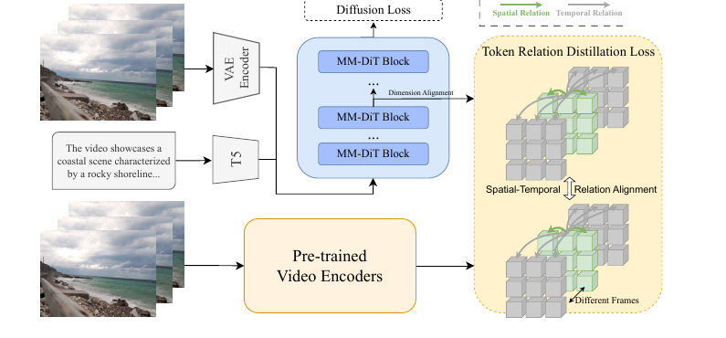

- 한 줄 정리
	- VideoMAEv2 같은 VFM의 spatio-temporal relation을 CogVideoX에 distill해서 T2V 모델의 물리적 그럴듯함을 높이는 fine-tuning 방법.

- motivation
	- 도메인: text-to-video diffusion model의 physics-plausible video generation.
	- 문제: 최신 T2V 모델도 접촉, 충돌, 굴러감, 유체 움직임 같은 물리 상식을 자주 어김.
	- 해결: VFM의 비디오 이해 representation을 relation-level로 distillation하는 fine-tuning.

- Main Method
	- 핵심 figure
		- 
	- 전체 파이프라인
		- 입력 비디오 $V \in \mathbb{R}^{F \times C \times H \times W}$를 VAE encoder에 넣어 VDM latent $z$를 얻음.
		- noisy latent $z_t$를 CogVideoX denoising transformer에 넣고, 중간 hidden state $h_t$를 추출함.
		- 같은 clean video $V$를 VideoMAEv2 같은 VFM encoder $E_v$에 넣어 teacher feature $y_v$를 얻음.
		- MLP $h_\phi$로 VDM hidden state의 channel dimension을 VFM feature와 맞춤.
		- 최종 loss는 기존 diffusion loss와 TRD loss를 더한 $L = L_{\text{diff}} + \lambda L_{\text{TRD}}$.
	- TRD(Token Relation Distillation)
		- VFM feature와 VDM hidden state를 각각 $f \times h \times w \times D$ 형태의 spatio-temporal token grid로 봄.
		- spatial relation: 같은 frame 안에서 token $i,j$의 cosine similarity를 계산.
		- temporal relation: frame $d$의 token과 다른 frame $e$의 token 사이 cosine similarity를 계산.
		- VDM이 VFM의 feature vector 자체가 아니라 pairwise similarity 구조를 닮도록 $L1$ distance로 학습.
	- 왜 soft alignment인가
		- 기존 REPA는 $h_\phi(h_t) \approx y_v$처럼 feature vector를 직접 맞추는 hard alignment.
		- VideoREPA는 $\text{relation}(h_\phi(h_t)) \approx \text{relation}(y_v)$만 맞추므로 VDM의 기존 feature space를 덜 망가뜨림.
	- resolution mismatch 처리
		- VDM은 3D VAE 때문에 temporal compression이 커서 VFM보다 temporal token 수가 작을 수 있음.
		- 논문은 VDM representation을 VFM feature의 temporal/spatial size에 맞게 interpolation한 뒤 relation을 비교함.
		- 첫 encoded frame은 semantic 유지 성격이 강하다고 보고 alignment에서 제외해 dynamic content에 집중함.
	- 학습 설정
		- base model은 CogVideoX-2B/5B, teacher VFM은 VideoMAEv2.
		- physics-specific dataset 없이 open-domain OpenVid로 fine-tuning함.
		- 2B는 32k video로 full fine-tuning, 5B는 64k video로 LoRA fine-tuning.

- 실험
	- VideoPhy
		- task: solid-solid, solid-fluid, fluid-fluid interaction을 묘사한 344개 text prompt를 주고, T2V 모델이 생성한 video가 현실 물리 상식에 맞는지 평가.
		- input/output: 입력은 text prompt이고, 출력은 생성 video이며, 논문은 짧은 prompt를 CogVideoX에 맞게 detailed prompt로 확장해 사용함.
		- metric: SA는 video가 prompt의 semantic을 잘 따르는지, PC는 video가 현실 물리 법칙을 따르는지를 의미함.
		- 평가 방식: VideoConPhysics auto-rater가 SA/PC score를 내고, 0.5 이상이면 1, 미만이면 0으로 binarize해서 평균을 냄.
		- VideoREPA-5B는 CogVideoX 대비 overall PC를 24.1% 개선하고, PC 40.1로 WISA보다 높은 성능을 보임.
	- VideoPhy2
		- task: 200개 action을 포함한 590개 detailed prompt로 human-object interaction 중심의 물리 상식 준수 여부를 평가.
		- input/output: 입력은 action-centric text prompt이고, 출력은 생성 video이며, 모델이 사람-물체 상호작용을 시간적으로 자연스럽게 만드는지가 핵심.
		- metric: SA는 prompt와 video의 일치도, PC는 generated video의 physical commonsense를 측정함.
		- 평가 방식: VideoPhy2-AutoEval이 각 video를 평가하고, SA/PC 각각 score가 4 이상인 video의 비율을 최종 점수로 사용함.
		- VideoREPA-2B는 CogVideoX 대비 PC를 67.97에서 72.54로 개선함.
	- qualitative
		- pencil rolling, crane lifting bricks 같은 예시에서 rigid body motion과 physical connection이 더 안정적으로 유지됨.

- Ablation 또는 Analysis
	- TRD 구성: spatial과 temporal component를 둘 다 쓸 때 PC가 가장 높고, 하나만 쓰면 SA와 PC가 모두 감소함.
	- REPA 비교: 기존 REPA를 그대로 fine-tuning에 쓰면 hard alignment 때문에 semantic quality가 크게 나빠짐.
	- target VFM: VideoMAE, V-JEPA, OmniMAE, VideoMAEv2 중 VideoMAEv2가 가장 좋은 PC를 보임.
	- alignment depth: diffusion transformer의 18번째 layer를 align할 때 가장 좋은 trade-off를 보임.
	- $\lambda$: TRD loss weight는 $\lambda = 0.5$가 diffusion loss와 relation distillation 사이 균형이 가장 좋음.
	- dimension alignment: VFM feature를 VDM에 맞추기보다 VDM representation을 VFM size에 맞추는 쪽이 더 좋음.
	- VFM input 설정: 고해상도 crop/grouping보다 전체 frame을 낮은 resolution으로 처리하는 전략이 VFM representation을 가장 잘 보존함.

- 용어 메모
	- VFM = Video Foundation Model.
	- MAE = Masked Autoencoder.
	- VideoMAE/VideoMAEv2는 MAE 기반 VFM이지만, 모든 VFM이 MAE 기반인 것은 아님.
	- latent는 VAE가 압축한 입력 표현이고, hidden state는 transformer 내부 activation.
