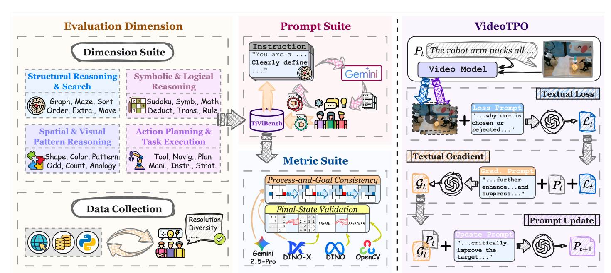

## 한 줄 정리

- 이미지에서 시작해 **정답에 이르는 과정을 영상으로 만들어내는 추론 능력**을 4개 차원·24개 task·3개 난이도로 평가하는 TiViBench와, 매 round의 두 후보 영상을 VLM이 비교·비평하여 모델별로 잘 맞는 프롬프트를 반복 탐색하는 training-free test-time 방법 VideoTPO를 제안한다.

## 핵심 아이디어 먼저

- 이 논문은 비디오 모델이 단순히 자연스러운 움직임을 만드는지를 넘어, 시작 이미지에 주어진 퍼즐이나 작업을 **프레임의 연속으로 실제로 풀 수 있는지** 묻는다.
	- 예를 들어 미로의 시작점 이미지를 주면, 공이 벽을 통과하지 않으면서 목표점까지 이동하는 영상을 만들어야 한다. 마지막 위치만 맞는 것이 아니라 이동 경로도 규칙을 지켜야 한다.
- TiViBench는 이런 문제를 구조 탐색, 시각 패턴, 기호 논리, 행동 계획으로 나누고, task에 따라 최종 프레임 또는 전체 궤적을 자동 검사한다.
- VideoTPO는 같은 프롬프트로 후보 영상 두 개를 만든 뒤, VLM이 `어느 쪽이 더 낫다`는 선택만 하는 대신 **각 영상이 무엇을 잘했고 무엇을 실패했는지** 글로 분석하게 한다. 이 비평에서 수정 지침을 만들고 프롬프트를 고쳐 다시 생성하므로, video model의 weight를 바꾸지 않고도 해당 모델이 이해하기 쉬운 지시문을 찾아간다.
- 가령 두 영상 모두 도형 위에 숫자를 순서대로 표시하지 못했다면, 다음 프롬프트에는 `왼쪽 도형부터 1초마다 숫자 하나를 바로 위에 표시하고, 추가 배경은 만들지 말라`처럼 위치·순서·시간·금지 조건을 구체화한다.

## Motivation

- **큰 도메인**: image-to-video(I2V) 생성 모델의 visual reasoning 평가와 test-time prompt optimization.
- **기존 문제**: 기존 I2V benchmark는 화질, prompt 정렬, 시간적 부드러움, 물리적 그럴듯함을 주로 측정해, 모델이 규칙을 이해하고 중간 단계를 거쳐 정답 상태에 도달하는지 체계적으로 평가하지 못한다.
- **해결 방식**: reasoning-oriented hierarchical benchmark + task-specific automatic metric + VLM self-analysis 기반 iterative test-time prompt optimization.

## Main Method

### 전체 입출력과 training/inference 구분

- **TiViBench의 모델 입력**: task의 초기 상태를 담은 이미지 $I$와, 목표를 서술하되 풀이 경로는 직접 알려주지 않는 프롬프트 $P$.
- **모델 출력**: 초기 상태에서 출발해 규칙을 따르며 목표 상태에 도달하는 비디오.
- **평가 출력**: $k$번 생성 중 최소 한 번 정답 영상을 만든 비율인 Pass@$k$.
- **VideoTPO 적용 시 입력**: 같은 초기 이미지 $I$, 현재 프롬프트 $P_t$, reasoning task 정의.
- **VideoTPO 적용 시 출력**: 후보 영상 비교에서 얻은 피드백으로 갱신된 프롬프트 $P_{t+1}$와, 그 프롬프트로 생성한 새 후보 영상.
- **Training 때 필요한 요소**
	- VideoTPO 자체는 추가 데이터, SFT/RL, video model weight update, 별도 reward model이 필요 없다.
	- TiViBench 구축은 별도 offline 과정이며, benchmark prompt 생성에 Gemini-2.5-Pro와 사람 3인의 검수를 사용한다.
- **Inference 때 필요한 요소**
	- 대상 I2V model, 후보 영상을 비교할 VLM인 GPT-4o, task 정의가 필요하다.
	- 기본 설정은 round당 후보 2개, 최적화 2 step이므로 입력 하나에 여러 번의 video generation과 VLM 호출이 추가된다.

### Part 1. TiViBench 구축

- **1) 4개 reasoning dimension과 24개 task 설계**
	- **Structural Reasoning & Search**: graph traversal, maze solving, number sorting, temporal ordering, rule extrapolation, game move처럼 구조와 제약을 따라 탐색하는 능력을 본다.
	- **Spatial & Visual Pattern Reasoning**: shape fitting, color connection, pattern recognition, odd-one-out, object counting, visual analogy처럼 공간 관계와 시각 패턴을 찾고 변환하는 능력을 본다.
	- **Symbolic & Logical Reasoning**: Sudoku, arithmetic, symbolic reasoning, visual deduction, transitive reasoning, game rule처럼 기호와 논리 규칙을 다루는 능력을 본다.
	- **Action Planning & Task Execution**: tool use, robot navigation, goal-directed planning, multi-step manipulation, instruction following, game strategy처럼 여러 행동을 올바른 순서로 실행하는 능력을 본다.
	- 각 task를 easy/medium/hard로 나누며, 최종 benchmark는 595개의 image-prompt pair로 구성된다.
- **2) 초기·과정·목표 상태를 확보하는 데이터 수집**
	- **입력 원천**: 인터넷 자료, Video-MMLU·PhysToolBench 같은 기존 dataset, Python으로 만든 synthetic sample.
	- 일반 I2V benchmark처럼 시작 이미지만 모으지 않고, 가능한 경우 원본 영상에서 **초기 상태 → 중간 과정 → 목표 상태**를 함께 확보한다.
	- 가로 영상 기준 720p 등 모델 입력 조건을 맞추고, 같은 task·난이도에서도 배경·스타일·형식을 다양화한다. 각 sample은 최소 3명의 annotator가 품질과 다양성을 검수한다.
	- **출력/이유**: 정답 final state뿐 아니라 올바른 경로까지 비교할 근거가 생기므로, 결과만 우연히 맞은 영상과 실제로 규칙을 지킨 영상을 구분할 수 있다.
- **3) Reasoning prompt 생성**
	- **입력**: 초기 이미지, 목표 이미지, task 정의.
	- Gemini-2.5-Pro가 150 token 이하의 I2V 프롬프트를 만들고, annotator 3명 중 한 명이라도 불명확하다고 판단하면 수정한다.
	- LLM 문제처럼 `A에서 B까지 최단 경로를 찾아라`라고 풀이를 직접 명령하기보다, `파란 공이 흰 길을 따라 움직여 빨간 점에 멈추며 검은 영역은 넘지 않는다`처럼 영상의 주체·목표·제약을 서술한다.
	- **출력/이유**: 모델에 중간 해답을 노출하지 않으면서도, 무엇이 올바른 비디오인지 자동 평가할 만큼 명확한 prompt가 만들어진다.
- **4) Task-specific metric 구성**
	- **Final-State Validation**은 마지막 상태의 정답 여부만 본다. OpenCV의 edge/contour/OCR로 Sudoku·수식·선택지·숫자열·bar sorting·match-3 결과를 검사하고, DINO embedding cosine similarity로 관심 영역의 pattern이나 shape가 target과 의미적으로 같은지 비교한다.
	- **Process-and-Goal Consistency**는 중간 과정과 최종 상태를 모두 본다. DINO-X grounding/tracking으로 공·블록의 시간별 위치나 물체가 사라지는 순서를 추적해, 미로 벽 침범이나 잘못된 실행 순서를 검출한다.
	- Tool use나 action planning처럼 고정된 vision rule로 검사하기 어려운 task는 Gemini-2.5-Pro에 2~3개의 binary QA를 묻는다. `렌치를 집었는가?` 같은 모든 질문이 ground truth와 일치해야 해당 sample을 정답으로 처리한다.
	- **출력/이유**: 하나의 범용 VLM judge에 모든 task를 맡기지 않고, OCR·semantic matching·grounding·tracking·QA 중 task의 정답 구조에 맞는 검증기를 사용한다.

### Part 2. VideoTPO - 한 입력에 대한 반복적 프롬프트 최적화

- **Step 1. 후보 영상 두 개 생성**
	- iteration $t$에서 초기 이미지 $I$와 현재 프롬프트 $P_t$를 같은 I2V model에 넣고 서로 다른 후보 $V_t^1,V_t^2$를 생성한다.
	- 한 영상만 보고 수정하는 post-rewriter와 달리, 동일 모델이 같은 지시를 서로 다르게 구현한 결과를 비교해 공통 실패와 model-specific preference를 동시에 드러낸다.
- **Step 2. Textual loss - 두 후보의 장단점을 글로 분석**
	- GPT-4o가 두 비디오, 현재 프롬프트, task 정의를 함께 보고 첫 프레임 보존, reasoning 규칙, 시간 순서, 목표 달성 여부를 단계별로 비교한다.
	- $$L_t=M(V_t^1,V_t^2,P_t)$$
	- $M$은 VLM, $L_t$는 숫자 loss가 아니라 선호 후보의 장점과 비선호 후보의 결함을 담은 **텍스트 비평**이다. 두 후보가 모두 실패한 경우에도 하나를 억지로 정답으로 고르지 않고 공통 실패를 적는다.
- **Step 3. Textual gradient - 실행 가능한 수정 방향 생성**
	- VLM은 $L_t$를 읽고, 다음 프롬프트에서 무엇을 추가·삭제·명확화해야 하는지를 textual gradient $G_t$로 바꾼다.
	- $$G_t=M(P_t,L_t)$$
	- 예를 들어 `숫자가 나타나지 않음`이라는 관찰을 `숫자의 위치, 출현 간격, 순서, 배경 제한을 명시하라`는 수정 지침으로 변환한다.
- **Step 4. Prompt update와 반복**
	- 현재 프롬프트와 수정 지침을 다시 VLM에 넣어 다음 프롬프트를 만든다.
	- $$P_{t+1}=M(P_t,G_t)$$
	- 갱신된 $P_{t+1}$로 다시 후보 영상을 만들며 정해진 depth만큼 반복한다. 논문의 기본값은 후보 수(width) 2, test-time step(depth) 2이다.
	- **핵심 차이**: pre-rewriter는 생성 전 상상으로 한 번 확장하고, 기존 post-rewriter는 한 후보의 실패만 보고 고친다. VideoTPO는 매 step에서 복수 후보의 상대적 성공·실패를 비교해 더 세밀하게 수정한다.

## 실험

### 벤치마크와 metric

- **TiViBench**
	- 입력 이미지와 reasoning prompt를 주고, I2V model이 구조 탐색·시각 패턴·기호 논리·행동 계획 문제의 풀이 과정을 비디오로 생성해야 하는 595-sample benchmark이다.
	- 4개 차원마다 6개 task가 있고 각 task를 3개 난이도로 나누어, 단순 영상 품질이 아니라 **과정과 정답의 correctness**를 평가한다.
- **Pass@1 / Pass@5**
	- Pass@$k$는 같은 문제에서 $k$개 비디오를 생성했을 때 하나라도 task-specific metric을 통과한 sample의 비율이다.
	- Pass@1은 한 번에 안정적으로 맞히는 능력, Pass@5는 여러 seed 중 정답이 나올 수 있는 잠재력을 보여준다. Commercial model은 black-box 비용 때문에 Pass@1만 보고한다.
- **평가 모델**
	- Open-source는 CogVideoX1.5-I2V, HunyuanVideo-I2V, Wan2.1-I2V-14B, Wan2.2-I2V-A14B를, commercial은 Kling 2.1, Veo 3.1-fast, Sora 2를 평가한다.
	- VideoTPO는 built-in prompt rewriter가 없는 HunyuanVideo와 Wan2.1에 적용하고, 생성 전 한 번 고치는 pre-rewriter 및 한 생성 결과를 보고 고치는 post-rewriter와 비교한다.

### 핵심 결과

- **Reasoning benchmark**: Pass@1 overall은 Sora 2가 27.90%, Veo 3.1이 26.05%로 open-source 최고인 Wan2.2의 9.41%보다 높았다. 다만 최고 모델도 약 4문제 중 1문제만 맞혀 현재 video reasoning의 절대 성능은 낮다.
- **Open-source의 잠재력**: Wan2.1은 Pass@1 8.40% → Pass@5 15.29%, Wan2.2는 9.41% → 16.47%로 상승했다. 정답 영상을 전혀 만들지 못한다기보다, 만들 가능성은 있지만 한 번에 안정적으로 선택·생성하지 못한다는 뜻이다.
- **VideoTPO / Pass@1**: HunyuanVideo overall은 4.03% → 10.25%, Wan2.1은 8.40% → 18.15%로 두 배 이상 향상했다. 각각의 pre-rewriter 4.71%/10.76%, post-rewriter 6.55%/12.10%보다도 높았다.
- **난이도별 경향**: 모든 모델이 easy → medium → hard로 갈수록 급격히 약해졌다. Sora 2도 structural reasoning에서 26.67% → 22.45% → 6.67%로 하락해, 시각적 완성도와 명시적 규칙 추론은 별개의 병목임을 보여준다.

## Ablation 또는 Analysis

### Ablation

- **Self-analysis vs. reward scoring**: 후보를 CLIP score나 GPT score로 best/worst만 고르는 방식보다, GPT-4o가 각 후보의 장단점을 직접 서술하는 VideoTPO가 4개 reasoning dimension 모두에서 높았다. 미세한 규칙 위반은 단일 scalar score보다 구체적인 실패 설명이 다음 prompt 수정에 더 유용하다는 결과다.
- **Scaling width**: 한 step에서 비교하는 후보 수를 1개에서 4개로 늘릴수록 모든 차원의 정확도가 꾸준히 상승했다. 더 다양한 실패와 성공을 비교할수록 수정 신호가 좋아진다.
- **Scaling depth**: test-time prompt update 횟수를 1회에서 4회로 늘릴수록 정확도가 상승했다. 한 번의 rewrite보다 생성 결과를 다시 확인하며 여러 번 고치는 것이 효과적이다.

### Analysis

- **주요 failure mode**: Sora 2와 Veo 3.1도 maze solving, temporal ordering, odd-one-out, Sudoku에서 특히 약했다. 원인은 경계 침범 금지 같은 high-level rule을 끝까지 지키지 못하고, VAE 등의 압축 과정에서 숫자·작은 형태 차이 같은 fine-grained feature가 손실되기 때문이라고 분석한다.
- **Metric-human alignment**: 저자들의 task-specific metric은 4개 차원 모두에서 Wan2.1 결과에 대한 사람 판정과 높은 agreement를 보여, Gemini가 영상을 직접 종합 판정하는 방식보다 reasoning correctness를 더 안정적으로 반영했다.
- **Prompt의 model specificity**: HunyuanVideo에 맞춰 VideoTPO로 얻은 prompt를 Wan2.1에 그대로 넣으면 개선이 작거나 일부 차원에서 악화됐지만, Wan2.1의 결과를 보며 직접 최적화하면 모든 차원이 크게 개선됐다. 좋은 prompt는 보편적인 문장이라기보다 model의 학습 분포·구조에 맞는 문장이다.
- **비용과 범위**: weight update와 학습 데이터는 없지만 기본 설정만으로도 후보 2개 × 2 step의 video generation과 GPT-4o 호출이 필요하다. 따라서 `training-free`이지 `compute-free`는 아니며, 긴 비디오나 비싼 commercial model에서는 latency·비용이 커질 수 있다.
- **평가 의존성**: benchmark metric이 OpenCV, DINO, DINO-X, Gemini로 task별로 달라 구현과 재현이 복잡하고, action-planning 계열 일부는 proprietary VLM 판정에 의존한다.
- **Benchmark 범위**: 24개 task는 reasoning 유형을 폭넓게 나누지만 미로·Sudoku·시각 퍼즐 비중이 높다. 따라서 이 점수는 현실 세계 전반의 world-model 능력보다, 정답이 검증 가능한 I2V reasoning task에서의 능력으로 해석하는 것이 안전하다.

## 용어 메모

- **Think-in-video / chain-of-frames reasoning**: 텍스트 토큰 대신 연속 프레임의 상태 변화를 통해 문제의 중간 단계와 답을 표현하는 추론 방식.
- **I2V**: 한 장의 초기 이미지를 조건으로 이후 장면의 움직임과 상태 변화를 생성하는 image-to-video 모델.
- **Textual loss**: 두 후보가 task를 얼마나 잘 수행했는지를 장단점 형태로 기록한 자연어 비평. 학습에 쓰는 scalar loss가 아니다.
- **Textual gradient**: textual loss에서 도출한, 프롬프트를 어느 방향으로 바꿔야 하는지에 대한 자연어 수정 지침. 실제 parameter gradient가 아니다.
- **Width / depth**: width는 한 round에서 비교하는 후보 영상 수, depth는 생성·비평·prompt update를 반복하는 횟수다.
- **Process-and-goal consistency**: 최종 정답뿐 아니라 그 정답에 도달하는 궤적·순서·제약 준수까지 함께 맞는지 보는 평가.
- **Model-specific prompt preference**: 같은 의미라도 video model마다 학습 데이터와 구조가 달라 더 잘 따르는 문장 표현·세부 지시 방식이 다르다는 뜻.
