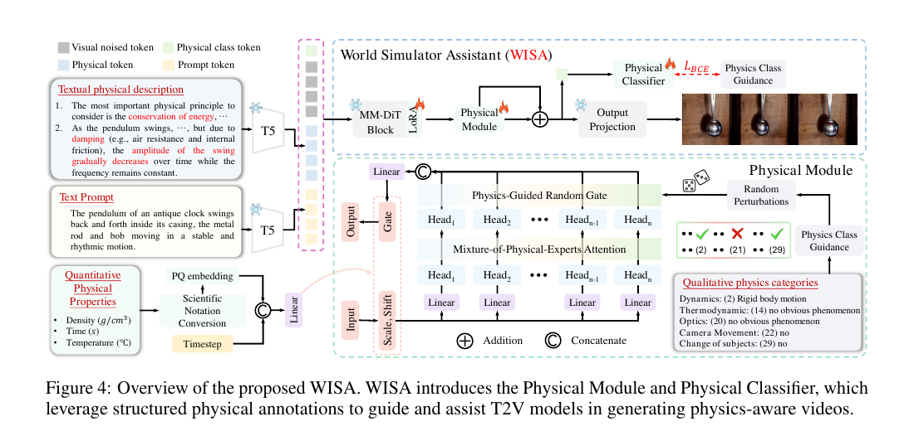

## 한 줄 정리

- 물리적으로 명확한 WISA-80K와, 물리 정보를 텍스트/카테고리/수치 조건으로 나누어 주입하는 WISA로 T2V 모델의 물리 법칙 일관성을 높인다.

## Motivation

- 도메인: 현실 물리 법칙을 따르는 text-to-video(T2V) 생성, 즉 world simulator 보조.
- 문제: 일반 영상 데이터에서는 물리 현상이 배경에 섞여 있고 caption도 물리 원리·조건을 명시하지 않아, T2V가 collision, melting, refraction 같은 현상을 안정적으로 학습하기 어렵다.
- 접근: structured physical annotation과 condition-specific injection.

## Main Method

### 1. WISA-80K와 입력 조건

- 17개 핵심 물리 현상이 뚜렷한 80K 영상을 수집하고, caption으로부터 GPT-4o mini가 세 종류의 조건을 자동 annotation한다.
	- Textual physical description: 장면에서 따라야 할 물리 원리와 관찰 가능한 결과를 자연어로 기술. 원 caption과 이어 붙여 T5 text encoder에 넣는다.
	- Qualitative physics categories: 어떤 현상이 있는지 나타내는 multi-hot $P_c \in \{0,1\}^{29}$. dynamics/thermodynamics/optics뿐 아니라 camera motion, object state 변화도 포함한다.
	- Quantitative physical properties: 주된 운동 물체의 density, 현상 발생 time range, temperature range인 $P_p$. time과 temperature는 범위가 넓어 coefficient와 exponent의 scientific notation으로 표현한다.
- Figure 4의 MM-DiT 입력에는 noisy visual token, text token, 수치 조건을 담은 physical token, 학습 가능한 physical class token이 함께 들어간다.
	- physical token: $P_p$의 PQ embedding으로 만든 수치 조건 token.
	- physical class token (`[PHYSICS_TOKEN]`): 전체 hidden feature를 모아 카테고리 분류에만 쓰는 CLS-like token.

### 2. Physical Module: qualitative은 MoPA, quantitative는 AdaLN

- 계산량을 제한하기 위해 모든 Diffusion Transformer block 뒤가 아니라 마지막 block 뒤에 Physical Module을 한 번만 둔다.

#### MoPA: 어떤 물리 현상인가?

- MHSA head 수를 카테고리 수와 같게 두고($h=C=29$), head $i$를 카테고리 $i$의 physical expert로 **설계상 고정**한다. learned router로 head를 고르는 MoE는 아니다.
- 학습 중 annotation noise에 견디도록 $P_c$의 각 원소를 확률 $0.2$로 flip해 $\hat P_c$를 만든다. 즉 $1\rightarrow0$, $0\rightarrow1$이 각각 독립적으로 일어난다.
- attention 출력 $F_h \in \mathbb{R}^{N\times d\times h}$에서 $\hat P_{c,i}=1$인 head만 남긴 뒤, head를 합쳐 output $F_o$를 만든다.

$$
\hat P_c=\mathrm{Random}(P_c),\qquad F_h=\mathrm{MHSA}(F),\qquad
F_o=\mathrm{Linear}(\mathrm{Reshape}(F_h\odot\hat P_c))
$$

- 따라서 gate는 “collision head를 켜라”처럼 **생성 경로를 선택**한다. 카테고리 $i$가 켜진 영상에서만 head $i$가 diffusion loss에 기여하므로, 반복 학습을 통해 해당 현상에 유용한 attention pattern으로 전문화된다. 여러 현상이 있으면 여러 head를 동시에 켠다.

#### AdaLN: 어느 정도 조건인가?

- $P_p$와 diffusion timestep embedding $T_e$를 합쳐 $\alpha,\beta,\gamma$를 만든다. 이들은 사람이 정하는 hyperparameter가 아니라, 조건별로 Linear layer가 매 forward에 출력하는 modulation 값이다.

$$
\alpha,\beta,\gamma=
\mathrm{Chunk}\bigl(\mathrm{Linear}(\mathrm{Concat}(\mathrm{Linear}(P_p),T_e))\bigr)
$$

$$
F\leftarrow F\ast(1+\alpha)+\beta,\qquad F_o\leftarrow F_o\ast\gamma
$$

- $\alpha$는 feature scale, $\beta$는 shift, $\gamma$는 MoPA output의 세기를 조절한다. 예를 들어 같은 liquid motion이어도 물/꿀의 density나 현상 지속 시간이 다르면 서로 다른 feature modulation을 받는다.
- 논문 식에는 LayerNorm 자체가 명시되지 않고 adaptive scale/shift 부분만 나타난다.

### 3. Physical Classifier: 생성 제어가 아닌 auxiliary supervision

- `[PHYSICS_TOKEN]`은 noisy visual/text token과 함께 MM-DiT와 MoPA를 통과한다. 마지막 hidden state $F_c$를 MLP에 넣어 29개 카테고리의 logit/확률 $f_c$를 예측한다.
- 원래 annotation $P_c$를 target으로 multi-label BCE $L_{pc}$를 계산하고 diffusion loss와 함께 역전파한다.

$$
L=L_{\mathrm{diffusion}}+\lambda\frac{L_{pc}}{1+L_{pc}.\mathrm{detach}}
$$

- gate와 classifier는 같은 카테고리를 쓰지만 역할이 다르다.
	- gate: $\hat P_c$를 보고 어떤 expert output을 통과시킬지 결정하는 **생성 경로 제어**.
	- classifier: hidden representation에서 원래 $P_c$를 예측하게 만들어 물리 카테고리가 feature에 드러나도록 하는 **학습용 보조 loss**.
- classifier output은 inference에서 완전히 버린다. reward model처럼 완성 영상을 평가하거나 생성 결과를 재정렬하지 않는다.
- classifier가 gate 정보를 일부 읽어낼 수 있다는 중복성은 남는다. 다만 gate는 $\hat P_c$로 perturb되고, classifier의 target은 원래 $P_c$이므로 gate만 복사해서는 최적 BCE를 얻지 못한다. 논문에서는 이를 독립적인 판별기가 아니라 auxiliary regularizer로 보는 편이 적절하다.

### 4. Inference

- 사용자의 text prompt만으로 GPT-4o가 textual description, 29개 qualitative category, quantitative property를 생성한다. 영상 정보를 보지 않으므로 inference-time visual leakage는 없다.
- 생성 시 textual description은 text conditioning으로, qualitative category는 MoPA gate로, quantitative property는 physical token/AdaLN으로 주입한다. classifier head는 사용하지 않는다.

## 실험

- Benchmark
	- VideoPhy: 물리 법칙을 반영해야 하는 344개 text prompt로 영상을 생성해 평가한다.
	- PhyGenBench: 다양한 물리 원리를 묻는 160개 prompt로 일반화 성능을 평가한다.
- Metric
	- VideoCon-Physics가 생성 영상과 prompt를 보고 semantic alignment(SA)와 physical consistency(PC)를 각각 $0$~$1$ 사이로 평가한다.
	- IS는 영상의 지각 품질/다양성, CLIPSIM은 text-video 의미 정합성을 평가한다.
- 결과: CogVideoX-5B에 WISA를 붙이면 VideoPhy의 SA/PC가 $0.57/0.41\rightarrow0.62/0.45$로 올랐고, inference time은 $210\mathrm{s}\rightarrow220\mathrm{s}$였다. Wan2.1에서도 IS와 CLIPSIM, SA/PC가 전반적으로 개선됐다.

## Ablation 또는 Analysis

- 물리 데이터: 일반 영상 80K로 LoRA만 학습한 경우 SA/PC가 $0.57/0.40$인 반면, WISA-80K의 textual physical description만으로도 $0.58/0.43$을 기록했다. 물리 현상이 선명한 데이터 자체가 도움이 된다.
- MoPA: textual+quantitative 조건에서 qualitative MoPA를 빼면 $0.59/0.43$, 전체 WISA는 $0.62/0.45$다. discrete 물리 카테고리별 expert routing이 성능 향상에 기여한다.
- Physical Classifier: 모든 조건을 쓰되 classifier를 빼면 $0.61/0.44$, 넣으면 $0.62/0.45$다. auxiliary category supervision이 작지만 일관된 이득을 준다.
- Attention map: rigid body motion head는 진자처럼 실제로 움직이는 물체를, no-obvious-dynamics head는 정적인 배경을 주로 본다. head specialization의 정성적 근거다.
