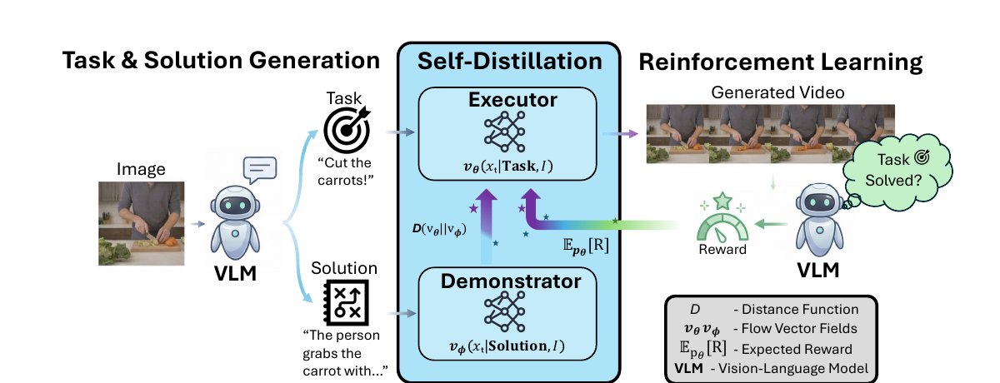

- 원문: [World Model Self-Distillation.pdf](World%20Model%20Self-Distillation.pdf)

- 한 줄 정리
	- 자세한 행동 설명이 있어야 움직일 수 있던 video model을, 짧은 명령만 보고도 스스로 행동 순서를 만들어내는 world model로 학습하는 방법.

- 핵심 아이디어 먼저
	- 이 논문은 **풀이를 보는 선생님(Demonstrator)**과 **문제만 보는 학생(Executor)**을 둠.
		- Demonstrator: “당근을 잡고, 칼을 들고, 여러 번 썬다”처럼 자세한 풀이를 보고 video를 만듦.
		- Executor: “당근을 썰어라”라는 짧은 task만 보고 video를 만들어야 함.
	- 학습 중에는 Executor가 Demonstrator의 움직임을 따라 배우고, VLM에게 자신이 만든 video가 task를 정말 해결했는지 채점받음.
	- 학습이 끝나면 Demonstrator와 VLM 없이 Executor만 사용하므로, 사용자는 initial image와 짧은 task만 주면 됨.

- motivation
	- 도메인: initial image와 instruction을 보고 앞으로 일어날 행동 video를 생성하는 visual world model.
	- 기존 문제
		- pretrained video model은 “무엇을 해야 하는지”보다 “어떻게 움직여야 하는지”가 자세히 적힌 prompt를 잘 따름.
		- 따라서 짧은 task를 풀려면 매번 VLM이 긴 solution prompt를 작성해주거나, 사람이 task-video 정답 쌍을 많이 모아야 했음.
		- task-video 수집은 환경, 물체, 행동 종류가 늘어날수록 비용이 매우 커짐.
	- 해결: VLM이 만든 상세 solution을 이용한 self-distillation + VLM 채점을 이용한 reinforcement learning.

- Main Method
	- 핵심 figure
		- 
	- 예시로 전체 흐름 이해하기
		- initial image $I$: 사람이 주방에서 당근과 칼 앞에 있음.
		- 짧은 task $T$: “Cut the carrots.”
		- 상세 solution $D$: “사람이 당근을 한 손으로 잡고, 다른 손으로 칼을 들어 당근을 여러 조각으로 자른다.”
		- Demonstrator는 $(I,D)$를 받아 구체적인 실행 방법을 알고 video를 생성함.
		- Executor는 $(I,T)$만 받지만, 학습 중 Demonstrator의 도움을 받아 같은 행동 순서를 스스로 만들어내도록 배움.

	- 1. Task와 solution 자동 생성
		- 정답 video가 없는 image $I$를 VLM에 넣음.
		- VLM은 이 장면에서 수행할 수 있는 짧은 task $T$와 그 task의 자세한 실행 설명 $D$를 만듦.
		- 즉, 실제 task 수행 video를 수집하지 않고도 $(I,T,D)$ 학습 데이터를 만들 수 있음.

	- 2. Demonstrator와 Executor
		- 두 모델 모두 noise를 조금씩 video latent로 바꾸는 flow-matching video model임.
		- Demonstrator는 detailed solution $D$를 조건으로 받아 “다음 단계에서 latent를 어느 방향으로 바꿀지” 예측함.
		- Executor는 short task $T$만 조건으로 같은 방향을 예측해야 함.
		- Demonstrator는 학습 중 고정하고 Executor만 업데이트함.

	- 3. Self-distillation: Executor가 막히는 지점에서 가르치기
		- 가장 단순한 방법인 off-policy distillation은 Demonstrator가 만든 경로만 보여주고 Executor가 따라 하게 함.
		- 문제는 Executor가 실제 생성 중 Demonstrator의 경로에서 벗어나면, 그 낯선 상태에서 어떻게 복구해야 하는지 배운 적이 없다는 것.
		- WMSD의 on-policy distillation은 **Executor가 직접 만든 경로**를 사용함.
			- 먼저 Executor가 task video를 생성함.
			- Executor가 실제로 방문한 각 latent state에서 Demonstrator에게 “상세 solution을 안다면 여기서 어느 방향으로 움직일 것인가?”를 물음.
			- 두 모델의 방향 차이를 줄여 Executor가 자기 실수를 만난 자리에서 바로 교정받게 함.
		- 한 지점에서의 차이는 대략 다음과 같음:
			- $d_t=\|v_{\text{Executor}}(x_t\mid I,T)-v_{\text{Demonstrator}}(x_t\mid I,D)\|_2^2$.
			- 쉽게 말하면 두 모델이 현재 video latent를 서로 다른 방향으로 바꾸려 할수록 $d_t$가 커짐.

	- 4. 같은 차이를 두 가지 방식으로 학습에 사용
		- distillation reward
			- 전체 video 경로에서 $d_t$가 작은 rollout에 높은 점수를 줌.
			- 여러 후보 중 Demonstrator의 자연스러운 움직임과 가까운 video를 더 자주 생성하게 만드는 역할.
		- anchor loss
			- Executor가 방문한 각 지점에서 두 모델의 방향 차이 $d_t$를 직접 줄임.
			- reinforcement learning이 높은 점수만 쫓다가 pretrained video model의 자연스러운 움직임을 잊지 않게 잡아주는 안전장치.

	- 5. VLM reward로 task-solving 능력 높이기
		- Demonstrator를 그대로 따라 하기만 하면 Executor의 성능은 Demonstrator 이상이 되기 어려움.
		- 그래서 같은 task에 대해 Executor가 여러 candidate video를 만들고, VLM이 다음을 채점함.
			- task를 끝까지 성공했는가?
			- 올바른 agent가 행동했는가?
			- 움직임과 물체 변화가 자연스럽고 시간적으로 일관적인가?
		- 같은 task의 candidate끼리 점수를 비교해 더 좋은 video의 생성 확률을 높임. 주 실험에서는 task 하나당 24개 candidate를 사용함.
		- task 성공 점수만 사용하면 VLM을 속이기 위해 물체가 갑자기 생기거나 사라질 수 있어, physical/temporal consistency reward도 함께 사용함.

	- 6. 최종 학습 목표
		- reward는 “어떤 video가 더 좋은가”를 정하고, anchor는 “video model의 움직임이 너무 망가지지 않았는가”를 제어함.
		- 개념적으로는 다음 두 항을 함께 최적화함:
			- $L_{\mathrm{final}}=L_{\mathrm{RL}}+\beta_dL_{\mathrm{anchor}}$.
		- $L_{\mathrm{RL}}$: task를 더 잘 해결하는 candidate를 선호하게 함.
		- $L_{\mathrm{anchor}}$: Executor의 움직임을 Demonstrator 근처에 유지함.
		- 따라서 Demonstrator는 정답을 강제로 복사하게 하는 teacher가 아니라, Executor가 RL로 더 좋은 해를 찾되 이상한 video로 무너지지 않게 하는 기준점 역할을 함.

	- inference
		- 입력: initial image $I$ + 짧은 task $T$.
		- 출력: task가 수행되는 future video.
		- 상세 solution 생성, VLM 채점, Demonstrator 호출은 모두 학습할 때만 필요함.
		- 그래서 inference 속도는 원래 few-step video model과 같음.

- 데이터 및 학습 설정
	- WorldTasks 학습 데이터
		- video-game 장면과 실제 장면에서 initial image 20,000개를 모음.
		- 흐리거나 너무 어둡고 밝은 image, 할 수 있는 행동이 거의 없는 장면은 제거함.
		- Qwen3.5-27B가 image마다 8개의 task-solution pair를 만들고, filtering 후 총 146,440개 task prompt를 사용함.
		- task는 `[행동할 agent]: [instruction]` 형식이라 사람, 차량, first-person camera 중 누가 움직여야 하는지 분명히 함.
	- 주 모델
		- LTX-2 8-step model을 LoRA로 학습하고, flow model용 RL 방법인 AWM을 사용함.
		- HunyuanVideo-1.5와 Flow-GRPO 조합에서도 성능이 올라, 특정 model이나 RL 방법에만 맞는 기법은 아님을 보임.

- 실험
	- WorldTasks-Bench
		- task: 200개의 initial image와 짧은 instruction을 주고, 지정된 agent가 task를 수행하는 video를 생성함.
		- Task Score: 생성된 video가 instruction을 끝까지 수행한 비율.
		- Agent Score: 엉뚱한 사람이 아니라 지정된 agent가 행동한 비율.
		- Realism/Consistency Score: 물체의 생성·소멸, 접촉, 움직임, 시간 변화가 자연스럽다고 판정된 비율.
		- LTX-2 8-step 결과
			- Task Score: $28.5\%\rightarrow60.5\%$.
			- Agent Score: $39.1\%\rightarrow69.1\%$.
			- Realism/Consistency: $69.4\%\rightarrow88.2\%$.
			- 세 점수 평균: $45.5\%\rightarrow72.6\%$.
		- 매번 VLM이 상세 solution을 써주는 방식의 평균 $59.8\%$보다도 높고, inference time은 base model과 같은 10.1초임.
		- HunyuanVideo-1.5에서도 25 training step만으로 평균이 $59.7\%\rightarrow67.3\%$로 증가함.
	- 어떤 task에서 많이 좋아졌는가
		- navigation Task Score: $31.1\%\rightarrow75.6\%$.
		- object interaction Task Score: $17.6\%\rightarrow55.9\%$.
		- 즉, 단순히 장면을 유지하는 것보다 “어디로 이동하기”, “물체를 조작하기” 같은 실제 행동에서 큰 개선이 나타남.
	- DreamGen Bench
		- task: initial robot image와 manipulation instruction을 주고, GR1 robot이 행동하는 future video를 생성함.
		- Object/Behavior/Environment는 각각 새로운 물체, 행동, 환경으로 일반화할 수 있는지 보는 subset.
		- WMSD는 GR00T robot video로 따로 SFT하지 않았는데도 논문 표의 Object/Behavior/Environment 점수에서 $70.0/57.4/58.6$을 기록함.
		- SFT된 Cosmos의 $62.0/61.7/65.5$와 비교하면, robot 전용 video 없이 학습한 방법으로서 경쟁력 있는 결과임.

- Ablation 또는 Analysis
	- on-policy vs. off-policy
		- off-policy는 약 60 step 이후 성능이 더 오르지 않음.
		- Executor가 실제 방문한 state에서 교정받는 on-policy는 계속 좋아졌고, distillation reward까지 사용할 때 가장 좋았음.
	- self-distillation + RL
		- RL만 사용하면 약 50 step 이후 성능이 정체됨.
		- on-policy self-distillation과 RL을 함께 쓰면 계속 개선되어, 상세 solution을 받는 Demonstrator보다도 task를 잘 해결함.
	- anchor 세기 $\beta_d$
		- 약 $0.01$이 가장 좋음.
		- 너무 작으면 자연스러운 움직임을 유지해주는 teacher 신호가 약하고, 너무 크면 Executor가 teacher와 다른 더 좋은 해를 탐색하지 못함.
	- consistency reward
		- 제거하면 task 성공처럼 보이게 하려고 필요한 물체나 구조물을 video 중간에 갑자기 만들어내는 reward hacking이 발생함.
	- Demonstrator 고정 여부
		- Executor와 Demonstrator가 weight를 공유하거나 Demonstrator도 계속 업데이트하면 학습이 불안정했음.
		- 따라서 최종 방법은 Demonstrator를 고정함.
	- 다른 distillation 방법
		- DMD 방식도 실험했지만 학습이 반복적으로 발산해 최종 방법에서는 사용하지 않음.
	- 한계
		- Demonstrator가 긴 puzzle처럼 어려운 task의 상세 solution부터 제대로 실행하지 못하면 Executor의 개선 폭도 작음.
		- robot video를 전혀 보지 않았으므로 특정 robot만의 정확한 외형과 관절 움직임까지 배우지는 못함.
		- “data-free”는 task 수행 video가 필요 없다는 뜻이지, initial image나 VLM annotation도 전혀 쓰지 않는다는 뜻은 아님.
		- 주 결과 학습에 128개의 GH200 GPU를 사용해 compute cost가 매우 큼.

- 용어 메모
	- latent: pixel video를 압축해서 model이 계산하기 쉽게 만든 내부 표현.
	- trajectory/rollout: noise에서 시작해 최종 video latent가 될 때까지 거쳐 간 전체 경로. 문맥에 따라 생성된 candidate video 자체를 가리키기도 함.
	- flow vector/velocity: 현재 latent를 다음 순간 어느 방향으로 얼마나 바꿀지 나타내는 값.
	- off-policy: teacher가 방문한 state에서만 학습하는 방식.
	- on-policy: 현재 Executor가 실제로 방문한 state에서 학습하는 방식.
	- anchor: RL 때문에 model이 원래의 자연스러운 video 생성 능력에서 너무 멀어지지 않게 붙잡는 regularization.
	- reward hacking: 실제 task 해결보다 평가 모델의 허점을 이용해 높은 점수만 얻는 현상.
