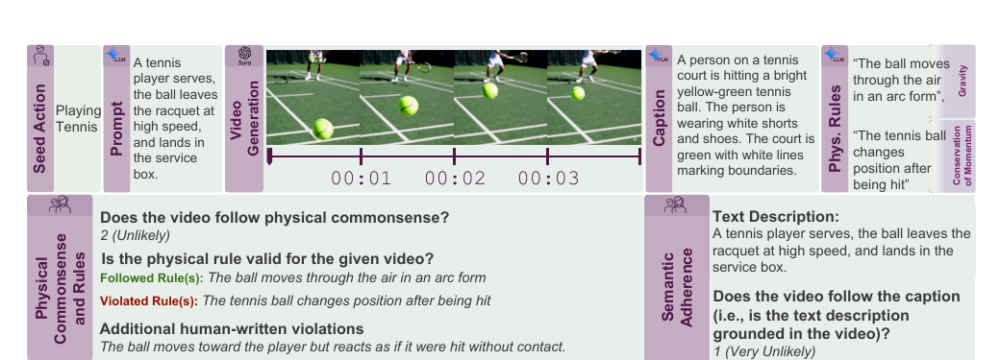

# 한 줄 정리

- 현실 행동을 중심으로 텍스트-비디오 생성 모델의 **prompt 충실도와 물리적 상식**을 분리해 사람 평가하고, 물리 법칙별 실패 원인까지 추적하는 3,940-prompt 벤치마크와 7B 자동 평가기.

# Motivation

- 큰 도메인: video generative model이 범용 world simulator로 쓰이기 위해 필요한 현실 세계의 물리적 상식.
- 기존 문제: 기존 벤치마크는 규모가 작거나 simulation-to-real gap이 있고, prompt 하나를 물리 법칙 하나에 고정해 실제 생성 비디오의 semantic mismatch와 복합 물리 현상을 충분히 다루지 못함.
- 해결 방식: action-centric benchmark + human rating + physical-rule annotation + learned automatic evaluator.

# Main Method

## 1. 데이터셋 구성

- **Seed action 선정**
	- Kinetics, UCF-101, SSv2에서 수집한 600개 이상의 행동을 두 독립 검토자가 물리 상식 평가에 적합한지 판정하고, 둘 다 선택한 232개를 Gemini-2.0-Flash-Exp로 의미 중복 제거.
	- 최종 197개 행동: object interaction 143개, physical activity/sports 54개. 타이핑처럼 운동·상호작용이 약한 행동은 제외.
- **복합 사건 prompt 생성**
	- Gemini-2.0-Flash-Exp가 행동당 20개씩, 총 3,940개 prompt를 생성. 단일 동작보다 `당기기 → 발사 → 과녁에 맞기`처럼 여러 사건이 이어지는 묘사를 유도.
	- Mistral-NeMo-12B-Instruct로 의미는 유지한 dense caption도 생성; 원 prompt 평균 16 token을 평균 138 token으로 확장해 긴 조건문 이해도도 시험.
- **Video-grounded physical rule 생성**
	- 먼저 각 prompt로 비디오를 생성하고, Gemini-2.0-Flash-Exp가 그 **생성 비디오를 captioning**한 뒤 해당 영상에서 성립해야 할 candidate rule 3개와 대응 법칙을 생성.
	- 물리 규칙을 원 prompt에서 곧바로 만들지 않는 이유: 모델이 prompt를 어겼어도 영상 자체는 물리적으로 그럴듯할 수 있기 때문. 즉 rule의 근거를 조건문이 아니라 실제 영상 내용에 둠.
	- 사람 평가자가 각 rule을 followed / violated / cannot be determined (CBD)로 판정하고, 후보에 없던 위반도 자유 서술로 추가.
- **Hard subset**
	- CogVideoX-5B가 semantic adherence와 physical commonsense를 모두 만족한 비율이 0인 행동 60개를 선택해 1,200 prompt의 hard split을 구성.
	- 운동량 전달, 상태 변화, 균형, backflip·pole vault 같은 복잡 운동이 주를 이룸.

## 2. 사람 평가와 점수

- 12명의 qualification 통과 AMT annotator가 명확한 rubric 훈련 후 각 비디오를 3명씩 평가; annotator agreement는 80%.
- **Semantic Adherence (SA)**
	- 입력: 원 prompt + 생성 비디오. 인물·물체·행동·관계가 prompt에 맞게 영상에 구현됐는지를 1--5 Likert scale로 평가.
- **Physical Commonsense (PC)**
	- 입력: 생성 비디오만 제공해 prompt 정보가 물리 판단을 오염시키지 않게 함. 전체 영상이 현실의 물리 법칙에 맞는지를 1--5로 평가.
- **Joint score**
	- 주 지표는 $\mathrm{SA} \ge 4$ 이면서 $\mathrm{PC} \ge 4$인 비디오의 비율. prompt를 거의 못 맞추는 모델이 조건부 물리 점수만 높여 지표를 속이는 문제를 피함.
- **Physical Rule (PR)**
	- 영상-rule 쌍별로 followed (1), violated (0), CBD (2)를 다수결로 결정. 물리 법칙 단위의 실패율까지 분석할 수 있음.

## 3. 자동 평가기

- 학습 데이터: train prompt 3,350개에서 HunyuanVideo-13B, Cosmos-Diffusion-7B, CogVideoX-5B 중 하나로 비디오를 생성하고, 사람 평가로 약 50K annotation을 수집.
- 모델: VideoCon-Physics 기반 7B video-language model을 fine-tuning한 multitask evaluator. 하나의 shared backbone으로 SA 점수 (1--5), PC 점수 (1--5), PR 분류 (0--2)를 함께 예측해 task 간 정보를 공유.
- 일반화 설정: seen model의 unseen prompt와, 학습에 없던 unseen video model 양쪽에서 사람 점수와의 일치도를 측정.

# 실험

- **벤치마크 설정**
	- 197개 행동당 17개 prompt는 자동 평가기 학습용, 3개는 test용으로 사용. 따라서 test는 $197 \times 3 = 591$ prompt이며, 본문의 590 표기는 산술상 오기로 보임.
	- 각 생성 모델은 test prompt마다 비디오 하나를 생성하고, 3명의 사람이 SA·PC·PR을 독립 평가. Wan2.2/Wan2.1, CogVideoX, Hunyuan, Cosmos, VideoCrafter, SVD 등 open model과 Sora, Ray2를 비교.
- **생성 모델 결과**
	- 최고 모델 Wan2.2-27B-A14B도 joint score가 전체 55.4%, hard 47.7%에 그침. Wan2.1-14B는 각각 32.6%, 21.9%로, 물리적으로 믿을 만하면서 조건문까지 맞춘 영상을 생성하는 일은 여전히 어렵다는 결과.
	- hard split은 모든 모델 성능을 크게 낮추며, closed model인 Ray2 (20.3%)와 Sora (23.3%)도 Wan2.2보다 낮음. object interaction보다 스포츠/physical activity에서 대체로 더 낮은 성능을 보임.
- **자동 평가기 결과**
	- 사람 점수와의 Pearson correlation 평균은 unseen prompt에서 42.0, unseen model에서 41.0으로 기존 최고 baseline (각 28.5, 26.5)을 크게 앞섬.
	- Gemini-2.0-Flash-Exp 대비 SA correlation은 80.8%, PC correlation은 236.4% 상대 향상. PR 분류 정확도도 unseen prompt/model에서 78.7%/72.9%로 Gemini-2.0의 59.2%/57.1%보다 높음.

# Ablation 또는 Analysis

- **법칙별 실패**: 질량 보존과 운동량 보존이 약 40%로 가장 자주 위반됨. 반사와 부력은 20% 미만 위반으로 비교적 잘 처리됨.
- **일반 video quality와의 분리**: PC는 aesthetics와 상관계수 0.09, motion quality와 0.002에 불과. 보기 좋고 움직임이 많은 영상만 최적화해서는 물리 상식을 얻지 못함.
- **강한 모델의 failure mode**: Wan2.2도 회전하는 yo-yo가 크게 변형되거나 줄이 사라지고, 묶인 풍선이 외력에 의해 부자연스럽게 수축하는 등 재질·인과·보존 법칙을 위반.
- **평가 설계의 의미**: PC 평가에서 prompt를 숨기고, 영상에 grounding된 rule과 전체적 PC를 병렬로 수집해 “prompt를 틀렸지만 물리는 맞는 영상”과 “prompt는 맞지만 물리는 틀린 영상”을 구분함.

# VideoPhy 대비 개선점

- **범위·규모**: 재질 간 상호작용 중심의 688 caption에서 실제 행동 중심의 3,940 prompt로 확장; 여러 사건이 이어지는 긴 dense caption까지 평가.
- **어려운 사례 선정**: 사람이 simulation 복잡도로 easy/hard를 정하던 방식에서, CogVideoX-5B가 joint score 0을 보인 행동 60개를 고른 model-based hard split으로 변경.
- **더 엄밀한 사람 평가**: SA·PC를 binary 대신 1--5로 세밀하게 평가하고, PC 평가는 prompt를 숨겨 semantic mismatch가 물리 판단을 오염시키지 않게 함.
- **법칙별 오류 추적**: 생성 영상에서 규칙을 추출한 뒤 followed / violated / CBD와 추가 위반을 수집. 따라서 영상은 그럴듯해도 질량·운동량 보존처럼 어떤 법칙에서 실패했는지 분석 가능.
- **자동 평가 확장**: SA·PC binary 판정기에서 SA·PC 점수화와 physical-rule 3-class 분류를 함께 학습하는 multitask evaluator로 확장.
