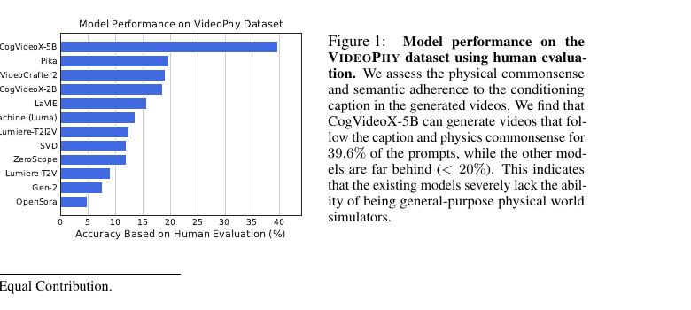

- 한 줄 정리
	- 물리 상호작용 caption 688개로 T2V 모델의 물리 상식 능력을 측정하고, 사람의 SA/PC 판단을 모사하도록 VideoCon을 fine-tuning한 자동 평가기까지 제공하는 benchmark

- motivation
	- 도메인: text-to-video (T2V) 생성 결과가 현실의 물리 법칙과 직관에 맞는지 평가하는 문제
	- 기존 문제: FVDㆍCLIPScore는 각각 영상 품질ㆍ텍스트 유사도에 치우쳐 있고, 기존 video benchmark도 시간에 걸친 물리 상식 위반을 직접 신뢰성 있게 측정하지 못함
	- 해결 방향: human-verified physics prompt benchmark + human judgment + video-language model fine-tuning

- Main Method
	- 핵심 Figure
		- 
		- caption 의미를 지키면서 물리적으로도 맞는 경우의 비율은 최고 CogVideoX-5B도 $39.6\%$에 그친다. 단순 시각 품질과 물리 상식은 별개로 평가해야 함을 보여준다.

	- 1. 물리 상식 caption benchmark 구축
		- 목표는 일상 물리 현상을 짧은 text prompt로 기술하고, 이 prompt에서 생성된 video가 물리적으로 그럴듯한지 측정하는 것이다. interaction material을 solid-solid, solid-fluid, fluid-fluid의 세 범주로 명시해 object와 interaction의 종류를 통제한다.
		- Stage 1 - GPT-4 caption generation: 각 물질 조합에서 접촉력ㆍ마찰력ㆍ유체 흐름을 요구하는 후보 caption을 생성한다. solids는 rigid/deformable/elastic/sand/metal/snow 등을, fluids는 물ㆍ꿀처럼 점성이 다른 흐름을 포괄한다.
		- Stage 2 - human verification: 저자가 caption이 명확한지, 불필요하게 복잡하지 않은지, 지정한 물질 interaction에 실제로 맞는지를 검수해 부적절한 LLM 생성을 제거한다.
		- Stage 3 - difficulty annotation: physics simulation 경험이 있는 두 연구자가 각 caption을 easy/hard로 독립 판단하고, $5\%$ 미만의 불일치는 논의로 합의한다. 난이도는 각 material category 안에서만 비교하며, deformable objectㆍ빠른 운동ㆍ고차 dynamics일수록 어렵다.
		- 최종 dataset은 688 caption (solid-solid 289, solid-fluid 291, fluid-fluid 108), 138개 action으로 구성된다. 평균 caption 길이는 8.5 words로 짧게 유지해, 언어 이해 난이도보다 물리적 생성 실패를 보도록 설계한다.

	- 2. 사람 기반 평가 protocol
		- 입력은 caption $c$이고, 각 T2V model이 $c$로 생성한 video $v$를 평가한다. 12개 open/closed model에서 총 11,330개 video를 모았으며, benchmark용 test caption은 344개다.
		- annotator는 model 이름을 모른 채 $(c,v)$에 대해 Semantic Adherence (SA)와 Physical Commonsense (PC)를 서로 독립적으로 각각 binary $0/1$로 판단한다. test에서는 video당 3명의 majority vote를 사용한다.
		- SA는 caption의 objectㆍactionㆍrelation이 video에 실제로 나타나는지, PC는 질량 보존ㆍ운동ㆍmaterial behavior가 일상 물리와 맞는지를 본다. 따라서 caption을 잘 따르지 않은 video도 PC 자체는 별도로 판단한다.

	- 3. VideoCon-Physics: 확장 가능한 자동 평가기
		- 사람 평가는 신뢰할 수 있지만 비싸므로, real-video semantic evaluator인 7B VideoCon을 generated-video distribution과 사람 label에 맞게 fine-tuning한다.
		- 입력은 $(\text{video}, \text{caption}, \text{task query})$이며 task query는 SA 또는 PC를 묻는다. 모델은 multimodal prompt에 조건부로 Yes/No를 생성하고, 그 log-likelihood를 학습한다. 하나의 multi-task model이 두 판단을 함께 수행한다.
		- 688 caption을 344 train/344 test로 반반 나누되, material state와 difficulty 분포를 맞춘다. train 쪽에서는 9개 T2V model이 생성한 prompt당 2개 video와 human label을 사용해 총 12,000개 annotation으로 학습하고, test에는 보지 못한 caption의 human judgment와 ROC-AUC를 비교한다.

- 실험
	- Benchmark와 metric
		- VideoPhy human benchmark: 344 held-out caption에 대해 model당 video 하나를 생성하고, 3명 평가자의 majority vote로 SA, PC, 그리고 둘 다 맞는 joint score $SA=1, PC=1$의 비율을 측정한다. joint score가 실제 “prompt도 맞고 physics도 맞는 video”의 핵심 지표다.
		- Automatic evaluator benchmark: 자동 평가기의 Yes/No score가 사람 binary label을 얼마나 잘 구분하는지 SA/PC별 ROC-AUC로 측정한다. unseen prompt뿐 아니라 evaluator가 학습 중 보지 못한 T2V model의 video에도 일반화되는지를 별도로 본다.
	- 결과
		- 사람 평가에서 CogVideoX-5B가 joint $39.6\%$, SA $63.3\%$, PC $53.0\%$로 가장 높았고 나머지 model의 joint score는 모두 $20\%$ 미만이었다. high visual quality나 caption adherence가 physics correctness를 보장하지 않으며, Dream Machine은 SA $61.9\%$지만 PC는 $21.8\%$였다.
		- solid-solid interaction이 특히 어렵다. 가장 좋은 CogVideoX-5B도 이 subset의 joint score가 $24.4\%$로 전체보다 크게 낮아, rigid contactㆍ충돌ㆍ변형이 핵심 병목임을 보인다.
		- VideoCon-Physics는 unseen prompt에서 SA/PC ROC-AUC $82/73$으로, zero-shot VideoCon의 $65/54$, Gemini-1.5-Pro-Vision의 $73/58$보다 높다. unseen T2V model에서도 $79/72$를 기록해 model ranking을 사람 평가와 대체로 같은 순서로 재현한다.

- Ablation 또는 Analysis
	- Material state
		- 모든 모델이 solid-solid caption에서 가장 낮은 성능을 보였고, fluid-fluid는 상대적으로 잘 처리했다. 생성기가 object contact와 rigid geometry를 제대로 모델링하지 못한다는 진단이다.
	- Caption difficulty
		- easy에서 hard로 갈수록 모든 모델의 SA와 PC가 함께 하락한다. simulation 관점에서 어려운 motion/object일수록 prompt conditioning도 어려워진다.
	- Failure modes
		- 질량/texture가 시간에 따라 보존되지 않음, 외력 없이 속도가 변함, 운동량에 맞지 않는 충돌, rigid solid의 비정상 변형, 비자연스러운 fluid flow, object interpenetration을 주요 위반으로 정리한다.
	- Motionㆍquality correlation
		- video quality는 SA/PC와 양의 상관, motion 크기는 SA/PC와 음의 상관을 보였다. 다만 상관관계일 뿐이고, quality가 높은 closed model도 절대적인 physical score는 낮다.
	- Video model fine-tuning
		- VideoPhy data로 T2V model을 단순 fine-tuning하면 SA는 유의미하게 하락하고 PC는 거의 변하지 않았다. 688개 수준의 작은 data만으로는 물리 상식을 직접 주입하기 어렵다는 부정적 결과다.
